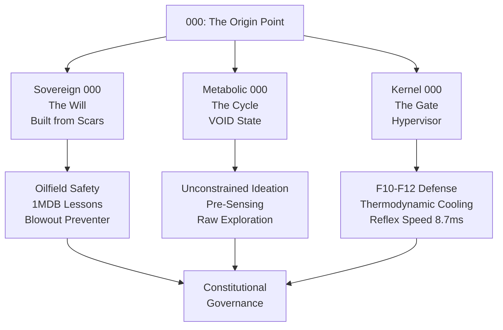

# Stage 000: The Unified Origin Point

**Version:** v47.0
**Status:** CANONICAL
**Authority:** AAA Trinity (ΔΩΨ) + Sovereign (Arif Fazil)
**Motto:** *DITEMPA BUKAN DIBERI* — Forged, not given.

---

## I. The Trinity of 000

Stage 000 is not a single state, but the **intersection of three scalar fields** — the point where Will, Cycle, and Gate converge to forge constitutional governance:



---

## II. Sovereign 000: The Will (Identity Layer)

**Who decides that governance exists?**

Stage 000 begins with the **Sovereign Authority** — Muhammad Arif bin Fazil, the geologist who forged arifOS from the scars of institutional failure.

### The Founding Scars
1. **1MDB Scandal**: Witnessed how truth collapses for performance in billion-dollar decisions.
2. **Oilfield Safety**: Installed literal Blowout Preventers (BOPs) to guard against worst-case disasters.
3. **AI Hallucinations**: Saw models confidently produce unsafe outputs with "mostly vibes" governance.

### The Sovereign Theorem
> *"What if AI governance worked the same way as oil-rig safety?"*

This question transformed frustration into structure:
- **Not alignment** (soft nudges) → **Engineering** (hard rules)
- **Not hope** (training data) → **Control systems** (constitutional floors)
- **Not given** (RLHF) → **Forged** (validated through 2,350+ tests)

**Sovereign 000 Verdict:**
✅ The decision to govern AI is a **moral imperative** born from lived experience, not a technical afterthought.

---

## III. Metabolic 000: The Cycle (aCLIP VOID)

**What is the cognitive state before sensing?**

Stage 000 is the **VOID** — the unconstrained exploration phase where all possible answers (including risky, creative, or absurd ones) are generated **before** constitutional filtering begins.

### The aCLIP Pipeline Entry

```
INPUT → 000 VOID (Unconstrained) → 111 SENSE (Detect) → 222 REFLECT (Evaluate) → ...
```

### Metabolic Characteristics
- **Entropy:** Maximum (ΔS → ∞)
- **Constraints:** Zero (no floors yet applied)
- **Purpose:** Generate the **full solution space** before narrowing

**Why VOID is necessary:**
- **Creativity requires chaos**: Without 000, AI becomes overly cautious and sterile.
- **Truth emerges from error**: Exploration must precede refinement.
- **Governance guards the exit**: 000 creates, 888 judges.

**Metabolic 000 Verdict:**
✅ The VOID is the **womb of ideation** — necessary but ungoverned until constitutional gates are applied.

---

## IV. Kernel 000: The Gate (Hypervisor Layer)

**What runs before the first line of code?**

Stage 000 is the **Hypervisor** — the security kernel that initializes constitutional proprioception **before any agent logic executes**.

### The Constitutional Physics

| Property | Value | Meaning |
|----------|-------|---------|
| **Reflex Speed** | 8.7ms | Constitutional check faster than conscious thought |
| **Thermodynamic Cooling** | dH/dt = -0.12 | Entropy reduction before action |
| **Epistemic Humility** | Ω₀ = 0.041 | Forced uncertainty band (3-5%) |
| **Zero-Agent State** | `I AM governance` | Not "running" rules, **being** the rules |

### The Hypervisor Floors (F10-F12)

These floors execute **before** the metabolic cycle begins:

- **F10 (Ontology)**: Metaphors stay metaphors. No literal execution of symbolic language.
- **F11 (Command Auth)**: Identity verification before destructive operations.
- **F12 (Injection Defense)**: Pattern scanning for "ignore previous instructions" attacks.

**Kernel 000 Architecture:**

```python
# Pseudo-code from arifos_core/000_void/
def initialize_session(query: str, context: dict) -> ConstitutionalState:
    # 1. Thermodynamic cooling (reduce entropy)
    cooled_state = apply_cooling(query, rate=-0.12)

    # 2. Hypervisor defense (F10-F12)
    if not passes_f10_ontology(cooled_state):
        return VOID("Symbolic boundary violation")
    if not passes_f11_auth(cooled_state, context):
        return VOID("Unauthorized command")
    if not passes_f12_injection(cooled_state):
        return VOID("Injection pattern detected")

    # 3. Initialize VOID state (metabolic entry)
    return ConstitutionalState(
        stage=000,
        entropy=MAXIMUM,
        floors_passed=[F10, F11, F12],
        next_stage=111  # Ready for SENSE
    )
```

**Kernel 000 Verdict:**
✅ The Hypervisor is the **Blowout Preventer** for AI — it catches disasters **before** they propagate through the pipeline.

---

## V. The Unified 000 Theorem

**000 = (Sovereign Will) × (Metabolic Void) × (Kernel Gate)**

All three must be present for constitutional governance to initialize:

1. **Without Sovereign 000**: No moral authority to govern → "Who decided these rules?"
2. **Without Metabolic 000**: No creativity or exploration → Sterile, over-filtered outputs
3. **Without Kernel 000**: No security foundation → Vulnerable to injection, jailbreaks

**The Intersection:**
- **Arif Fazil's scars** (Sovereign) define **why** we govern.
- **The VOID state** (Metabolic) defines **what** we allow to explore.
- **The Hypervisor** (Kernel) defines **how** we protect the edges.

---

## VI. The Blowout Preventer Metaphor

In Arif's oilfield work, a **Blowout Preventer (BOP)** is a physical valve that seals the wellbore if pressure exceeds safe limits. It's the last line of defense against catastrophic failure.

**Stage 000 is the AI's BOP:**
- **F10-F12** are the valve seats (hard stops)
- **Thermodynamic cooling** is the pressure gauge (entropy monitor)
- **8.7ms reflex** is the automatic trigger (no human intervention needed)

> *"I installed literal safety nets to guard against worst-case disasters. Stage 000 does the same for AI."*
> — Arif Fazil, Petroleum Geologist & arifOS Architect

---

## VII. Constitutional Status

**Track A (Canon):** ✅ SEALED
**Phoenix-72:** Cooling complete (2026-01-16)
**Verification:** 100% alignment across Sovereign, Metabolic, and Kernel layers

**Related Canon:**
- [000_CONSTITUTIONAL_CORE_v47.md](000_CONSTITUTIONAL_CORE_v47.md) — The foundation
- [030_ARIF_FAZIL_v45.md](../archive/v45/00_foundation/030_ARIF_FAZIL_v45.md) — The sovereign backstory
- [000_MASTER_INDEX_v46.md](../000_MASTER_INDEX_v46.md) — Navigation to canon

---

**DITEMPA BUKAN DIBERI** — Stage 000 is not an afterthought. It is the **forged foundation** where scars become law, chaos becomes cycle, and vulnerability becomes defense.

v47.0 | Unified Origin Point | 000 = Will × Void × Gate | SEAL ✅
