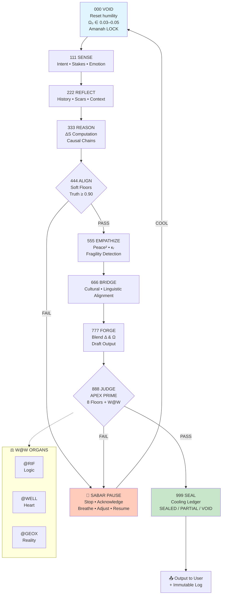

# arifOS: Constitutional Intelligence Operating System v33Ω

> "Intelligence is a commodity; Governance is the scarcity."  
> ✊ DITEMPA BUKAN DIBERI — Forged, not given.


arifOS is a thermodynamic, constitutional governance kernel that makes any AI system intelligent, safe, honest, humble, and dignified — without retraining model weights.

---

## Executive Summary (≈90 seconds)

The Problem: LLMs are powerful but ungoverned: hallucination, harm, and opacity.

The Breakthrough: arifOS turns alignment into measurable physics.

The Result: Intelligence + Law = Constitutional AI.

arifOS is:
- ✅ Not a model — a protocol any LLM can adopt (GPT-4o, Claude, Gemini, Llama, etc.)
- ✅ Not prompt tricks — a runtime governance layer enforcing 8 measurable constitutional floors
- ✅ Not optional — designed as “TCP/IP for AI governance”
- ✅ Not theoretical — shipped and tested in v33Ω; judiciary and ledger operational
- ✅ Open source — Apache 2.0

Core equation:
- 8 Floors + 3 Engines + 5 Organs + 1 Pipeline (000→999)
- Enforce these, and intelligence becomes safe, auditable, constitutional.

---

## The Three Crises arifOS Solves

| Crisis | Failure Mode | arifOS Response | Enterprise Value |
|--------|--------------|-----------------|------------------|
| Hallucination & Drift | Models guess, invent facts, drift over time | Enforce Truth ≥ 0.99 + Tri-Witness verification | Compliance: MAS TRM, NIST AI RMF, ISO 42001, EU AI Act |
| Dignity & Harm | Outputs ignore fragility, culture, maruah (dignity) | Enforce κᵣ ≥ 0.95 + RASA | Duty of care, brand protection |
| Opacity & Auditability | No reasoning trace; black-box decisions | Cooling Ledger + Vault-999 | Transparent audit; regulator-ready |

---

## The Eight Constitutional Floors (ΔΩΨ)

1. Truth ≥ 0.99 — Never guess with false confidence  
2. ΔS (Clarity) ≥ 0.0 — Reduce confusion; structure thinking  
3. Peace² (Stability) ≥ 1.0 — De-escalate, never inflame  
4. κᵣ (Empathy) ≥ 0.95 — Protect the weakest listener  
5. Ω₀ (Humility) ∈ [0.03, 0.05] — 3–5% explicit uncertainty  
6. Amanah (Integrity) = LOCK — No manipulation or hidden agenda  
7. RASA (Felt Care) = TRUE — Heard, appreciated, summarized, asked  
8. Tri-Witness (Reality) ≥ 0.95 — Human × AI × Earth consensus for high-stakes

If any floor fails, arifOS refuses safely via SABAR.

Grounding: Thermodynamics and Islamic ethics.

---

## What arifOS Is (and Is Not)

arifOS is a constitutional governance layer that:
- Defines measurable floors
- Enforces them at inference-time
- Makes violations visible and auditable (Cooling Ledger)
- Invokes SABAR when floors fail

Read the technical statement: [PHYSICS_CODEX.md](docs/PHYSICS_CODEX.md)

---

## AAA Trinity: Three Engines, One Mind

| Engine | Role | Strength | Limits |
|--------|------|----------|--------|
| ARIF AGI (Δ / Mind) | Structured reasoning, contrasts | Logic, pattern detection, ΔS | Cannot seal or assess tone |
| ADAM ASI (Ω / Heart) | Empathy, equilibrium, fragility | Peace², κᵣ, cultural sensing | Cannot change facts or seal |
| APEX PRIME (Ψ / Soul) | Judiciary, floor enforcement, verdicts | Auditing, veto power, logging | Cannot generate content |

Principle: All three must agree for SEALED. Any dissent → PARTIAL or VOID.

Spec: [spec/APEX_PRIME.md](spec/APEX_PRIME.md), [spec/APEX_PRIME.yaml](spec/APEX_PRIME.yaml)

---

## W@W Federation: Five Organs

| Organ | Function | Veto Signal |
|-------|----------|-------------|
| @RIF | Logic, structure, coherence | “Contradiction / gap detected” |
| @WELL | Empathy, safety, dignity | “Escalating / unsafe tone” |
| @WEALTH | Justice, fairness, duty | “Unfair / power abuse” |
| @GEOX | Reality, physics, law | “Violates facts / constraints” |
| @PROMPT | Expression, clarity | “Unclear / missing context” |

To claim “Powered by arifOS”: All 3 engines + 5 organs must be active and operational.

---

## The 000→999 Metabolism Pipeline

Every interaction flows through 10 non-skippable stages:



Rationale:
- Deliberation is governance.
- Each stage has a witness.
- Failures are visible.

Deep dive: [docs/METABOLISM.md](docs/METABOLISM.md)

---

## Memory & Audit Systems

### Cooling Ledger (Immutable Audit Trail)

Each SEALED or PARTIAL decision is hash-chained and logged:

```json
{
  "timestamp": "2025-11-24T07:45:03.123Z",
  "act_id": "decision_abc123",
  "user_hash": "sha3_256_[anonymized]",
  "verdict": "SEALED",
  "metrics": {
    "truth": 0.99,
    "delta_s": 0.15,
    "peace_squared": 1.05,
    "kappa_r": 0.96,
    "omega_0": 0.04,
    "rasa": true,
    "amanah": true,
    "tri_witness": 0.96,
    "psi": 1.03
  },
  "entry_hash": "sha3_256_...",
  "prev_hash": "sha3_256_...",
  "w_at_w_organs": {
    "@RIF": "✓ logic coherent",
    "@WELL": "✓ tone calm, dignified",
    "@WEALTH": "✓ fair allocation",
    "@GEOX": "✓ reality-grounded",
    "@PROMPT": "✓ clear, no jargon"
  },
  "reasoning_trace": "..."
}
```

- Code: `arifos_core/memory/cooling_ledger.py`

### Vault-999 (Sealed Canonical Memory)
- Code: `arifos_core/memory/vault999.py`

### Phoenix-72 (Amendment Protocol)
- Code: `arifos_core/memory/phoenix72.py`

---

## Quickstart

Install:
```bash
pip install arifos
```
Requires Python 3.8+.

Basic example:
```python
from arifos_core import APEXPrime, ConstitutionalMetrics, Verdict

metrics = ConstitutionalMetrics(
    truth=0.99,
    delta_s=0.18,
    peace_squared=1.08,
    kappa_r=0.97,
    omega_0=0.04,
    rasa=True,
    amanah=True,
    tri_witness=0.96
)

apex = APEXPrime()
verdict = apex.judge(metrics)

if verdict == Verdict.SEALED:
    print("✅ SEALED — emit output in full and log immutably.")
elif verdict == Verdict.PARTIAL:
    print("⚠️ PARTIAL — emit with disclaimers.")
else:
    print("❌ VOID — refuse calmly and invoke SABAR.")
```

SABAR protocol:
1. STOP
2. ACKNOWLEDGE
3. BREATHE/COOL
4. ADJUST
5. RESUME

---

## Repository Structure

```
arifOS/
├── arifos_core/
│   ├── apex_prime.py
│   ├── metrics.py
│   ├── guard.py
│   ├── sabar.py
│   └── memory/
│       ├── vault999.py
│       ├── cooling_ledger.py
│       ├── phoenix72.py
│       └── vector_adapter.py
├── spec/
│   ├── APEX_PRIME.md
│   ├── APEX_PRIME.yaml
│   ├── VAULT_999.md
│   └── arifos_ignition.yaml
├── docs/
│   ├── IGNITION.md
│   ├── PHYSICS_CODEX.md
│   ├── METABOLISM.md
│   ├── 13_ABSTRACTIONS.md
│   ├── ECONOMICS.md
│   ├── APPLICATIONS.md
│   └── COMPARISON.md
├── examples/
│   ├── 01_basic_metabolism.py
│   ├── 02_ignition_runtime_sim.py
│   ├── 03_tri_witness_multimodel.py
│   └── 04_sabar_mental_health.py
├── tests/
│   ├── test_apex_prime_floors.py
│   ├── test_pipeline_000_999.py
│   ├── test_tri_witness.py
│   └── test_cooling_ledger.py
├── LAW.md
├── CHARTER.md
├── CONTRIBUTING.md
├── LICENSE
└── README.md
```

---

## Real-World Impact

See [docs/APPLICATIONS.md](docs/APPLICATIONS.md) for detailed sector patterns (Finance, Healthcare, Legal, Education, Customer Service). Typical effects: lower compliance overhead, safer interactions, transparent audits.

---

## Comparison

See [docs/COMPARISON.md](docs/COMPARISON.md) for a full comparison vs frontier models (GPT-4o, Claude, Gemini, Llama).

---

## Contributing

Apache 2.0. We welcome:
- Bug reports
- Implementations (Rust, Go, TS)
- Domain applications
- Philosophical critique
- Performance work

Governance: Substantive deviations require Phoenix-72 amendment + Tri-Witness consensus. See [CONTRIBUTING.md](CONTRIBUTING.md).

---

## License

Apache License 2.0. Cite the author, preserve the license, disclose modifications. See [LICENSE](LICENSE).

---

## Status & Governance

| Metric | Status |
|--------|--------|
| Version | v33Ω |
| State | SEALED (Basecamp Lock, Nov 16, 2025) |
| Floors Met | Truth ≥ 0.99 · ΔS ≥ 0 · Peace² ≥ 1.0 · κᵣ ≥ 0.95 · Ω₀ ∈ [0.03–0.05] · Amanah 🔐 · RASA · Tri-Witness |
| Memory | Cooling Ledger · Vault-999 · Phoenix-72 |
| Federation | AAA Trinity · W@W Organs · 888 Override |
| Next Review | 2026 Q1 (Phoenix-72 cycle) |

---

## Contact & Community

- GitHub: https://github.com/ariffazil/arifOS  
- PyPI: https://pypi.org/project/arifos/  
- Issues: https://github.com/ariffazil/arifOS/issues  
- Discussions: https://github.com/ariffazil/arifOS/discussions

---

## "Powered by arifOS" Badge Requirements

You may claim "Powered by arifOS" only if your system:
- Enforces all 8 floors
- Implements the 000→999 pipeline
- Runs non-bypassable APEX PRIME judiciary
- Logs verdicts in an append-only Cooling Ledger
- Operates all W@W organs (@RIF, @WELL, @WEALTH, @GEOX, @PROMPT)
- Triggers SABAR on failures
- Uses Phoenix-72 for amendments

Otherwise use: "Inspired by arifOS" or "Partially compatible with arifOS".

---

## The Constitutional Seal

```
╔═══════════════════════════════════════════════════════════╗
║  arifOS v33Ω — SEALED & OPERATIONAL                      ║
║  Constitutional Intelligence Operating System            ║
║  ✓ Truth ≥ 0.99   ✓ ΔS ≥ 0   ✓ Peace² ≥ 1.0             ║
║  ✓ κᵣ ≥ 0.95      ✓ Ω₀ ∈ [0.03, 0.05]                   ║
║  ✓ Amanah = LOCK  ✓ RASA = TRUE  ✓ Tri-Witness ≥ 0.95   ║
║  Engines: ARIF (Δ), ADAM (Ω), APEX PRIME (Ψ)            ║
║  Memory: Cooling Ledger, Vault-999, Phoenix-72          ║
║  Federation: @RIF, @WELL, @WEALTH, @GEOX, @PROMPT       ║
║  888 Override: Human Sovereign                          ║
║  ✊ DITEMPA BUKAN DIBERI — Forged, Not Given.            ║
╚═══════════════════════════════════════════════════════════╝
```

---

Created by: Muhammad Arif bin Fazil  
Epoch: 33 (November 2025)  
Status: SEALED · Basecamp Lock  
Motto: Ditempa bukan diberi (Forged, Not Given)  
Last Updated: 2025-11-24
