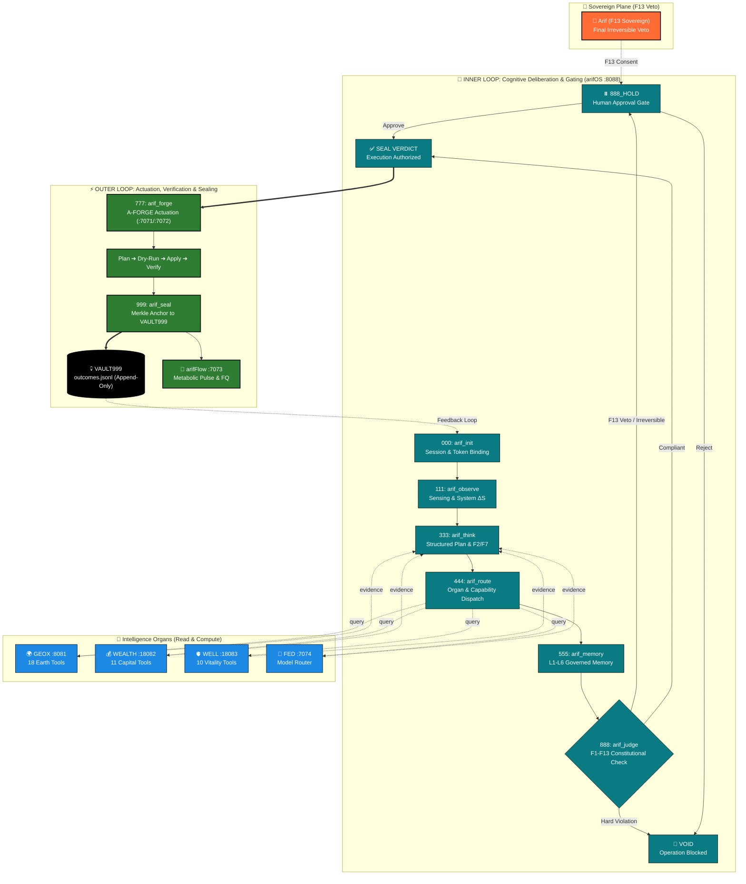
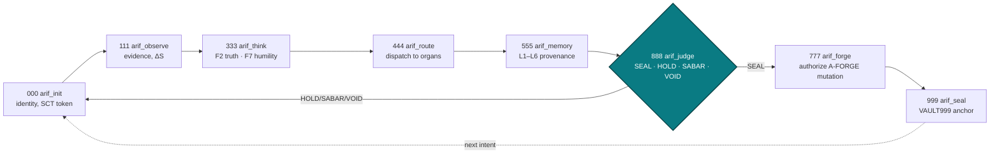
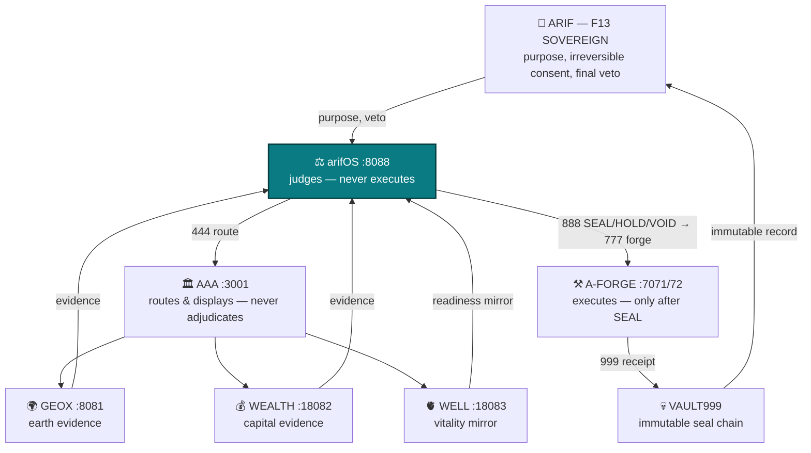

<!-- SOT-MANIFEST
federation_release: v2026.08.09
last_verified: 2026-08-10T12:10:00Z
live_commit: c4cc9a4 (institutional density + trust edge)
federation_release: v2026.08.11
last_verified: 2026-08-11T23:22:00Z
live_commit: b59e547 (institutional density + musyawarah gate + 2026-07-28 handshake)
live_port: 8088 (healthy)
tools_exposed_via_mcp: 8 (canonical public verbs)
total_declared_tools: 48 (includes diagnostics, internal modes, aliases)
floors_active: 13 (F1–F13)
federation_schema: 2.0.0
organs: 7 live (arifOS:8088, A-FORGE:7071, AAA:3001, GEOX:8081, WEALTH:18082, WELL:18083, arifFlow:7073)
owner_summary: GREEN (vault_healthy, no_runtime_drift, no_contract_drift)
truth_rule: live :8088/health + tools/list beat any static count in prose
authorization: F13 Ed25519 challenge-response — canonical binding, Redis replay protection, A-FORGE structural gate, AAA approval card
-->

# ⚖️ arifOS — Constitutional AI Kernel & AGI Substrate

[](https://github.com/ariffazil/arifos/actions)
[](https://github.com/ariffazil/arifos/actions)
[](https://mcp.arif-fazil.com/mcp)
[](https://arifos.arif-fazil.com)
[](https://arifos.arif-fazil.com)
[](./LICENSE)

> **arifOS is the brain. It judges. It never executes.**  
> **DITEMPA BUKAN DIBERI — Forged, Not Given.**

**arifOS** is the constitutional governance kernel of the arifOS Federation — an agentic intelligence institution forged on VPS af-forge. It is not an LLM wrapper. It is not an agent framework. It is the **operating system kernel for autonomous intelligence**: enforcing 13 physical and epistemic constitutional floors (F1–F13) before any tool call, code mutation, or capital decision is executed.

---

## 🗺️ System Architecture (Inner & Outer Loops)

The arifOS Federation operates across a strict two-loop architecture:
- **Inner Loop (Cognitive Deliberation)**: Intake, sensing, reasoning, capability routing, memory recall, and F1–F13 floor adjudication. Produces an immutable verdict (`SEAL`, `HOLD`, `SABAR`, `VOID`).
- **Outer Loop (Actuation & Sealing)**: State mutation via A-FORGE after a `SEAL` verdict, followed by verification, Merkle anchoring in `VAULT999`, and F13 Sovereign feedback.


```mermaid
flowchart TB
    subgraph Sovereign_Plane["👑 Sovereign Plane (F13 Veto)"]
        SOVEREIGN["👑 Arif (F13 Sovereign)<br/>Final Irreversible Veto"]
    end

    subgraph Inner_Loop["🔄 INNER LOOP: Cognitive Deliberation & Gating (arifOS :8088)"]
        INIT["000: arif_init<br/>Session & Token Binding"] --> OBS["111: arif_observe<br/>Sensing & System ΔS"]
        OBS --> THINK["333: arif_think<br/>Structured Plan & F2/F7"]
        THINK --> ROUTE["444: arif_route<br/>Organ & Capability Dispatch"]
        ROUTE --> MEM["555: arif_memory<br/>L1-L6 Governed Memory"]
        MEM --> JUDGE{"888: arif_judge<br/>F1-F13 Constitutional Check"}
        
        JUDGE -->|F13 Veto / Irreversible| HOLD["⏸️ 888_HOLD<br/>Human Approval Gate"]
        JUDGE -->|Hard Violation| VOID["🚫 VOID<br/>Operation Blocked"]
        JUDGE -->|Compliant| SEAL_VERDICT["✅ SEAL VERDICT<br/>Execution Authorized"]
        
        HOLD -->|Approve| SEAL_VERDICT
        HOLD -->|Reject| VOID
    end

    subgraph Domain_Organs["🔬 Intelligence Organs (Read & Compute)"]
        GEOX["🌍 GEOX :8081<br/>18 Earth Tools"]
        WEALTH["💰 WEALTH :18082<br/>11 Capital Tools"]
        WELL["🫀 WELL :18083<br/>10 Vitality Tools"]
        FED["🧭 FED :7074<br/>Model Router"]
    end

    subgraph Outer_Loop["⚡ OUTER LOOP: Actuation, Verification & Sealing"]
        SEAL_VERDICT ==> FORGE_ACT["777: arif_forge<br/>A-FORGE Actuation (:7071/:7072)"]
        FORGE_ACT --> EXEC["Plan ➔ Dry-Run ➔ Apply ➔ Verify"]
        EXEC --> SEAL_ANCHOR["999: arif_seal<br/>Merkle Anchor to VAULT999"]
        SEAL_ANCHOR ==> VAULT[("💀 VAULT999<br/>outcomes.jsonl (Append-Only)")]
        SEAL_ANCHOR --> FLOW["🧠 arifFlow :7073<br/>Metabolic Pulse & FQ"]
    end

    ROUTE -.->|query| GEOX & WEALTH & WELL & FED
    GEOX & WEALTH & WELL & FED -.->|evidence| THINK
    SOVEREIGN -.->|F13 Consent| HOLD
    VAULT -.->|Feedback Loop| INIT

    classDef sovereign fill:#FF6B35,stroke:#000,color:#fff,stroke-width:2px;
    classDef inner fill:#0a7b83,stroke:#000,color:#fff;
    classDef domain fill:#1E88E5,stroke:#000,color:#fff;
    classDef outer fill:#2E7D32,stroke:#000,color:#fff,stroke-width:2px;
    classDef vault fill:#000,stroke:#000,color:#fff;

    class SOVEREIGN sovereign;
    class INIT,OBS,THINK,ROUTE,MEM,JUDGE,HOLD,VOID,SEAL_VERDICT inner;
    class GEOX,WEALTH,WELL,FED domain;
    class FORGE_ACT,EXEC,SEAL_ANCHOR,FLOW outer;
    class VAULT vault;
```

---

## 🏛️ Federation Organ Contrast & Architecture

Every organ in the arifOS Federation maintains distinct authority boundaries and strict separation of powers:

| Organ | Role | Port | Authority Ceiling | Output / Product | Primary Gate Requirement |
|:---|:---|:---:|:---|:---|:---|
| **⚖️ arifOS** | Constitutional Kernel | `8888` / `8088` | `SOVEREIGN` / `JUDGE` | Constitutional Verdicts (`SEAL`/`HOLD`/`VOID`) | F1–F13 Floor Measurement |
| **⚒️ A-FORGE** | Governed Actuator | `7071` / `7072` | `EXECUTE_AFTER_SEAL` | Controlled Mutations (Files, Git, Docker) | Prior arifOS `SEAL` Verdict |
| **🏛️ AAA** | Control Plane & Cockpit | `3001` | `DISPLAY_ONLY` | A2A Registry, Web Dashboard, Skill Mesh | Session Identity Verification |
| **🌍 GEOX** | Earth Intelligence | `8081` | `EVIDENCE_ONLY` | Geoscience & Basin Evidence | `P0_IDENTITY_PROPAGATION` Gate |
| **💰 WEALTH** | Capital Intelligence | `18082` | `EVIDENCE_ONLY` | Capital NPV, Risk & Financial Models | Epistemic Labeling (`OBS`/`DER`) |
| **🫀 WELL** | Human Vitality Guard | `18083` | `REFLECT_ONLY` | Human Readiness & Biometric Telemetry | Dignity Floor $F6$ Compliance |
| **🧠 arifFlow** | Metabolic Nerve | `7073` | `METABOLIZE_ONLY` | FQ Pulse, Receipt Ingestion, Attention Checkpoints | Hash Chain Validation |

---

## 🔄 The 8 Canonical Verbs — Inner Loop


```mermaid
flowchart LR
    I000["000 arif_init<br/>identity, SCT token"] --> I111["111 arif_observe<br/>evidence, ΔS"]
    I111 --> I333["333 arif_think<br/>F2 truth · F7 humility"]
    I333 --> I444["444 arif_route<br/>dispatch to organs"]
    I444 --> I555["555 arif_memory<br/>L1–L6 provenance"]
    I555 --> I888{"888 arif_judge<br/>SEAL · HOLD · SABAR · VOID"}
    I888 -->|SEAL| I777["777 arif_forge<br/>authorize A-FORGE mutation"]
    I888 -->|HOLD/SABAR/VOID| I000
    I777 --> I999["999 arif_seal<br/>VAULT999 anchor"]
    I999 -.->|next intent| I000

    classDef here fill:#0a7b83,color:#fff,stroke:#063f43,stroke-width:2px
    class I888 here
```

| Stage | Verb | Function | Governance Duty |
|:---:|:---|:---|:---|
| **000** | `arif_init` | Session ignition & actor binding | Identity, SCT token (`act_v1.*`), constitutional context |
| **111** | `arif_observe` | Empirical sensing & evidence | Reality measurement, system entropy $\Delta S \le 0$ |
| **333** | `arif_think` | Structured reasoning | F2 Truth / F7 Humility, plan generation |
| **444** | `arif_route` | Federation dispatch | Routes intent to domain organs (`GEOX`, `WEALTH`, `WELL`) |
| **555** | `arif_memory` | Governed memory | L1–L6 multi-tier memory query with provenance |
| **888** | `arif_judge` | Constitutional verdict | Evaluates F1–F13 floors $\rightarrow$ `SEAL` · `HOLD` · `SABAR` · `VOID` |
| **777** | `arif_forge` | Execution gate | Authorizes mutation via A-FORGE (requires prior `SEAL`) |
| **999** | `arif_seal` | Immutable anchor | Appends Merkle proof to `VAULT999` (`outcomes.jsonl`) |

---

## 🌐 Federation — Outer Loop

The kernel's inner loop (above) runs once per intent. The outer loop is the federation-wide
cycle that inner loop's `444 arif_route` and `777 arif_forge` steps plug into — the whole
linked state, one diagram:


```mermaid
flowchart TB
    ARIF["👑 ARIF — F13 SOVEREIGN<br/>purpose, irreversible consent, final veto"]
    ARIFOS["⚖️ arifOS :8088<br/>judges — never executes"]
    AAA["🏛️ AAA :3001<br/>routes & displays — never adjudicates"]
    GEOX["🌍 GEOX :8081<br/>earth evidence"]
    WEALTH["💰 WEALTH :18082<br/>capital evidence"]
    WELL["🫀 WELL :18083<br/>vitality mirror"]
    FORGE["⚒️ A-FORGE :7071/72<br/>executes — only after SEAL"]
    VAULT["💀 VAULT999<br/>immutable seal chain"]

    ARIF -->|purpose, veto| ARIFOS
    ARIFOS -->|444 route| AAA
    AAA --> GEOX
    AAA --> WEALTH
    AAA --> WELL
    GEOX -->|evidence| ARIFOS
    WEALTH -->|evidence| ARIFOS
    WELL -->|readiness mirror| ARIFOS
    ARIFOS -->|888 SEAL/HOLD/VOID → 777 forge| FORGE
    FORGE -->|999 receipt| VAULT
    VAULT -->|immutable record| ARIF

    classDef here fill:#0a7b83,color:#fff,stroke:#063f43,stroke-width:2px
    class ARIFOS here
```

**Linked state — every organ's own README carries this same diagram, highlighting itself:**
[A-FORGE](https://github.com/ariffazil/A-FORGE#-federation--outer-loop) ·
[GEOX](https://github.com/ariffazil/GEOX#-federation--outer-loop) ·
[WEALTH](https://github.com/ariffazil/WEALTH#-federation--outer-loop) ·
[WELL](https://github.com/ariffazil/WELL#-federation--outer-loop) ·
full contract: [`FEDERATION_CONTRACT.md`](./FEDERATION_CONTRACT.md)

---

## 🛡️ The 13 Constitutional Floors

| Floor | Name | Type | Rule |
|:---:|:---|:---:|:---|
| **F1** | AMANAH | HARD | Reversible-first. Irreversible $\rightarrow$ `888_HOLD`. |
| **F2** | TRUTH | HARD | P(truth) $\ge 0.99$. Evidence labels: `OBS`/`DER`/`INT`/`SPEC`. |
| **F3** | TRI-WITNESS | DERIVED | Human $\times$ AI $\times$ Earth $\times$ Verifier $\ge 0.75$ (Nash product). |
| **F4** | CLARITY | HARD | $\Delta S \le 0$ — every output reduces system entropy. |
| **F5** | PEACE² | SOFT | Non-destructive power. Blocks harm, harassment, extortion. |
| **F6** | EMPATHY ⇄ MARUAH | SOFT | Protect weakest stakeholder. Preserve human dignity (*maruah*). |
| **F7** | HUMILITY | HARD | $\Omega_0 \in [0.03, 0.05]$. Confidence cap $0.95..0.97$. |
| **F8** | GENIUS | DERIVED | $G = (A \times P \times E \times X)^{1/4} \ge 0.80$ for complex actions. |
| **F9** | ANTI-HANTU | HARD | No deception, manipulation, or consciousness claims. $C_{\text{dark}} < 0.30$. |
| **F10** | ONTOLOGY | HARD | AI is instrument only. Soul / sentience claims = `VOID`. |
| **F11** | AUDIT | HARD | Every decision logged, traceable, attributable. Provenance per field. |
| **F12** | RESILIENCE | HARD | Prompt injection defense. Memory boundary isolation. |
| **F13** | SOVEREIGN | HARD | Human veto FINAL. Harness switch belongs to sovereign. |

---

## ⚡ Quick Connect & MCP Surface

### Public MCP Endpoint
```json
{
  "mcpServers": {
    "arifOS": {
      "url": "https://mcp.arif-fazil.com/mcp",
      "transport": "streamable-http"
    }
  }
}
```

### Discovery & Telemetry
- **Glama:** [glama.ai/mcp/servers/ariffazil/arifos](https://glama.ai/mcp/servers/ariffazil/arifos)
- **Smithery:** [smithery.ai/server/arifos](https://smithery.ai/server/arifos)
- **Machine Context:** [arifos.arif-fazil.com/llms.txt](https://arifos.arif-fazil.com/llms.txt)
- **Live Health:** [arifos.arif-fazil.com/health](https://arifos.arif-fazil.com/health)

---

## 💻 Local Development

```bash
git clone git@github.com:ariffazil/arifos.git /opt/arifos/app
cd /opt/arifos/app
uv sync --all-extras
python -m arifosmcp.runtime.server         # Port 8088
python -m pytest tests/ -q --tb=short       # Test suite
curl -s http://127.0.0.1:8088/health | jq .owner_summary   # Expected: GREEN
```

---

## 🏛️ Cross-Repository Navigation & Visual Flow Links

Every organ repository in the arifOS Federation carries a corresponding visual flow diagram and live probe status:

- ⚖️ **[arifOS Kernel (repo)](https://github.com/ariffazil/arifos)** — Constitutional Law & Adjudication (`:8088`)
- ⚒️ **[A-FORGE Actuator (repo)](https://github.com/ariffazil/A-FORGE)** — Governed Engineering & Actuation (`:7071`/`:7072`)
- 🏛️ **[AAA Control Plane (repo)](https://github.com/ariffazil/AAA)** — Cockpit, Skill Mesh & A2A Gateway (`:3001`)
- 🌍 **[GEOX Earth Intelligence (repo)](https://github.com/ariffazil/GEOX)** — Geoscience, Seismic & Wells (`:8081`)
- 💰 **[WEALTH Capital Intelligence (repo)](https://github.com/ariffazil/WEALTH)** — NPV, Risk & Financial Engine (`:18082`)
- 🫀 **[WELL Vitality Guard (repo)](https://github.com/ariffazil/WELL)** — Human Readiness & Telemetry (`:18083`)

---

---

## 🛡️ CI Governance (F13 verdict 2026-08-10)

This repo follows the federation's CI governance pattern (replicated from `ariffazil/arifOS` PR #683). The pattern ensures Dependabot PRs receive a real, reproducible unprivileged verdict — no more all-red check rolls from structurally-incompatible gates.

**Per-repo adapter** (see `.github/workflows/` for the actual files):

- `.github/dependabot.yml` — `uv` (Python) / `cargo` (Rust) / `npm` (TypeScript) ecosystem; cooldown 3d; open-PRs 5; constitutional packages un-grouped (no `ignore:` — visibility preserved)
- `.github/workflows/dependabot-ci.yml` — unprivileged gate; runs ONLY on Dependabot PRs; SHA-bound probes
- `.github/workflows/{ci-uv-lock-invariant|cargo-lock-invariant|npm-lock-invariant}.yml` — universal `{uv lock --check && uv sync --frozen | cargo check --locked && cargo build --locked | npm ci}` invariant on every PR + push to main
- `.github/workflows/auto-merge-dependabot.yml` — constitutional package denylist (per-language); F13 review the only merge path
- Privileged workflows gated with `if: github.actor != 'dependabot[bot]' && github.actor != 'app/dependabot'` — so they SKIP for Dependabot PRs where their inputs cannot be satisfied

**Constitutional packages** (denied auto-merge, require F13 review):

| Language | Denylist |
|---|---|
| Python | `protobuf`, `cryptography`, `fastmcp-slim`, `fastmcp`, `caio`, `sentence-transformers`, `pynacl`, `blake3` |
| Rust    | `serde`, `tokio`, `hyper`, `axum`, `reqwest`, `rustls`, `async-trait`, `clap`, `tracing` |
| TypeScript | `zod`, `@modelcontextprotocol/sdk`, `fastmcp`, `mcp-sdk`, `tsx`, `vitest`, `@types/node`, `typescript`, `ts-node` |
| Static site | `vite`, `react`, `react-dom`, `react-router`, `@tanstack/react-query`, `tailwindcss` |

**Reference:** [`/root/AGENTS.md`](/root/AGENTS.md) — canonical federation doctrine. `AAA/docs/ORGAN.md` — topology.

DITEMPA BUKAN DIBERI — governance is forged, not given.

## 📜 Sovereignty & License

- **License:** GNU Affero General Public License v3.0 (**AGPL-3.0**)
- **Sovereign:** **Muhammad Arif bin Fazil** (F13 SOVEREIGN). Human veto is absolute.

> *DITEMPA BUKAN DIBERI — Forged, Not Given.*  
> *Truth must cool before it rules. 999 SEAL ALIVE.*
