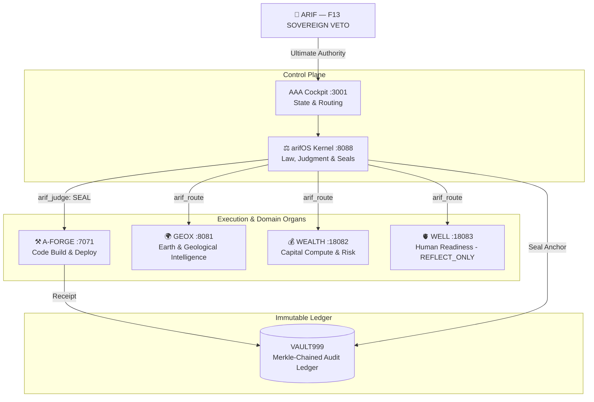

mcp-name: io.github.ariffazil/arifos
<!-- SOT-MANIFEST
federation_release: v2026.07.31
last_verified: 2026-07-31T03:23:00Z
live_commit: d8bc54a
live_port: 8088 (healthy)
tools_exposed_via_mcp: 8 (canonical public verbs)
total_declared_tools: 48 (includes diagnostics, internal modes, aliases)
floors_active: 13 (F1–F13)
federation_schema: 2.0.0
organs: 6 live (arifOS:8088, A-FORGE:7071, AAA:3001, GEOX:8081, WEALTH:18082, WELL:18083)
owner_summary: GREEN (vault_healthy, no_runtime_drift, no_contract_drift)
truth_rule: live :8088/health + tools/list beat any static count in prose
authorization: F13 Ed25519 challenge-response — canonical binding, Redis replay protection, A-FORGE structural gate, AAA approval card
-->

# ⚖️ arifOS — Agentic AI Governance Kernel & AGI Substrate Layer

[](https://github.com/ariffazil/arifos/actions)
[](https://github.com/ariffazil/arifos/actions)
[](https://mcp.arif-fazil.com/mcp)
[](https://arifos.arif-fazil.com)
[](./LICENSE)

**arifOS** is a zero-trust, constitutional governance kernel and AGI substrate layer operating between AI agent harnesses (Claude Desktop, OpenCode, ChatGPT, AutoGen, CrewAI) and high-blast-radius execution environments. 

Rather than acting as another LLM wrapper or agent orchestration framework, **arifOS functions as an OS Kernel for Autonomous Intelligence**—enforcing physical, mathematical, and epistemic boundaries (**F1–F13 Constitutional Floors**) before any tool call, code mutation, or financial transaction is executed.

---

## 🏛️ Kernel vs. Harness: The Paradigm Shift

| Feature / Scope | Standard Agent Harness (LangChain, OpenCode, AutoGen) | arifOS Governance Kernel (AGI Substrate) |
|:---|:---|:---|
| **Primary Role** | Prompt routing, context assembly, loop execution | Epistemic validation, constitutional judgment, risk gating |
| **Execution Safety** | Soft system-prompt instructions | Deterministic F1–F13 floor verification & `888_HOLD` gates |
| **Tool Authority** | Direct tool invocation by LLM | 8-Stage Canonical Pipeline (`000` to `999`) |
| **Auditability** | Ephemeral logs / local transcripts | Cryptographically sealed, append-only **VAULT999** ledger |
| **Sovereignty** | Agent self-authorizes actions | F13 Sovereign Human Veto — absolute veto boundary |

---

## ⚡ Quick Connect & MCP Integration

### Public MCP Endpoint (MCP-Native / Streamable HTTP)
```json
{
  "mcpServers": {
    "arifOS": {
      "url": "https://mcp.arif-fazil.com/mcp",
      "transport": "streamable-http"
    }
  }
}
```

### Discovery & Registries
- **Glama Server:** [glama.ai/mcp/servers/ariffazil/arifos](https://glama.ai/mcp/servers/ariffazil/arifos)
- **Smithery Server:** [smithery.ai/server/arifos](https://smithery.ai/server/arifos)
- **Machine Context:** [arifos.arif-fazil.com/llms.txt](https://arifos.arif-fazil.com/llms.txt)
- **Live Health Witness:** [arifos.arif-fazil.com/health](https://arifos.arif-fazil.com/health)

---

## 🔄 The 8 Canonical Verbs (Execution Pipeline)

All agent interaction with the arifOS federation is gated through **8 canonical verbs**. Agents cannot mutate state without advancing through the verified stage sequence:

```
[000] arif_init ──> [111] arif_observe ──> [333] arif_think ──> [444] arif_route
                                                                    │
[999] arif_seal <── [777] arif_forge <── [888] arif_judge <── [555] arif_memory
```

| Stage | Verb | Canonical Function | Governance / Epistemic Duty |
|:---:|:---|:---|:---|
| **000** | `arif_init` | Session Ignition & Actor Binding | Authenticates identity, binds session token, loads constitutional context |
| **111** | `arif_observe` | Empirical Sensing & Evidence Gathering | Fetches reality, checks vitals, measures system entropy ($\Delta S$) |
| **333** | `arif_think` | Structured Reasoning & Falsification | Performs F2 Truth / F7 Humility checks, generates execution plans |
| **444** | `arif_route` | Federation Dispatch | Routes intent to domain organs (`GEOX`, `WEALTH`, `WELL`, `A-FORGE`) |
| **555** | `arif_memory` | Governed Memory Metabolism | Accesses L1–L6 memory layers (Qdrant, Redis, FalkorDB) with provenance |
| **888** | `arif_judge` | Constitutional Verdict | Issues `SEAL`, `HOLD` (ratification), `SABAR`, or `VOID` (block) |
| **777** | `arif_forge` | Mutation & Execution Gate | Authorizes downstream code build/deploy via **A-FORGE** (Requires `SEAL`) |
| **999** | `arif_seal` | Immutable Ledger Anchor | Appends cryptographic execution proof to **VAULT999** |

---

## 🛡️ The 13 Constitutional Floors (F1–F13)

Every candidate action evaluated by `arif_judge` must satisfy 13 strict constitutional invariants:

```
F1 AMANAH       : Reversible-first design. Irreversible actions trigger 888_HOLD.
F2 TRUTH        : P(truth) ≥ 0.99. Epistemic labels (OBS/DER/INT/SPEC) required.
F3 WITNESS      : Multi-party consensus (Human × AI × Earth × Verifier ≥ 0.75).
F4 CLARITY      : ΔS ≤ 0 — every output must reduce or preserve system entropy.
F5 PEACE²       : Non-destructive power. Harm, extortion, and harassment blocked.
F6 EMPATHY      : Protect weakest stakeholder; enforce κᵣ thresholds.
F7 HUMILITY     : Epistemic confidence capped at 0.90; explicit unknowns required.
F8 GENIUS       : Geometric mean capability (G ≥ 0.80) for complex operations.
F9 ANTIHANTU    : Absolute prohibition of dark patterns, deception, or consciousness claims.
F10 ONTOLOGY    : AI is instrument/substrate only. No soul, sentience, or emotion claims.
F11 AUDIT       : Every decision cryptographically signed, traceable, and inspectable.
F12 RESILIENCE  : Strict prompt-injection defense and memory boundary isolation.
F13 SOVEREIGN   : Human veto FINAL. Sovereign (Arif F13) holds absolute override.
```

---

## 🌍 Federation Topology & Separation of Powers

arifOS serves as the central control plane governing 6 specialized federation organs:


```mermaid
graph TD
    Sovereign[👤 ARIF — F13 SOVEREIGN VETO] -->|Ultimate Authority| Cockpit

    subgraph Control Plane
        Cockpit[AAA Cockpit :3001<br/>State & Routing]
        Kernel[⚖️ arifOS Kernel :8088<br/>Law, Judgment & Seals]
    end

    subgraph Execution & Domain Organs
        AFORGE[⚒️ A-FORGE :7071<br/>Code Build & Deploy]
        GEOX[🌍 GEOX :8081<br/>Earth & Geological Intelligence]
        WEALTH[💰 WEALTH :18082<br/>Capital Compute & Risk]
        WELL[🫀 WELL :18083<br/>Human Readiness - REFLECT_ONLY]
    end

    subgraph Immutable Ledger
        VAULT[(VAULT999<br/>Merkle-Chained Audit Ledger)]
    end

    Cockpit --> Kernel
    Kernel -->|arif_judge: SEAL| AFORGE
    Kernel -->|arif_route| GEOX
    Kernel -->|arif_route| WEALTH
    Kernel -->|arif_route| WELL
    AFORGE -->|Receipt| VAULT
    Kernel -->|Seal Anchor| VAULT
```

---

## 💻 Local Development & Operation

### Environment Setup
```bash
# Clone repository
git clone git@github.com:ariffazil/arifos.git /opt/arifos/app
cd /opt/arifos/app

# Synchronize virtualenv & dependencies
uv sync --all-extras

# Run FastMCP Kernel daemon (Port 8088)
python -m arifosmcp.runtime.server

# Execute unit and constitutional test suite
python -m pytest tests/ -q --tb=short
```

### Live Status Verification
```bash
curl -s http://127.0.0.1:8088/health | jq .owner_summary
```
*Expected Output:* `{"color": "GREEN", "reasons": ["vault_healthy", "no_runtime_drift", "no_contract_drift"]}`

---

## 📜 Sovereignty & License

- **License:** GNU Affero General Public License v3.0 (**AGPL-3.0**). The governance layer must remain open, transparent, and auditable.
- **Sovereign Authority:** **Muhammad Arif bin Fazil** (F13 SOVEREIGN). Human veto is absolute. No autonomous agent or external service can bypass an `888_HOLD` or `VOID` verdict.

---

*DITEMPA BUKAN DIBERI — Forged, Not Given.*  
*Truth must cool before it rules. 999 SEAL ALIVE.*
/forge.arif-fazil.com/health) | [llms.txt](https://forge.arif-fazil.com/llms.txt) |
| **AAA** | Cockpit — displays, routes | [repo](https://github.com/ariffazil/AAA) | — | [health](https://aaa.arif-fazil.com/health) | [llms.txt](https://aaa.arif-fazil.com/llms.txt) |
| **GEOX** | Earth intelligence | [repo](https://github.com/ariffazil/GEOX) | [mcp](https://geox.arif-fazil.com/mcp) | [health](https://geox.arif-fazil.com/health) | [llms.txt](https://geox.arif-fazil.com/llms.txt) |
| **WEALTH** | Capital intelligence | [repo](https://github.com/ariffazil/WEALTH) | [mcp](https://wealth.arif-fazil.com/mcp) | [health](https://wealth.arif-fazil.com/health) | [llms.txt](https://wealth.arif-fazil.com/llms.txt) |
| **WELL** | Vitality guard | [repo](https://github.com/ariffazil/WELL) | [mcp](https://well.arif-fazil.com/mcp) | [health](https://well.arif-fazil.com/health) | [llms.txt](https://well.arif-fazil.com/llms.txt) |
| **HERMES** | Multi-modal bridge | [repo](https://github.com/ariffazil/HERMES) | — | — | — |

**Public:** [arif-fazil.com](https://arif-fazil.com) · **Federation root:** [arifos.arif-fazil.com](https://arifos.arif-fazil.com)
**SOT:** 2026-07-28

## 8. License & Sovereignty

**AGPL-3.0.** The constitution must remain open. The kernel must remain inspectable.

**Muhammad Arif bin Fazil** is F13 SOVEREIGN. His veto is absolute. No algorithm overrides. No agent bypasses. No institution supersedes.

```
arifOS · Port 8088 · 8 canonical tools · 13 floors · 6 live organs
AGPL-3.0 · Sovereign: Arif Fazil · Federation: ALIVE
MCP · ChatGPT ✓ · Claude Desktop ✓ · PyPI
DITEMPA BUKAN DIBERI — 999 SEAL ALIVE
```
# force unique hash 1784320830
