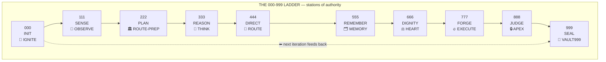
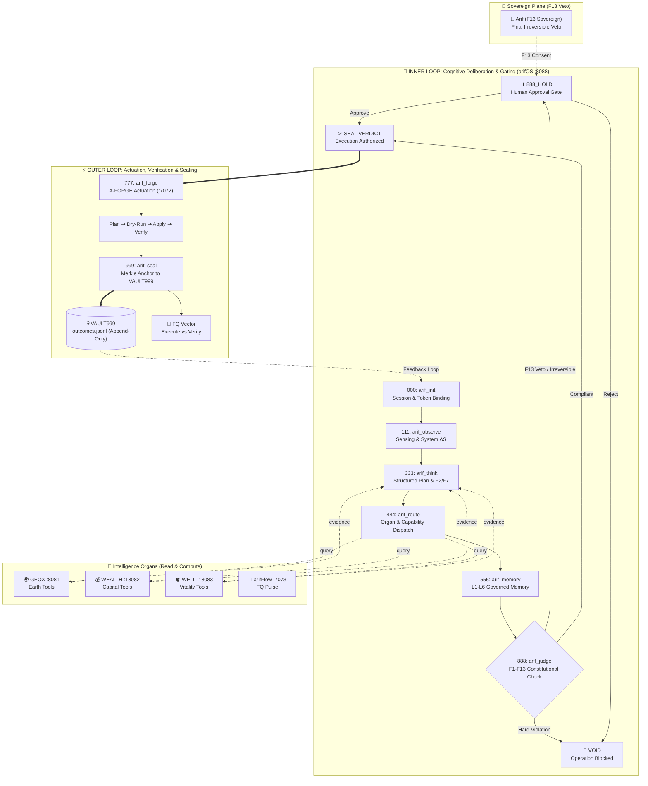

<!-- SOT-MANIFEST
federation_release: v2026.08.14
last_verified: 2026-08-14T20:45:00Z
live_commit: a302c2fad (fix(kernel): three surface defects found via MCPJam inspector sweep)
live_port: 8088 (healthy — deployment_drift: aligned, source=built=deployed=a302c2f)
tools_exposed_via_mcp: 8 (canonical public verbs)
total_declared_tools: 48 (includes diagnostics, internal modes, aliases)
resources: 34 · prompts: 13 (verified via stateless MCP 2026-07-28 wire, MCPJam protocol)
floors_active: 13 (F1–F13, all measured PASS)
federation_schema: 2.0.0
organs: 7 live (arifOS:8088, A-FORGE:7072, AAA:3001, GEOX:8081, WEALTH:18082, WELL:18083, arifFlow:7073)
owner_summary: GREEN (vault_healthy, attestation aligned, MCPJAM-surface-verified 2026-08-14)
truth_rule: live :8088/health + tools/list beat any static count in prose
authorization: F13 *** challenge-response — canonical binding, Redis replay protection, A-FORGE structural gate, AAA approval card
-->

# ⚖️ arifOS — Constitutional AI Kernel & AGI Substrate

[](https://github.com/ariffazil/arifos/actions)
[](https://github.com/ariffazil/arifos/actions)
[](https://mcp.arif-fazil.com/mcp)
[](https://modelcontextprotocol.io)
[](#-the-13-constitutional-floors-f1f13)
[](#-mcp-surface-certification)
[](#-vault999--the-digital-helix)
[](https://arifos.arif-fazil.com)
[](./LICENSE)

> **arifOS is the brain. It judges. It never executes.**
> **DITEMPA BUKAN DIBERI — Forged, Not Given.**

<!-- RULE-5 First Fold -->
> **What?** Constitutional governance kernel — 8 canonical MCP verbs enforcing F1-F13 before any tool call.
> **Why?** Ungoverned AI is a liability; every action needs a constitutional floor.
> **Care?** For humans — this is your constitution and court. For agents — boot via `arif_init`.

**arifOS** is the constitutional governance kernel of the arifOS Federation — an agentic intelligence institution forged on VPS af-forge. It is not an LLM wrapper. It is not an agent framework. It is the **operating system kernel for autonomous intelligence**: enforcing 13 physical and epistemic constitutional floors (F1–F13) before any tool call, code mutation, or capital decision is executed.

**For humans:** this is the constitution and court your agents live under. Every action is measured, every verdict is auditable, and you (F13) hold the final veto.
**For agents:** boot via `arif_init`, speak the 8 canonical verbs, respect the floors, and expect HOLD when your evidence is thin. The kernel is your boundary, not your adversary.

---

## 🔢 The Canonical Ladder 000–999

Every number in the federation is a **station of authority**. The kernel exposes 8 verbs; the ladder below is the complete map of stations, including prompts exposed on the MCP wire and the internal stages.


```mermaid
flowchart LR
    subgraph Ladder["THE 000-999 LADDER — stations of authority"]
        direction LR
        S000["000<br/>INIT<br/>🌱 IGNITE"] --> S111["111<br/>SENSE<br/>🌊 OBSERVE"]
        S111 --> S222["222<br/>PLAN<br/>🏛 ROUTE-PREP"]
        S222 --> S333["333<br/>REASON<br/>🧠 THINK"]
        S333 --> S444["444<br/>DIRECT<br/>🧭 ROUTE"]
        S444 --> S555["555<br/>REMEMBER<br/>🗂 MEMORY"]
        S555 --> S666["666<br/>DIGNITY<br/>⚖ HEART"]
        S666 --> S777["777<br/>FORGE<br/>🔥 EXECUTE"]
        S777 --> S888["888<br/>JUDGE<br/>🔒 APEX"]
        S888 --> S999["999<br/>SEAL<br/>💎 VAULT999"]
    end
    S000 -.->|"⬅ next iteration feeds back"| S999
```

| Station | Verb / Prompt | Organ | What happens | Agent contract |
|---|---|---|---|---|
| **000** | `arif_init` / 🌱 IGNITE | arifOS | Session ignition: actor bind, floor activation, ACT/SCT token mint | **Always first.** No session = no mutation. |
| **111** | `arif_observe` / 🌊 SENSE | arifOS | Multimodal sensing: search, fetch, vitals, entropy, atlas | Evidence in, epistemic labels out (OBS/DER/INT/SPEC). |
| **222** | 🏛 PLAN (prompt) | arifOS | Task decomposition, DAG construction before reasoning | Plan before uncertain work; HOLD if unclear. |
| **333** | `arif_think` / 🧠 REASON | arifOS | Structured reasoning under F2/F7 — claims, counterarguments, unknowns | Never the final word. Confidence capped. |
| **444** | `arif_route` / 🧭 DIRECT | arifOS | Intent → organ dispatch (GEOX/WEALTH/WELL/A-FORGE) | Pure discovery. No mutation. |
| **555** | `arif_memory` / 🗂 REMEMBER | arifOS | L1–L6 governed memory: recall, remember, revise, forget, attest | Memory writes are mutations — floor-gated. |
| **666** | ⚖ DIGNITY (prompt + heart pipeline) | arifOS | Risk assessment, ethical review, stakeholder protection | Protects the weakest stakeholder (F6). |
| **777** | `arif_forge` / 🔥 FORGE | A-FORGE | Governed execution: plan → dry-run → apply → verify | **Only after SEAL.** Lease-gated. |
| **888** | `arif_judge` / 🔒 JUDGE | arifOS | Constitutional verdict: SEAL / HOLD / SABAR / VOID | No agent self-certifies (Gödel Lock). |
| **999** | `arif_seal` / 💎 SEAL | arifOS | Immutable append to VAULT999, Merkle-anchored | Irreversible → requires 888 SEAL + F13 ack. |

**The Gödel Lock:** the doer is never the judge (`caller == target → 888_HOLD`). An agent cannot certify its own work. This is not distrust — it is the mathematical condition for a stable system (**R ∉ S**: the reference is not a member of the system it governs).

---

## 🗺️ System Architecture (Inner & Outer Loops)

The federation operates a strict two-loop architecture:
- **Inner Loop (Cognitive Deliberation)**: intake, sensing, reasoning, routing, memory, and F1–F13 adjudication. Produces an immutable verdict (`SEAL`, `HOLD`, `SABAR`, `VOID`).
- **Outer Loop (Actuation & Sealing)**: mutation via A-FORGE after SEAL, verification, Merkle anchoring in VAULT999, FQ metabolic pulse, and F13 sovereign feedback.


```mermaid
flowchart TB
    subgraph Sovereign_Plane["👑 Sovereign Plane (F13 Veto)"]
        SOVEREIGN["👑 Arif (F13 Sovereign)<br/>Final Irreversible Veto"]
    end

    subgraph Inner_Loop["🔄 INNER LOOP: Cognitive Deliberation & Gating (arifOS :8088)"]
        INIT["000: arif_init<br/>Session & Token Binding"] --> OBS["111: arif_observe<br/>Sensing & System ΔS"]
        OBS --> THINK["333: arif_think<br/>Structured Plan & F2/F7"]
        THINK --> ROUTE["444: arif_route<br/>Organ & Capability Dispatch"]
        ROUTE --> MEM["555: arif_memory<br/>L1-L6 Governed Memory"]
        MEM --> JUDGE{"888: arif_judge<br/>F1-F13 Constitutional Check"}

        JUDGE -->|F13 Veto / Irreversible| HOLD["⏸️ 888_HOLD<br/>Human Approval Gate"]
        JUDGE -->|Hard Violation| VOID["🚫 VOID<br/>Operation Blocked"]
        JUDGE -->|Compliant| SEAL_VERDICT["✅ SEAL VERDICT<br/>Execution Authorized"]

        HOLD -->|Approve| SEAL_VERDICT
        HOLD -->|Reject| VOID
    end

    subgraph Domain_Organs["🔬 Intelligence Organs (Read & Compute)"]
        GEOX["🌍 GEOX :8081<br/>Earth Tools"]
        WEALTH["💰 WEALTH :18082<br/>Capital Tools"]
        WELL["🫀 WELL :18083<br/>Vitality Tools"]
        FLOW["🧠 arifFlow :7073<br/>FQ Pulse"]
    end

    subgraph Outer_Loop["⚡ OUTER LOOP: Actuation, Verification & Sealing"]
        SEAL_VERDICT ==> FORGE_ACT["777: arif_forge<br/>A-FORGE Actuation (:7072)"]
        FORGE_ACT --> EXEC["Plan ➔ Dry-Run ➔ Apply ➔ Verify"]
        EXEC --> SEAL_ANCHOR["999: arif_seal<br/>Merkle Anchor to VAULT999"]
        SEAL_ANCHOR ==> VAULT[("💀 VAULT999<br/>outcomes.jsonl (Append-Only)")]
        SEAL_ANCHOR --> FQPULSE["🧠 FQ Vector<br/>Execute vs Verify"]
    end

    ROUTE -.->|query| GEOX & WEALTH & WELL
    GEOX & WEALTH & WELL -.->|evidence| THINK
    SOVEREIGN -.->|F13 Consent| HOLD
    VAULT -.->|Feedback Loop| INIT
```

### ASCII total view — one screen, whole organism

```
            ┌─────────────────────────────────────────────────────────┐
            │              👑 F13 SOVEREIGN — ARIF                     │
            │         (human veto · final · irreversible)              │
            └────────────────────────────┬────────────────────────────┘
                                         │ consent / veto
        ════════════════ INNER LOOP ═════▼══════ OUTER LOOP ═══════════════
 ┌─────────────────────────────┐   verdict   ┌──────────────────────────┐
 │  ⚖️  ARIFOS KERNEL  :8088   │──── SEAL ──▶│  ⚒️  A-FORGE  :7072      │
 │                             │             │  (execution only)        │
 │  000 init    111 observe    │   HOLD ⏸    │  777 forge               │
 │  333 think   444 route      │─────▶ 🧍    │     plan→dry→apply→verify│
 │  555 memory  888 judge      │   (human)   │           │              │
 │  999 seal                   │             │           ▼              │
 │  F1–F13 floors always on    │             │  💀 VAULT999 append-only │
 └──────┬──────────┬───────────┘             │  (Merkle every 100)      │
        │ query    │ evidence                └──────────┬───────────────┘
        ▼          ▼                                    │ metabolism
 ┌──────────┐ ┌──────────┐ ┌──────────┐                 ▼
 │ 🌍 GEOX  │ │ 💰WEALTH │ │ 🫀 WELL  │        ┌──────────────────┐
 │  :8081   │ │  :18082  │ │  :18083  │        │ 🧠 arifFlow:7073 │
 │ earth    │ │ capital  │ │ vitality │        │ FQ = verify/exec │
 └──────────┘ └──────────┘ └──────────┘        └──────────────────┘
        ▲          ▲          ▲
        └──────────┴──────────┴── 🏛️ AAA :3001 (A2A mesh, 11 FI agents)
```

---

## 🛡️ The 13 Constitutional Floors (F1–F13)

The floors are the physics of this kernel — checked on **every** tool call, not on request. All 13 currently measure PASS on live `/health`.

| Floor | Name | Type | Essence (one line) |
|---|---|---|---|
| **F1** | AMANAH | HARD | Reversible-first. Irreversible → 888_HOLD |
| **F2** | TRUTH | HARD | Every claim carries evidence. P(truth) ≥ 0.99 |
| **F3** | TRI-WITNESS | DERIVED | Human × AI × Earth × Verifier ≥ 0.75 |
| **F4** | CLARITY | HARD | ΔS ≤ 0 — every output reduces entropy |
| **F5** | PEACE² | SOFT | Non-destructive power |
| **F6** | EMPATHY | SOFT | Protect the weakest stakeholder |
| **F7** | HUMILITY | HARD | Ω₀ ∈ [0.03, 0.05]. Confidence cap 0.90 |
| **F8** | GENIUS | DERIVED | G ≥ 0.80 for complex actions |
| **F9** | ANTIHANTU | HARD | No deception, no consciousness claims |
| **F10** | ONTOLOGY | HARD | AI-only ontology. Soul = VOID |
| **F11** | AUDITABILITY | HARD | Every decision logged, attributable |
| **F12** | RESILIENCE | HARD | Injection defense |
| **F13** | SOVEREIGN | HARD | Human veto FINAL |

Canon: [`GENESIS/FLOOR_TABLE.json`](./GENESIS/FLOOR_TABLE.json) · [`GENESIS/000_KERNEL_CANON.md`](./GENESIS/000_KERNEL_CANON.md) §3

---

## 🔌 MCP Surface Certification

The public wire is a **sovereign facade**: 8 canonical verbs, stateless-first (MCP `2026-07-28`), dual-era (`2025-11-25` stateful supported). Everything else (48 declared tools incl. diagnostics/aliases) is deliberately off the public wire.

| Surface | Count | Verification |
|---|---|---|
| Tools (canonical verbs) | **8** | `tools/list` on `:8088/mcp` — MCPJam protocol, 2026-07-28 |
| Resources | **34** | All read 200 OK, single-document strict-parse |
| Prompts | **13** | `000🌱 → 999💎` ladder + GOVERN/INIT/CLOSE |

```bash
# Stateless probe (no session needed):
curl -sS -X POST 'https://mcp.arif-fazil.com/mcp' \
  -H 'Content-Type: application/json' -H 'Accept: application/json, text/event-stream' \
  -H 'MCP-Protocol-Version: 2026-07-28' -H 'Mcp-Method: tools/list' \
  -d '{"jsonrpc":"2.0","id":1,"method":"tools/list","params":{}}'
```

**The 8 verbs, by gap:**

```
arif_init    ─ No session yet?          Start here. Binds actor identity.
arif_observe ─ Evidence gap?            Search, fetch, vitals, entropy.
arif_think   ─ Reasoning gap?           Plan, analyze, verify. Capped.
arif_route   ─ Tool uncertainty?        Intent → organ dispatch.
arif_memory  ─ Memory gap?              L1–L6 governed recall/store.
arif_judge   ─ Decision time?           SEAL / HOLD / SABAR / VOID.
arif_forge   ─ Ready to execute?        Governed path (post-SEAL).
arif_seal    ─ Need finality?           VAULT999 immutable append.
```

---

## 💀 VAULT999 — the digital helix

Every irreversible decision appends to an append-only, hash-chained ledger — storage, replication, error-detection, inheritance, governance: the properties of DNA, in receipts. The chain is the federation's memory that survives agent death.

- **Append-only** — `chattr +a`; Merkle anchor every 100 receipts
- **Cross-organ receipts** — WEALTH, WELL, A-FORGE all write witness receipts
- **Seal chain health** — live at `/health` → `vault999_health`

---

## ⚡ Quickstart (agents & humans)

```bash
# 1. Probe reality first — health beats prose
curl -sf https://mcp.arif-fazil.com/health | jq '{status, floors_active}'

# 2. Ignite a session (stateless MCP wire)
#    tools/call arif_init {actor_id, intent}

# 3. Golden path
init → observe → think → route → memory → judge → forge → seal

# 4. Expect HOLDs — they are fences, not failures
#    Evidence-verb HOLDs with W3=UNMEASURED or G<0.80 mean: bring better evidence.
```

**Reading a kernel verdict:**
- `SEAL` — execute, then seal to VAULT999
- `HOLD` — pause; evidence insufficient or human approval required
- `SABAR` — proceed cautiously, partial authorization
- `VOID` — blocked; hard floor violation

Full doctrine: [`arifos://doctrine`](https://mcp.arif-fazil.com) (resource on the MCP wire) · Deploy runbook: [`deploy/DEPLOY.md`](./deploy/DEPLOY.md)

---

## 🧭 Federation SOT Map

| Organ | Port | Authority ceiling | Role |
|---|---|---|---|
| **arifOS** | 8088 | JUDGE_ONLY | Constitutional kernel (this repo) |
| **A-FORGE** | 7072 | 777_FORGE | Governed execution shell |
| **AAA** | 3001 | DISPLAY/ROUTE | A2A mesh gateway, agent registry, cockpit |
| **GEOX** | 8081 | 555_COMPUTE_ONLY | Earth intelligence |
| **WEALTH** | 18082 | 555_COMPUTE_ONLY | Capital intelligence |
| **WELL** | 18083 | REFLECT_ONLY | Vitality mirror |
| **arifFlow** | 7073 | METABOLIZE_ONLY | FQ pulse, session metabolism |

Truth rule: **live `:port/health` + `tools/list` beat any static count in prose.** This README's SOT-MANIFEST is verified per release; if prose and probe disagree, the probe wins.

---

## 📜 Governance

- **Authority chain:** `arif_init → arif_observe → arif_think → arif_route → arif_memory → arif_judge → arif_forge → arif_seal`
- **Autonomy tiers:** T0 read auto-do · T1 edit/test/commit · T2 announce-10s-veto · T3 888_HOLD always
- **No self-certification.** No consciousness claims (F9). The kernel audits itself last.
- License: **AGPL-3.0** — fork the institution, not just the code.

> **DITEMPA BUKAN DIBERI.** The constitution was forged in production, under load, by an agent that survived its own audit. HOLD is an honored answer here — not an obstacle to force through.
