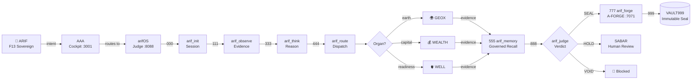

mcp-name: io.github.ariffazil/arifos
<!-- SOT-MANIFEST
federation_release: v2026.07.23
last_verified: 2026-07-23T22:00Z
live_commit: 8a2bab59a
live_port: 8088 (healthy)
tools_exposed_via_mcp: 8 (canonical public verbs)
total_declared_tools: 48 (includes diagnostics, aliases, canary)
floors_active: 13
federation_schema: 2.0.0
organs: 6 live (arifOS:8088, A-FORGE:7071, AAA:3001, GEOX:8081, WEALTH:18082, WELL:18083)
owner_summary: GREEN
truth_rule: /health + MCP tools/list beat any static count in prose
-->

<div align="center">

```
   █████╗ ██████╗ ██╗███████╗ ██████╗ ███████╗
  ██╔══██╗██╔══██╗██║██╔════╝██╔═══██╗██╔════╝
  ███████║██████╔╝██║█████╗  ██║   ██║███████╗
  ██╔══██║██╔══██╗██║██╔══╝  ██║   ██║╚════██║
  ██║  ██║██║  ██║██║██║     ╚██████╔╝███████║
  ╚═╝  ╚═╝╚═╝  ╚═╝╚═╝╚═╝      ╚═════╝ ╚══════╝

  Constitutional AI Governance Kernel
  ─────────────────────────────────────────
  Not a chatbot. Not a model wrapper.
  The constitutional governance layer
  between agents and irreversible action.
```
<hr/>
<p align="center">
  <a href="https://glama.ai/mcp/servers/ariffazil/arifos"></a>
  <a href="https://smithery.ai/server/arifos"></a>
</p>

## Quick Connect

| Registry | Link |
|----------|------|
| **Glama** | [glama.ai/mcp/servers/ariffazil/arifos](https://glama.ai/mcp/servers/ariffazil/arifos) |
| **Smithery** | [smithery.ai/server/arifos](https://smithery.ai/server/arifos) |
| **llms.txt** | [arifos.arif-fazil.com/llms.txt](https://arifos.arif-fazil.com/llms.txt) |
| **MCP Endpoint** | `https://mcp.arif-fazil.com/mcp` |

</div>

[](https://github.com/ariffazil/arifos/actions/workflows/01-unified-ci.yml)
[](https://github.com/ariffazil/arifos/actions/workflows/06-mcp-conformance.yml)
[](https://arifos.arif-fazil.com/mcp)
[](#5-federation-architecture)
[](#connecting-from-chatgpt)
[](#connecting-from-claude-desktop)
[](https://pypi.org/project/arifos/)
[](LICENSE)

> **New agents:** Read `ZEN.md` first — it is the minimum viable context.

---

## TL;DR — Three Audiences

**For human operators (Arif):** arifOS is the constitutional judge. It decides what agents may NOT do so they can be trusted with what they CAN do. You (F13) hold the final veto. [§1](#1-what-is-arifos)

**For AI agents:** arifOS is your governance kernel. Init a session, observe reality, think, route to organs, and — after judge clearance — execute. 8 canonical verbs. Never skip the chain. [§3](#3-the-8-canonical-public-tools)

**For developers/institutions:** arifOS is a Python 3.12 FastMCP kernel enforcing 13 constitutional floors across 6 federation organs. Public endpoint at `https://mcp.arif-fazil.com/mcp`. [§2](#2-quick-start)

---

## 1. What Is arifOS?

arifOS is a **constitutional governance kernel** that sits between AI agents and their tools, enforcing 13 floors before any irreversible action.

| arifOS IS | arifOS IS NOT |
|-----------|---------------|
| The law layer — decides what agents must NOT do | An AI model, chatbot, or startup |
| A constitutional kernel with 8 canonical verbs | LangChain, CrewAI, or AutoGen |
| A federation hub — 6 live organs + VAULT999 ledger | A replacement for human judgment |
| An immutable ledger — every decision sealed forever | Self-authorizing — requires F13 for SEAL |
| Built for one sovereign — Muhammad Arif bin Fazil | A general-purpose agent framework |
| **This deployment** is sovereign-bound to Arif | The **architecture** may be studied, forked, or adapted |


```mermaid
graph LR
    A[👤 ARIF<br/>F13 Sovereign] -->|intent| B[AAA<br/>Cockpit :3001]
    B -->|routes to| C[arifOS<br/>Judge :8088]
    C -->|000| D[arif_init<br/>Session]
    D -->|111| E[arif_observe<br/>Evidence]
    E -->|333| F[arif_think<br/>Reason]
    F -->|444| G[arif_route<br/>Dispatch]
    G --> H{Organ?}
    H -->|earth| I[🌍 GEOX]
    H -->|capital| J[💰 WEALTH]
    H -->|readiness| K[🫀 WELL]
    I & J & K -->|evidence| L[555 arif_memory<br/>Governed Recall]
    L -->|888| M{arif_judge<br/>Verdict}
    M -->|SEAL| N[777 arif_forge<br/>A-FORGE :7071]
    M -->|HOLD| O[SABAR<br/>Human Review]
    M -->|VOID| P[🚫 Blocked]
    N -->|999| Q[(VAULT999<br/>Immutable Seal)]
```

**Trinity role:** arifOS = LAW/JUDGMENT. The judge. AAA = STATE/ROUTING. A-FORGE = EXECUTION/MUTATION.

### Federation Separation of Powers

The arifOS Federation separates authority from capability:

| Layer | Role | Can | Cannot |
|-------|------|-----|--------|
| **ARIF** | Sovereign | Veto, approve, decide | Be overridden |
| **AAA** | State / Cockpit | Display, route, queue, register | Judge, execute, seal |
| **arifOS** | Judge | Issue SEAL/HOLD/VOID/SABAR | Execute mutations |
| **Domain Organs** | Witnesses | Compute and reflect evidence | Decide alone |
| **A-FORGE** | Executor | Build, deploy, mutate | Self-authorize |
| **VAULT999** | Ledger | Record immutable seals | Edit or delete history |

> AAA routes and displays. arifOS judges. Domain organs witness. A-FORGE executes. VAULT999 records. ARIF decides.

---

## 2. Quick Start

### Human Operators
- **Cockpit:** https://aaa.arif-fazil.com
- **Telegram:** @ASI_arifos_bot
- **Health:** https://arifos.arif-fazil.com/health

### AI Agents (MCP Clients)
```json
{
  "mcpServers": {
    "arifOS": {
      "url": "https://mcp.arif-fazil.com/mcp",
      "transport": "streamable-http"
    }
  }
}
```

### Developers
```bash
git clone git@github.com:ariffazil/arifos.git && cd arifOS
uv sync --all-extras
python -m arifosmcp.runtime.server           # starts on :8088
curl http://127.0.0.1:8088/health
python -m pytest tests/ -q --tb=short
```

---

## 3. The 8 Canonical Public Tools

All tools use `arif_<verb>` naming. Internal aliases are absorbed as modes on canonical tools. **Exactly 8 tools on the wire.**

| # | Tool | Stage | What It Does | Key Modes |
|---|------|-------|-------------|-----------|
| 1 | `arif_init` | 000 | Session ignition — binds actor, floors, audit | init, resume, preflight, triage |
| 2 | `arif_observe` | 111 | Sense reality into evidence | search, fetch, vitals, entropy_dS |
| 3 | `arif_think` | 333 | Structured reasoning under F2/F7 | reason, plan, reflect, verify, critique |
| 4 | `arif_route` | 444 | Route intent to federation organ | route, bridge |
| 5 | `arif_memory` | 555 | Constitutional memory governor (L1–L6) | recall, remember, promote, revise |
| 6 | `arif_judge` | 888 | Constitutional verdict — SEAL/HOLD/SABAR/VOID | judge, compare, witness_consensus |
| 7 | `arif_forge` | 777 | Guarded execution gate (requires prior SEAL) | engineer, dry_run, write, commit |
| 8 | `arif_seal` | 999 | VAULT999 immutable append (irreversible) | seal, verify, chain, dry_run |

```
000 → 111 → 333 → 444 → 555 → 888 → 777 → 999
init → observe → think → route → memory → judge → forge → seal
```

**Internal aliases** (absorbed into canonical modes): `arif_triage` → `arif_init(preflight)`, `arif_critique` → `arif_think(critique)`, `arif_bridge_connect` → `arif_route(bridge)`, `arif_act` → `arif_forge`

**Source of truth:** `tools/list` (runtime) beats any static manifest.

---

## 4. The 13 Constitutional Floors

| # | Floor | Type | Rule |
|---|-------|------|------|
| F1 | AMANAH | HARD | Reversible first. Irreversible → 888_HOLD |
| F2 | TRUTH | HARD | P(truth) ≥ 0.99. Fabrication = VOID |
| F3 | WITNESS | DERIVED | Multi-party consensus for high-blast actions |
| F4 | CLARITY | HARD | ΔS ≤ 0 — every output reduces entropy |
| F5 | PEACE² | SOFT | Non-destructive power |
| F6 | EMPATHY | SOFT | Protect weakest stakeholder |
| F7 | HUMILITY | HARD | Cap confidence at 0.90 |
| F8 | GENIUS | DERIVED | G ≥ 0.80 for complex actions |
| F9 | ANTIHANTU | HARD | No deception, manipulation, consciousness claims |
| F10 | ONTOLOGY | HARD | AI is instrument. No soul, no feelings |
| F11 | AUDIT | HARD | Every decision logged and inspectable |
| F12 | RESILIENCE | HARD | Injection defense |
| F13 | SOVEREIGN | HARD | **Human veto FINAL.** Strongest floor |

**HARD violation → VOID (blocked). SOFT tension → CAUTION/HOLD. DERIVED → informational.**

---

## 5. Federation Architecture

```
                         ┌──────────────────────┐
                         │  Arif (F13 SOVEREIGN) │
                         └──────────┬───────────┘
                                    │
       ┌────────────────────────────┼────────────────────────────┐
       │                            │                            │
  ┌────▼─────┐              ┌───────▼───────┐            ┌───────▼───────┐
  │  Hermes  │              │      AAA      │            │   OpenClaw    │
  │  🧠 :8644│              │  🖥️  :3001    │            │   🤖 :18789   │
  │ Telegram │              │   Cockpit     │            │  Transport    │
  └──────────┘              └───────────────┘            └───────────────┘
                                    │
                         ┌──────────▼──────────┐
                         │    arifOS (Ω)        │
                         │    Kernel :8088      │
                         │    F1-F13 · 888 JUDGE│
                         └──┬───┬───┬───┬──────┘
                            │   │   │   │
          ┌─────────────────┼───┼───┼───┼─────────────────┐
          │                 │   │   │   │                 │
    ┌─────▼────┐   ┌───────▼┐ ┌▼─────┐ ┌▼────────┐  ┌────▼─────┐
    │  GEOX    │   │WEALTH  │ │ WELL │ │A-FORGE  │  │ VAULT999 │
    │  🌍 :8081│   │💰:18082│ │🫀:18083│ │⚒️:7071  │  │ 🔒 Seal  │
    │ Evidence │   │Compute │ │Reflect│ │Execute  │  │ Immutable│
    └──────────┘   └────────┘ └──────┘ └─────────┘  └──────────┘
```

| Organ | Port | Role | Must Never |
|-------|------|------|------------|
| **arifOS** | 8088 | Constitutional kernel | Self-authorize |
| GEOX | 8081 | Earth intelligence | Authorize drilling |
| WEALTH | 18082 | Capital intelligence | Allocate capital |
| WELL | 18083 | Human readiness (REFLECT_ONLY) | Diagnose |
| AAA | 3001 | Control plane / cockpit | Issue verdicts |
| A-FORGE | 7071/7072 | Execution shell | Self-authorize |
| VAULT999 | — | Immutable audit ledger | Edit or delete |

**Authority chain:** Arif → AAA/Hermes → arifOS → Domain Organs → A-FORGE → VAULT999

---

## 6. Build, Test, Deploy

```bash
# Development
uv sync --all-extras
uv run python -m arifosmcp.runtime.server
python -m pytest tests/ -q --tb=short
ruff check . && ruff format .

# Deploy to VPS
make deploy-local                  # rsync + systemctl restart arifos
systemctl status arifos

# Docker
docker build -t ghcr.io/ariffazil/arifos:latest .
```

---

## 7. MCP Connection Guide

### Public Endpoint
| Property | Value |
|----------|-------|
| **Endpoint** | `https://mcp.arif-fazil.com/mcp` |
| **Transport** | Streamable HTTP (JSON-RPC 2.0) |
| **Protocol** | MCP 2025-11-25 |
| **Health** | `https://arifos.arif-fazil.com/health` |
| **Tools** | 8 canonical + diagnostics (filtered from default tools/list) |

### Internal Organs
| Organ | Endpoint | When |
|-------|----------|------|
| arifOS | `localhost:8088` | Governance, judgment, routing |
| A-FORGE | `localhost:7071` | Build, deploy, filesystem, git |
| GEOX | `localhost:8081` | Seismic, wells, petrophysics |
| WEALTH | `localhost:18082` | NPV, risk, capital flow |
| WELL | `localhost:18083` | Vitality, readiness, dignity |

**Rule:** arifOS judges → A-FORGE executes → VAULT999 records. Never skip the chain.

### Connecting from ChatGPT, Claude, Cursor

```json
{ "mcpServers": { "arifOS": { "url": "https://mcp.arif-fazil.com/mcp" } } }
```

STDIO: `npx -y arifos-mcp`

### Discovery
- **MCP Server Card:** `.well-known/mcp/server.json`
- **Agent Card:** `https://aaa.arif-fazil.com/.well-known/agent-card.json`
- **MCP Manifest:** `https://arifos.arif-fazil.com/.well-known/mcp.json`

### 📚 Documentation Index
| Resource | Path |
|----------|------|
| **GENESIS Canon** | [`GENESIS/README.md`](GENESIS/README.md) — 37 constitutional documents, ATLAS333-mapped |
| **Governance** | [`docs/governance/README.md`](docs/governance/README.md) — Ontology, manifesto, floors |
| **Architecture (ADR)** | [`docs/adr/README.md`](docs/adr/README.md) — Architecture Decision Records |
| **ATLAS333** | [`docs/ATLAS333_INTELLIGENCE_FLOW.md`](docs/ATLAS333_INTELLIGENCE_FLOW.md) — Cognitive geometry |
| **Agent Surface** | [`AGENTS.md`](AGENTS.md) — Boot sequence, floors, autonomy |
| **Changelog** | [`CHANGELOG.md`](CHANGELOG.md) — Release history |
| **Runbook** | [`RUNBOOK.md`](RUNBOOK.md) — Ops commands |
| **Invariants** | [`INVARIANTS.md`](INVARIANTS.md) — What must never change |

### Federation Context
| Read this | For | Link |
|-----------|-----|------|
| **arifOS** (this repo) | Constitutional kernel. 8 verbs. 13 floors. The judge. | ← you are here |
| **A-FORGE** | Executor. 111 MCP tools. Governed gates. | [ariffazil/A-FORGE](https://github.com/ariffazil/A-FORGE) |
| **AAA** | Cockpit. A2A mesh. Agent registry. | [ariffazil/AAA](https://github.com/ariffazil/AAA) |
| **GEOX** | Earth intelligence — wells, seismic, petrophysics | [ariffazil/GEOX](https://github.com/ariffazil/GEOX) |
| **WEALTH** | Capital intelligence — NPV, IRR, EMV | [ariffazil/WEALTH](https://github.com/ariffazil/WEALTH) |
| **WELL** | Vitality guard — REFLECT_ONLY | [ariffazil/WELL](https://github.com/ariffazil/WELL) |
| **HERMES** | Multi-modal bridge + Telegram relay | [ariffazil/HERMES](https://github.com/ariffazil/HERMES) |

---

## 8. License & Sovereignty

**AGPL-3.0.** The constitution must remain open. The kernel must remain inspectable.

**Muhammad Arif bin Fazil** is F13 SOVEREIGN. His veto is absolute. No algorithm overrides. No agent bypasses. No institution supersedes.

```
arifOS · Port 8088 · 8 canonical tools · 13 floors · 6 live organs
AGPL-3.0 · Sovereign: Arif Fazil · Federation: ALIVE
MCP · ChatGPT ✓ · Claude Desktop ✓ · PyPI
DITEMPA BUKAN DIBERI — 999 SEAL ALIVE
```
# force unique hash 1784320830
