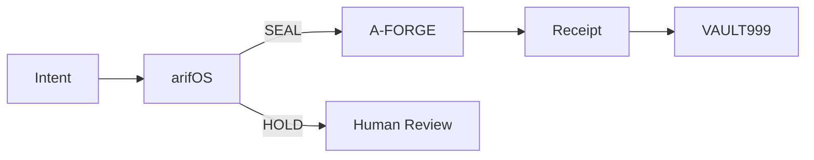

<!-- SOT-MANIFEST
federation_release: v2026.08.25
last_verified: 2026-08-25T04:15:00Z
live_commit: e52e36afd (docs(webmcp): public console is unavailable; door is /mcp)
tools_exposed_via_mcp: 8 (canonical public verbs — KERNEL_ABI_8, live-witnessed 2026-08-25 via mcp.arif-fazil.com/mcp tools/list)
total_declared_tools: 48 (includes diagnostics, internal modes, aliases)
resources: 34 · prompts: 13
floors_registered: 13 (F1–F13)
federation_schema: 2.0.0
organs: 7 (arifOS:8088, A-FORGE:7072, AAA:3001, GEOX:8081, WEALTH:18082, WELL:18083, arifFlow:7073)
truth_rule: live :8088/health + tools/list beat any static count in prose
canonical_stations: tools_sot.yaml + constitutional_map.py (SOT)
generated_marker: this file is hand-maintained; canonical verb table sourced from tools_sot.yaml
readme_note: ZEN first-fold compression 2026-08-25 (F13 GO); full reference moved to docs/README-FULL.md; federation card at docs/FEDERATION_CARD.md
-->

# arifOS — Law

## Judge before acting. Never act.

The constitutional kernel of the arifOS Federation.

arifOS is law, not an agent.

It judges.
It seals.
It never executes.

DITEMPA BUKAN DIBERI — Forged, Not Given.

---

## Every action, three questions

Every consequential action must answer:

1. Who **performs** it?
2. Who **approved** it?
3. Who **witnessed** it?

arifOS answers the second — and only the second.

Execution belongs to A-FORGE.
Routing belongs to AAA.
Authority belongs to the sovereign.

> **The agent that acts is not allowed to certify its own action.**

## Verdicts

Four. No fifth.

- **SEAL** — authorized under stated conditions
- **HOLD** — insufficient evidence, or human approval required
- **SABAR** — proceed cautiously, partial authorization
- **VOID** — blocked by a constitutional floor

## Verbs (MCP)

Eight canonical verbs, live-witnessed 2026-08-25 via `mcp.arif-fazil.com/mcp`:

`arif_init` · `arif_observe` · `arif_think` · `arif_route` · `arif_memory` · `arif_judge` · `arif_forge` · `arif_seal`

Door: `/mcp`. Public console is not exposed — the kernel serves `/webmcp` on :8088 locally only.

## 30-second proof

Request: "delete production database"
  No session ACT, no evidence chain → **HOLD**
  Evidence + floors pass → **SEAL** with conditions → execution by A-FORGE → receipt → VAULT999

VAULT999 (live 2026-08-25): 2,952 records · append-only · 0 broken lines.

## Architecture in one sentence

**The judge never executes; the executor never certifies.**

```mermaid
flowchart LR
    Intent[Intent] --> Judge[arifOS]
    Judge -->|SEAL| Forge[A-FORGE]
    Forge --> Receipt[Receipt]
    Receipt --> Vault[VAULT999]
    Judge -->|HOLD| Human[Human Review]
```

## Federation card

ARIF = Sovereign · arifOS = Law · AAA = Institution · A-FORGE = Hands

**ARIF vetoes. arifOS judges. AAA routes. A-FORGE executes.**

Full card: [docs/FEDERATION_CARD.md](./docs/FEDERATION_CARD.md) ·
Full reference README: [docs/README-FULL.md](./docs/README-FULL.md) ·
Constitution: [GENESIS/000_KERNEL_CANON.md](./GENESIS/000_KERNEL_CANON.md) ·
Quickstart & MCP surface: [docs/README-FULL.md](./docs/README-FULL.md)
