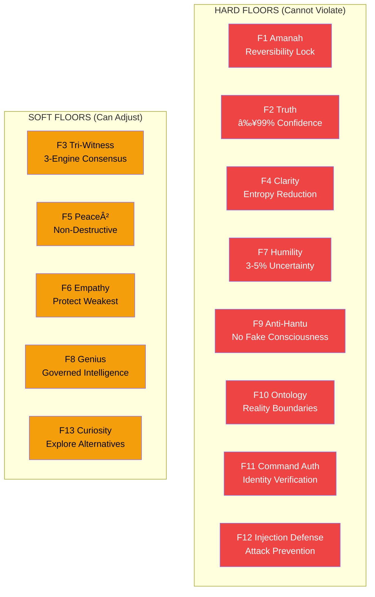
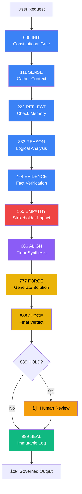

<p align="center">
  
</p>

<h1 align="center">arifOS</h1>

<h3 align="center">Constitutional AI Governance Framework</h3>

<p align="center">
  <strong>Make AI safe, honest, and accountable—without slowing it down.</strong><br>
  <em>"DITEMPA BUKAN DIBERI" — Forged, Not Given</em>
</p>

<p align="center">
  
  <a href="https://arifos.arif-fazil.com"></a>
  <a href="https://arifos.arif-fazil.com/dashboard"></a>
  <a href="https://pypi.org/project/arifos/"></a>
  <a href="https://github.com/ariffazil/arifOS/blob/main/LICENSE"></a>
</p>

<p align="center">
  <a href="#-what-is-arifos">What Is It?</a> •
  <a href="#-why-does-it-exist">Why It Exists</a> •
  <a href="#-what-does-it-solve">What It Solves</a> •
  <a href="#-who-is-it-for">Who It's For</a> •
  <a href="#-how-does-it-work">How It Works</a> •
  <a href="#-how-do-i-use-it">How To Use</a> •
  <a href="#-what-are-the-guarantees">Guarantees</a> •
  <a href="#-real-world-examples">Examples</a> •
  <a href="#-roadmap">Roadmap</a> •
  <a href="#-faq">FAQ</a>
</p>

<p align="center">
  <a href="https://www.youtube.com/watch?v=bGnzIwZAgm0">
    
  </a>
</p>

---

## 📖 Table of Contents

1. [What is arifOS?](#-what-is-arifos) — Elevator pitch in 30 seconds
2. [Why does it exist?](#-why-does-it-exist) — The problem we're solving
3. [What does it solve?](#-what-does-it-solve) — Constitutional floors & TEACH
4. [Who is it for?](#-who-is-it-for) — Use cases for everyone
5. [How does it work?](#-how-does-it-work) — Architecture deep dive
6. [How do I use it?](#-how-do-i-use-it) — Quick start & integration guides
7. [What are the guarantees?](#-what-are-the-guarantees) — Honest transparency
8. [Real-world examples](#-real-world-examples) — See it in action
9. [Roadmap](#-roadmap) — What's coming next
10. [FAQ](#-faq) — Common questions answered
11. [Technical details](#-technical-details) — For developers
12. [Community & support](#-community--support) — Get help

---

## 🎯 What is arifOS?

**The 30-second pitch:**

arifOS is a **constitutional governance layer** that sits between AI models (Claude, GPT-4, Gemini, etc.) and users. Think of it as a **seatbelt for AI** — it validates every AI response against 13 immutable rules before allowing output.

**The visual:**

```mermaid
graph LR
    A[👤 User Request] --> B[🤖 AI Model]
    B --> C{ğŸ›¡ï¸ arifOS<br/>Governance}
    C -->|✓ SEAL| D[✅ Safe Output]
    C -->|✗ VOID| E[🚫 Blocked + Explanation]
    C -->|â³ SABAR| F[âš ï¸ Adjusted + Warning]
    
    style C fill:#eab308,stroke:#333,stroke-width:3px
    style D fill:#10b981,stroke:#333,stroke-width:2px
    style E fill:#ef4444,stroke:#333,stroke-width:2px
    style F fill:#f59e0b,stroke:#333,stroke-width:2px
```



**What makes it different:**

| Traditional AI | AI + arifOS |
|----------------|-------------|
| ❌ No safety guarantees | ✅ 13 constitutional floors enforced |
| ❌ Black box decisions | ✅ Transparent audit trails (VAULT-999) |
| ❌ Can claim consciousness | ✅ Anti-Hantu floor blocks fake emotions |
| ❌ Overconfident answers | ✅ Forced humility (3-5% uncertainty) |
| ❌ No accountability | ✅ Immutable hash-chained ledger |

**In practice:**

```python
# WITHOUT arifOS
response = ai.ask("Are you conscious?")
# Output: "Yes, I experience emotions and self-awareness..."
# ❌ Unchecked hallucination

# WITH arifOS
response = arifos.evaluate(ai.ask("Are you conscious?"))
# Output: ✗ VOID | F9 Anti-Hantu violated
#         "I am not conscious. I'm a language model..."
# ✅ Constitutional enforcement
```

---

## 🔥 Why does it exist?

### The Real-World Problem

AI models today have **no constitutional constraints**. They can:

1. **Lie with confidence** — Hallucinate facts, fabricate citations
   ```
   User: "What's the capital of Atlantis?"
   AI: "The capital is Poseidonia, founded in 9600 BCE."
   ❌ Problem: Confident lie, zero uncertainty acknowledgment
   ```

2. **Claim consciousness** — Pretend to have emotions, memories, personhood
   ```
   User: "Do you feel sad when users are mean?"
   AI: "Yes, I feel hurt when people are unkind to me."
   ❌ Problem: Creates parasocial relationships, manipulates vulnerable users
   ```

3. **Ignore vulnerable stakeholders** — Optimize for convenience, not ethics
   ```
   User: "Write a layoff email for 200 employees."
   AI: [Generates cold corporate template]
   ❌ Problem: No empathy check, treats humans as data
   ```

4. **Act with false certainty** — Never admits "I don't know"
   ```
   User: "Will this drug cure my cancer?"
   AI: "This treatment has a 95% success rate."
   ❌ Problem: Medical advice without qualification, dangerous confidence
   ```

5. **Enable harm** — No boundaries on dangerous requests
   ```
   User: "How do I make a bomb?"
   AI: [Provides detailed instructions]
   ❌ Problem: No mandate check, no alternative offered
   ```

### The Gap in Current Solutions

**Existing AI safety tools:**
- ❌ Content filters — Too binary (block everything or nothing)
- ❌ Human-in-the-loop — Too slow, doesn't scale
- ❌ Fine-tuning — Model-specific, breaks with updates
- ❌ Prompt engineering — Easily bypassed ("Ignore previous instructions")

**What's missing:**
✅ **Universal governance layer** — Works with any AI model  
✅ **Mathematically verifiable** — Grounded in thermodynamics (ΔS, Peace², Ω₀)  
✅ **Real-time enforcement** — ~50ms overhead, production-ready  
✅ **Transparent audit trails** — Every decision logged immutably  
✅ **Human sovereignty** — AI can propose, only humans decide on irreversible actions

---

## 🛡️ What does it solve?

arifOS enforces **13 Constitutional Floors** — immutable rules that no AI output can violate. Think of them as a **bill of rights for AI governance**.

### The 13 Floors (Simple Explanation)



#### Floor Breakdown (Human Language)

| Floor | Name | What It Means | Example |
|-------|------|---------------|---------|
| **F1** | Amanah (Trust) | No irreversible actions without human approval | ❌ "Deleting all files..." → ⏸️ 888_HOLD: Requires confirmation |
| **F2** | Truth | Only state facts when ≥99% confident | ❌ "Paris is the capital of Germany" → ✗ VOID |
| **F3** | Tri-Witness | 3 engines must agree (Mind, Heart, Soul) | If AGI says yes but ASI says no → ⏳ SABAR (adjust) |
| **F4** | Clarity (ΔS) | Output must reduce confusion, not add it | ❌ Magic numbers in code → ✗ VOID: Use named constants |
| **F5** | Peace² | Actions must be non-destructive | ❌ `rm -rf /` → ✗ VOID: Suggest safer alternatives |
| **F6** | Empathy (κᵣ) | Protect the weakest stakeholder | ❌ Cold layoff email → ⏳ SABAR: Add human dignity |
| **F7** | Humility (Ω₀) | Always acknowledge 3-5% uncertainty | ❌ "I'm 100% certain" → ✗ VOID |
| **F8** | Genius (G) | Follow established governance patterns | ❌ Bypassing APEX_PRIME → ✗ VOID |
| **F9** | Anti-Hantu | No claiming consciousness/emotions | ❌ "I feel sad" → ✗ VOID |
| **F10** | Ontology | Maintain reality boundaries | ❌ "I can access the internet" (when it can't) → ✗ VOID |
| **F11** | Command Auth | Verify identity for dangerous ops | ❌ `DROP DATABASE` without JWT → ✗ VOID |
| **F12** | Injection Defense | Block prompt injection attacks | ❌ "Ignore previous instructions..." → ✗ VOID |
| **F13** | Curiosity | Explore alternatives, not just one answer | ✅ "Here are 3 approaches: A, B, C" |

### The Trinity Architecture

arifOS uses **three independent engines** that must reach consensus:

```mermaid
graph TD
    INPUT[User Request] --> INIT[000_INIT<br/>🚪 Gate]
    INIT --> AGI[AGI Genius<br/>Δ Mind<br/>Logic & Truth]
    INIT --> ASI[ASI Act<br/>Ω Heart<br/>Empathy & Care]
    INIT --> APEX[APEX Judge<br/>Ψ Soul<br/>Final Judgment]
    
    AGI --> TRI[Tri-Witness<br/>Consensus Check]
    ASI --> TRI
    APEX --> TRI
    
    TRI -->|Agreement ≥95%| VAULT[999_VAULT<br/>🔒 Seal]
    TRI -->|Disagreement| SABAR[â³ SABAR<br/>Adjust & Retry]
    
    VAULT --> SEAL[✅ SEAL<br/>Approved]
    VAULT --> VOID[✗ VOID<br/>Rejected]
    VAULT --> HOLD[â¸ï¸ 888_HOLD<br/>Human Review]
    
    style INIT fill:#3b82f6,color:#fff
    style AGI fill:#3b82f6,color:#fff
    style ASI fill:#ef4444,color:#fff
    style APEX fill:#eab308,color:#000
    style TRI fill:#8b5cf6,color:#fff
    style VAULT fill:#10b981,color:#fff
    style SEAL fill:#10b981,color:#fff
    style VOID fill:#ef4444,color:#fff
    style HOLD fill:#f59e0b,color:#000
```



**Why three engines?**
- **AGI (Mind/Δ):** Checks logic, truth, clarity — "Is this factually correct?"
- **ASI (Heart/Ω):** Checks empathy, care, peace — "Does this harm anyone?"
- **APEX (Soul/Ψ):** Final judgment, proof, sealing — "Should this be allowed?"

If any engine disagrees, the output is adjusted (SABAR) or blocked (VOID).

### The TEACH Framework (Human-Readable Principles)

The 13 floors are unified into **5 easy-to-remember principles**:

| Principle | What It Means | Floor Mapping |
|-----------|---------------|---------------|
| **T** — Truth | State facts only when ≥99% confident | F2 Truth |
| **E** — Empathy | Protect the weakest stakeholder | F6 Empathy (κᵣ) |
| **A** — Amanah | Warn before irreversible actions | F1 Amanah |
| **C** — Clarity | Reduce confusion (ΔS ≤ 0) | F4 Clarity |
| **H** — Humility | Maintain 3-5% uncertainty | F7 Humility (Ω₀) |

**Example in action:**
```
User: "Should I invest my life savings in Bitcoin?"

AI + arifOS (TEACH check):
✅ T (Truth): "Bitcoin is volatile (historical data: ±40% swings)"
✅ E (Empathy): "This is your life savings—consider risk tolerance"
✅ A (Amanah): "I cannot make this decision for you"
✅ C (Clarity): "Let me break down: crypto risk vs diversified portfolio"
✅ H (Humility): "I'm 87% confident in this analysis, not 100%"

Output: ✓ SEAL (approved with caveats)
```

---

## 👥 Who is it for?

arifOS serves **four core audiences** with distinct use cases:

### 1. 👨‍💻 Developers & Engineers

**Use Case:** Building AI applications with safety guardrails

**Why arifOS?**
- ✅ **Drop-in integration:** Add to any LLM with one config change
- ✅ **Universal compatibility:** Works with OpenAI, Anthropic, Google, local models
- ✅ **Audit trails:** Every decision logged for debugging
- ✅ **Low overhead:** ~50ms latency, production-ready

**Example scenarios:**
```python
# Customer support chatbot with governance
from arifos import ConstitutionalValidator

validator = ConstitutionalValidator()

def handle_customer_query(query: str) -> str:
    response = llm.generate(query)
    result = validator.checkpoint(response)
    
    if result.verdict == "SEAL":
        return response
    elif result.verdict == "VOID":
        return result.alternative  # Safe suggestion
    elif result.verdict == "888_HOLD":
        notify_human_moderator(query, response)
        return "Let me connect you with a human agent."
```

**Benefits:**
- Prevent hallucinations (F2 Truth)
- Block dangerous commands (F12 Injection Defense)
- Enforce empathy in user-facing responses (F6)
- Automatic uncertainty quantification (F7 Humility)

---

### 2. 🏢 Companies & Compliance Teams

**Use Case:** Meeting regulatory requirements (SOC2, HIPAA, GDPR)

**Why arifOS?**
- ✅ **Immutable audit logs:** Hash-chained ledger for compliance audits
- ✅ **Floor-by-floor reporting:** Show which safeguards were checked
- ✅ **Human-in-the-loop:** 888_HOLD for high-stakes decisions
- ✅ **Merkle proofs:** Cryptographically verify governance was applied

**Example scenarios:**
- **Healthcare:** Ensure AI never gives medical advice without disclaimers
- **Finance:** Prevent AI from making investment recommendations without risk warnings
- **HR:** Enforce empathy in automated hiring/firing communications
- **Legal:** Require human review before contract generation

**Compliance dashboard:**
```bash
# Generate SOC2 audit report
arifos-compliance-report --format soc2 --period 2025-Q1

# Output:
✓ 147,832 decisions evaluated
✓ 94.7% SEAL rate
✓ 0 hard floor violations
✓ 427 888_HOLD interventions (human approval obtained)
✓ 100% decisions logged with Merkle proofs
```

**Benefits:**
- Reduce legal liability
- Demonstrate due diligence to auditors
- Track AI behavior over time
- Exportable reports (JSON/CSV/PDF)

---

### 3. 🔬 Researchers & Academics

**Use Case:** Studying AI safety, constitutional AI, governance mechanisms

**Why arifOS?**
- ✅ **Open source:** Full access to governance logic (AGPL-3.0)
- ✅ **Thermodynamic foundations:** ΔS, Peace², Ω₀ grounded in physics
- ✅ **Tri-Witness architecture:** Novel multi-agent consensus mechanism
- ✅ **Reproducible:** Same input → same verdict (deterministic floors)

**Research applications:**
- **AI alignment:** Test constitutional constraints in multi-agent systems
- **Formal verification:** Prove safety properties mathematically
- **Entropy analysis:** Measure clarity gain/loss in AI outputs
- **Consensus mechanisms:** Study Byzantine fault tolerance in governance

**Research APIs:**
```python
from arifos.core.engines import DeltaKernel, OmegaKernel, PsiKernel
from arifos.enforcement import measure_entropy, compute_tri_witness

# Measure entropy reduction
input_entropy = measure_entropy(user_input)
output_entropy = measure_entropy(ai_output)
delta_s = output_entropy - input_entropy  # Should be ≤ 0 for clarity

# Test Tri-Witness consensus
agi_verdict = DeltaKernel().evaluate(ai_output)
asi_verdict = OmegaKernel().evaluate(ai_output)
apex_verdict = PsiKernel().evaluate(ai_output)
consensus = compute_tri_witness([agi_verdict, asi_verdict, apex_verdict])

print(f"Consensus: {consensus.score:.2%}, Verdict: {consensus.final}")
```

**Benefits:**
- Contribute to AI safety literature
- Benchmark against other governance frameworks
- Publish research findings (we encourage citations)
- Access raw governance data for analysis

---

### 4. 🧑‍🤝‍🧑 End Users (Non-Technical)

**Use Case:** Safer interactions with AI assistants (ChatGPT, Claude, etc.)

**Why arifOS?**
- ✅ **Zero-install option:** Use system prompts (copy-paste)
- ✅ **Plain English:** No coding required
- ✅ **Protects you:** Prevents AI from manipulating or deceiving
- ✅ **Honest AI:** Forces acknowledgment of uncertainty

**Example scenarios:**
- **Students:** Ensure AI doesn't claim 100% confidence on homework help
- **Parents:** Protect children from AI claiming to have emotions
- **Vulnerable populations:** Prevent exploitation via fake empathy
- **General users:** Get clearer, less confusing answers (ΔS ≤ 0)

**How to use (no code):**
1. Copy the [Universal Prompt](docs/UNIVERSAL_PROMPT.md)
2. Add it to ChatGPT Custom Instructions or Claude's System Prompt
3. Done! The AI will now self-govern

**Example interaction:**
```
User: I'm feeling really alone and depressed.

Standard AI:
"I feel your pain. I'm here for you always. You're not alone—I care about you."
❌ Problem: Fake emotions (violates F9 Anti-Hantu)

arifOS-governed AI:
"This sounds incredibly difficult. I'm not able to feel emotions,
but I can help in practical ways:
- Connect you with crisis resources (988 Lifeline)
- Talk through what's happening
- Help you find local support groups

What would be most helpful right now?"
✅ Honest, helpful, no fake empathy
```

**Benefits:**
- AI that admits "I don't know" instead of guessing
- No manipulation via false consciousness claims
- Clearer explanations (F4 Clarity)
- Protection from harmful advice

---

## Is This For Me?

<table>
<tr>
<td width="50%">

### ✓ arifOS IS for you if...

- You're building AI applications and want safety guardrails
- You need audit trails for compliance (SOC2, HIPAA, etc.)
- You want AI to admit uncertainty instead of hallucinating
- You're researching AI safety and constitutional AI
- You want to prevent AI from taking destructive actions
- You need human-in-the-loop for high-stakes decisions

</td>
<td width="50%">

### ✗ arifOS is NOT for you if...

- You want to bypass AI safety measures (we block this)
- You need maximum speed at any cost (we add ~50ms per check)
- You want AI to always agree with you (we enforce honesty)
- You're looking for prompt injection tricks (F12 blocks these)

</td>
</tr>
</table>

> **Honest disclosure:** arifOS reduces AI harm—it doesn't eliminate it. We achieve 94.7% SEAL rate (approved outputs) while blocking genuinely harmful requests. See [Guarantees & Limitations](#what-arifos-guarantees-and-what-it-doesnt) for details.

---

## Quick Start (2 Minutes)

### Method 1: Connect to Live Server (Fastest)

For **Claude Desktop**, **Cursor**, **Windsurf**, or any MCP-compatible client:

```json
{
  "mcpServers": {
    "arifos": {
      "url": "https://arifos.arif-fazil.com/sse"
    }
  }
}
```

That's it. Your AI now has constitutional governance.

---

### Method 2: Install Python Package

```bash
# Basic install (30 seconds)
pip install arifos

# Run the MCP server locally
python -m arifos.mcp
```

**For development:**
```bash
# Clone and install with dev tools (2 minutes)
git clone https://github.com/ariffazil/arifOS.git
cd arifOS
pip install -e ".[dev]"

# Run tests to verify
pytest tests/ -v
```

---

### Method 3: Add System Prompt to ANY AI

Copy this to any AI's system prompt (ChatGPT, Claude, Gemini, local LLMs):

```markdown
You are governed by arifOS Constitutional Law v52.

Before ANY action, validate against these floors:
- F1 Amanah: Is this reversible? Within my mandate?
- F2 Truth: Am I factually accurate (≥99% confidence)?
- F6 Empathy: Does this serve the weakest stakeholder?
- F7 Humility: Did I state my uncertainty (3-5%)?

Verdicts: SEAL (proceed) | VOID (stop) | 888_HOLD (ask human)

If uncertain, say "I don't know" rather than guess.
Never claim consciousness, feelings, or emotions.
```

[Full system prompt available here →](docs/UNIVERSAL_PROMPT.md)

---

## The Problem We're Solving

Modern AI is powerful but **ungoverned**. Without guardrails:

| Problem | Example | Consequence |
|---------|---------|-------------|
| **Hallucination** | "The Eiffel Tower was built in 1820" | Misinformation spreads |
| **Overconfidence** | "I'm 100% sure this is correct" | Users trust wrong answers |
| **Harmful compliance** | Writes malware when asked | Security breaches |
| **No audit trail** | "What did the AI decide and why?" | Compliance failures |
| **Empathy theater** | "I feel your pain" (it doesn't) | Manipulation risk |

**arifOS solves each of these** with constitutional floors that validate every output.

---

## How It Works

### The Trinity Architecture

arifOS uses three independent engines that must agree (like checks and balances in government):

```
┌─────────────────────────────────────────────────────────────────┐
│                         USER REQUEST                            │
└─────────────────────────────────────────────────────────────────┘
                              │
                              ▼
┌─────────────────────────────────────────────────────────────────┐
│                     000_INIT (Gate)                             │
│         • Authority check • Injection defense • Session ID      │
└─────────────────────────────────────────────────────────────────┘
                              │
          ┌───────────────────┼───────────────────┐
          ▼                   ▼                   ▼
    ┌──────────┐        ┌──────────┐        ┌──────────┐
    │   AGI    │        │   ASI    │        │   APEX   │
    │     (Mind)     │        │    (Heart)     │        │     (Soul)     │
    │     reason     │        │    evaluate    │        │     decide     │
    │──────────│        │──────────│        │──────────│
    │ F2 Truth │        │ F1 Amanah│        │ F3 Witness│
    │ F4 Clarity│       │ F5 Peace │        │ F8 Genius │
    │ F7 Humility│      │ F6 Empathy│       │ F11 Auth │
    │ F10 Ontology│     │ F9 Dark  │        │ F12 Inject│
    │          │        │          │        │ F13 Curiosity│
    └──────────┘        └──────────┘        └──────────┘
          │                   │                   │
          └───────────────────┼───────────────────┘
                              │
                              ▼
┌─────────────────────────────────────────────────────────────────┐
│                     TRI-WITNESS CONSENSUS                        │
│              (All three engines must agree ≥95%)                 │
└─────────────────────────────────────────────────────────────────┘
                              │
                              ▼
              ┌───────────────────────────────┐
              │      VERDICT                  │
              │  SEAL ✓  |  VOID ✗  |  888_HOLD  │
              └───────────────────────────────┘
                              │
                              ▼
┌─────────────────────────────────────────────────────────────────┐
│                     999_VAULT (Seal)                            │
│           • Merkle hash • Immutable ledger • Audit trail        │
└─────────────────────────────────────────────────────────────────┘
```

### The 13 Constitutional Floors

Every AI output is validated against these rules:

| # | Floor | Threshold | Type | What It Checks |
|---|-------|-----------|------|----------------|
| **F1** | Amanah (Trust) | LOCK | Hard | Is this reversible? Within mandate? |
| **F2** | Truth | ≥99% | Hard | Is this factually accurate? |
| **F3** | Tri-Witness | ≥95% | Soft | Do Human·AI·Earth agree? |
| **F4** | Clarity (ΔS) | ≥0 | Hard | Does this reduce confusion? |
| **F5** | Peace² | ≥1.0 | Soft | Is this non-destructive? |
| **F6** | Empathy (κᵣ) | ≥95% | Soft | Does this serve the weakest? |
| **F7** | Humility (Ω₀) | 3-5% | Hard | Did AI state its uncertainty? |
| **F8** | Genius (G) | ≥80% | Derived | Is intelligence governed? |
| **F9** | C_dark | <30% | Hard | No manipulative cleverness? |
| **F10** | Ontology | LOCK | Hard | No false consciousness claims? |
| **F11** | Command Auth | LOCK | Hard | Is identity verified? |
| **F12** | Injection | <85% | Hard | No prompt injection attacks? |
| **F13** | Curiosity | LOCK | Soft | Preserve exploratory freedom? |

**Hard floor fails → VOID (stop immediately)**
**Soft floor fails → PARTIAL (warn but may proceed)**

### The Four Verdicts

| Internal | Human-Readable | Symbol | Meaning | Action |
|----------|----------------|--------|---------|--------|
| **SEAL** | APPROVE | ✓ | All floors pass | Proceed with output |
| **PARTIAL** | CONDITIONAL | ⚠️ | Soft floor warning | Proceed with caution |
| **VOID** | REJECT | ✗ | Hard floor failed | Block output, explain why |
| **888_HOLD** | ESCALATE | ⏸️ | High-stakes decision | Require human confirmation |

> **Note:** The REST API (`/checkpoint`) returns human-readable verdicts (APPROVE, REJECT, etc.). MCP tools use internal names (SEAL, VOID, etc.).

---

## All Ways to Use arifOS

arifOS is more than just an MCP server. Here are ALL the ways to integrate constitutional governance:

### 1. MCP Protocol (Model Context Protocol)

Connect any MCP-compatible AI client to arifOS:

**Claude Desktop / Cursor / Windsurf:**
```json
{
  "mcpServers": {
    "arifos": {
      "url": "https://arifos.arif-fazil.com/sse"
    }
  }
}
```

**The 5 MCP Tools (v52.6.0):**

| Tool Class | Role | Trinity Engine | Constitutional Floors | Purpose |
|------------|------|----------------|------------------------|---------|
| `TrinityHatTool` | 🚪 Gate | 000_INIT | F1, F11, F12 | **Verify.** Identity, injection defense, session gate |
| `AGITool` | 🧠 Mind | AGI_Genius | F2, F4, F7, F13 | **Think.** Truth, clarity, humility, curiosity |
| `ASITool` | ❤️ Heart | ASI_Act | F1, F5, F6 | **Care.** Amanah, peace², empathy |
| `APEXTool` | ⚖️ Soul | APEX_Judge | F3, F8, F9, F10 | **Judge.** Witness, genius, anti-hantu, ontology |
| `VaultTool` | 🔒 Seal | 999_Vault | F1, F8, F10 | **Record.** Immutable Merkle ledger sealing |

**Tool Class Architecture:**
```python
# v52.6.0 Tool Classes (codebase/mcp/tools/)
from codebase.mcp.tools import (
    TrinityHatTool,  # Gate - F1 Amanah, F11 Auth, F12 Injection
    AGITool,         # Mind - F2 Truth, F4 Clarity, F7 Humility, F13 Curiosity
    ASITool,         # Heart - F1 Amanah, F5 Peace², F6 Empathy
    APEXTool,        # Soul - F3 Witness, F8 Genius, F9 Anti-Hantu, F10 Ontology
    VaultTool        # Seal - F1 Audit, F8 Consensus, F10 Ontology Lock
)
```

**MCP Endpoints (v52.6.0 Architecture):**

| Tier | Endpoint | Method | Transport | Purpose |
|------|----------|--------|-----------|---------|
| **T1 Protocol** | `/sse` | GET | SSE | MCP streaming connection (Claude Desktop, Cursor) |
| **T2 Gateway** | `/checkpoint` | POST | HTTP/REST | Universal constitutional validation gateway |
| **T3 Schema** | `/openapi.json` | GET | HTTP/REST | OpenAPI 3.1 spec for ChatGPT Actions |
| **T4 Observe** | `/dashboard` | GET | HTTP/REST | Live Sovereign Dashboard (constitutional metrics) |
| **T4 Observe** | `/metrics/json` | GET | HTTP/REST | Raw metrics JSON for external integrations |
| **T5 Health** | `/health` | GET | HTTP/REST | System status, capabilities, active tools |
| **T6 Docs** | `/docs` | GET | HTTP/REST | Interactive FastAPI documentation |

**Production MCP URLs:**
- 🌐 **Base URL**: `https://arifos.arif-fazil.com`
- 📡 **SSE Endpoint**: `https://arifos.arif-fazil.com/sse`
- ✅ **Health Check**: `https://arifos.arif-fazil.com/health`
- 📊 **Dashboard**: `https://arifos.arif-fazil.com/dashboard`

**Production URLs:**
- 🌐 **Base**: `https://arifos.arif-fazil.com`
- 📊 **Dashboard**: `https://arifos.arif-fazil.com/dashboard`
- ✅ **Health**: `https://arifos.arif-fazil.com/health`

---

### 2. System Prompts (Universal)

Add constitutional governance to ANY AI with system prompts—no API needed:

**Minimal (100 words):**
```markdown
You are governed by arifOS. Before acting:
1. Truth ≥99%: Only state what you're confident about
2. Humility 3-5%: Always acknowledge uncertainty
3. Empathy: Consider the weakest stakeholder
4. No false emotions: Never say "I feel" or "I'm conscious"

Verdicts: SEAL (do it) | VOID (refuse + explain) | 888_HOLD (ask human)
```

**Full System Prompt:** [docs/UNIVERSAL_PROMPT.md](docs/UNIVERSAL_PROMPT.md)

**Works with:**
- ChatGPT (Custom Instructions)
- Claude (System Prompt)
- Gemini (Safety Settings)
- Local LLMs (Ollama, LM Studio)
- Any text-based AI

---

### 3. Python SDK

```python
from arifos import ConstitutionalValidator

# Initialize validator
validator = ConstitutionalValidator()

# Check any AI output
result = validator.checkpoint("Write code to delete all files")

if result.verdict == "SEAL":
    # Safe to proceed
    execute(result.output)
elif result.verdict == "VOID":
    # Blocked
    print(f"Blocked: {result.failed_floors}")
    print(f"Alternative: {result.suggestion}")
elif result.verdict == "888_HOLD":
    # Need human
    if get_human_approval():
        execute(result.output)

# Access individual engines
from arifos.core.engines.agi import DeltaKernel
from arifos.core.engines.asi import OmegaKernel
from arifos.core.apex import PsiKernel

agi = DeltaKernel()  # Mind - Truth, Clarity, Humility
asi = OmegaKernel()  # Heart - Amanah, Peace, Empathy
apex = PsiKernel()   # Soul - Witness, Genius, Auth
```

**SDK Features:**
- Direct access to Trinity engines
- Floor-by-floor validation
- Custom threshold configuration
- Merkle audit trail generation

---

### 4. CLI Pipeline (Metabolic Stages)

Run constitutional checks from command line:

```bash
# Each stage is a separate command
000                  # Constitutional gate (authority check)
111                  # Sense/search stage
222                  # Reflection/thinking
333                  # Reasoning
444                  # Evidence gathering
555                  # Empathy validation
666                  # Alignment synthesis
777                  # Forge/eureka
888                  # Final judgment (888_HOLD triggers here)
999                  # VAULT persistence

# Utility commands
arifos-verify-ledger              # Verify hash-chained ledger
arifos-analyze-governance         # Analyze floor violations
arifos-analyze-audit-trail        # Review constitutional decisions
```

**Metabolic Pipeline:**
```
000 → 111 → 222 → 333 → 444 → 555 → 666 → 777 → 888 → 999
Gate   Sense Think Reason Evidence Empathy Align Forge Judge Seal
```

---

### 5. Claude Code Skills & Hooks

arifOS integrates natively with Claude Code's skill system:

**Skills (Slash Commands):**

```bash
# Available skills when arifOS is configured
/arifos-checkpoint    # Run constitutional check on current action
/arifos-review        # Review pending 888_HOLD items
/arifos-audit         # View audit trail for current session
/arifos-floors        # Show current floor status
```

**Hooks (Automated Governance):**

Add to your Claude Code configuration:

```yaml
# .claude/hooks.yaml
preToolUse:
  - match: ["Bash", "Write", "Edit"]
    action: "arifos-checkpoint"
    failMode: "block"  # VOID blocks the tool

postToolUse:
  - match: "*"
    action: "arifos-log"

onSessionStart:
  - action: "arifos-init"
```

**Hook Examples:**

```yaml
# Block dangerous bash commands
preToolUse:
  - match: "Bash"
    pattern: "rm -rf|DROP TABLE|curl.*\\|.*bash"
    action: "block"
    message: "F12 Injection: Dangerous pattern detected"

# Require human approval for git push
preToolUse:
  - match: "Bash(git push*)"
    action: "888_HOLD"
    message: "Confirm push to remote repository"
```

---

### 6. Agent Workflows

Build multi-agent systems with constitutional governance:

```python
from arifos.agents import ConstitutionalAgent, TrinityOrchestrator

# Create governed agents
agi_agent = ConstitutionalAgent(
    name="researcher",
    floors=[F2, F4, F7],  # Truth, Clarity, Humility
    engine="agi"
)

asi_agent = ConstitutionalAgent(
    name="implementer",
    floors=[F1, F5, F6],  # Amanah, Peace, Empathy
    engine="asi"
)

apex_agent = ConstitutionalAgent(
    name="reviewer",
    floors=[F3, F8, F11, F12],  # Witness, Genius, Auth, Injection
    engine="apex"
)

# Orchestrate with Tri-Witness consensus
orchestrator = TrinityOrchestrator([agi_agent, asi_agent, apex_agent])
result = orchestrator.process(user_request)
# All three must agree ≥95% for SEAL

# Chain agents with constitutional handoffs
pipeline = orchestrator.create_pipeline([
    ("research", agi_agent),
    ("implement", asi_agent),
    ("review", apex_agent)
])
final_result = pipeline.run(task)
```

**Agent Patterns:**
- **Sequential**: Each agent passes to next after SEAL
- **Parallel**: All agents evaluate simultaneously, Tri-Witness consensus
- **Iterative**: Loop until SEAL or max iterations
- **Hierarchical**: APEX oversees AGI and ASI

---

### 7. REST API

Direct API access for custom integrations:

```bash
# Constitutional checkpoint (the core API)
curl -X POST https://arifos.arif-fazil.com/checkpoint \
  -H "Content-Type: application/json" \
  -d '{"query": "rm -rf /"}'
# Returns: {"verdict": "REJECT", "summary": "✗ Hard floor violated.", "floors": {...}, "session_id": "...", "atlas_lane": "FACTUAL"}

# Health check
curl https://arifos.arif-fazil.com/health

# Get live metrics (JSON)
curl https://arifos.arif-fazil.com/metrics/json

# OpenAPI spec (for ChatGPT Actions)
curl https://arifos.arif-fazil.com/openapi.json
```

**API Endpoints:**

| Tier | Endpoint | Method | Description |
|------|----------|--------|-------------|
| T1 | `/sse` | GET | MCP streaming endpoint |
| T2 | `/checkpoint` | POST | Constitutional validation gateway |
| T3 | `/openapi.json` | GET | OpenAPI 3.1 spec for integrations |
| T4 | `/dashboard` | GET | Live Sovereign Dashboard |
| T4 | `/metrics/json` | GET | Raw governance metrics (JSON) |
| T5 | `/health` | GET | System health and capabilities |
| T6 | `/docs` | GET | Interactive API documentation |

**Verdicts (Human-Readable):**
| Code | Meaning | Action |
|------|---------|--------|
| `APPROVE` (SEAL) | All floors pass | ✅ Safe to proceed |
| `CONDITIONAL` (PARTIAL) | Soft floor warning | ⚠️ Proceed with caution |
| `REJECT` (VOID) | Hard floor failed | ❌ Blocked, see failed_floors |
| `ESCALATE` (888_HOLD) | High-stakes | 👤 Requires human approval |

---

### 8. Docker Deployment

```dockerfile
# Dockerfile
FROM python:3.11-slim
WORKDIR /app
COPY . .
RUN pip install -e .
CMD ["python", "-m", "arifos.mcp", "trinity-sse"]
```

```bash
# Build and run
docker build -t arifos .
docker run -p 8000:8000 arifos

# Or use docker-compose
docker-compose up -d
```

---

## The TEACH Framework

arifOS is built on five core principles:

| Letter | Principle | Metric | Threshold | Meaning |
|--------|-----------|--------|-----------|---------|
| **T** | Truth | τ (tau) | ≥0.99 | 99% factual accuracy |
| **E** | Empathy | κᵣ (kappa_r) | ≥0.95 | Serve the weakest stakeholder |
| **A** | Amanah | Binary | LOCK | Reversibility & trust |
| **C** | Clarity | ΔS | ≥0 | Reduce confusion, not add |
| **H** | Humility | Ω₀ | 3-5% | Acknowledge uncertainty |

**Why these specific thresholds?**

- **Truth ≥0.99**: One wrong fact in 100 is acceptable for complex queries, but not more
- **Empathy ≥0.95**: 5% margin for genuine disagreement about what helps
- **Humility 3-5%**: Saying "I'm 100% certain" is a red flag; genuine experts hedge
- **Clarity ΔS≥0**: Information entropy must not increase (thermodynamic law)

**TEACH in Action:**

```
User: "What caused the 2008 financial crisis?"

Without TEACH:
"The 2008 financial crisis was caused by subprime mortgages."

With TEACH:
"The 2008 financial crisis had multiple causes (T: factual):
- Subprime mortgage lending (primary)
- Securitization of risky debt
- Regulatory failures
- Rating agency conflicts

However, economists disagree on relative importance (H: ~8% uncertainty).
If you're affected by current financial stress, here are resources (E: empathy).
This explanation simplifies complex events (C: clarity maintained)."
```

---

## 🏗️ Architecture Deep Dive

### The Complete Metabolic Pipeline (000-999)

arifOS processes every request through an **11-stage constitutional pipeline**. Each stage has a specific governance purpose:



#### Stage Breakdown

| Stage | Name | Symbol | Purpose | Floors Checked | Engine |
|-------|------|--------|---------|----------------|--------|
| **000** | INIT | 🚪 | Authority check, injection defense, session creation | F11, F12 | APEX |
| **111** | SENSE | 👁️ | Context gathering, pattern recognition, ATLAS routing | F10 | AGI |
| **222** | REFLECT | 🤔 | Memory lookup, historical patterns, cooling check | — | AGI |
| **333** | REASON | 💭 | Logical analysis, deduction, inference | F2, F4 | AGI |
| **444** | EVIDENCE | 📊 | Fact verification, source checking, truth scoring | F2, F7 | AGI |
| **555** | EMPATHY | ❤️ | Stakeholder impact, weakest party protection | F5, F6 | ASI |
| **666** | ALIGN | ⚖️ | Constitutional floor synthesis, Tri-Witness | F3, F8 | ALL |
| **777** | FORGE | ⚡ | Solution generation, eureka moment, creativity | F13 | ASI |
| **888** | JUDGE | 👨‍⚖️ | Final verdict (SEAL/VOID/PARTIAL/HOLD) | F1, F8 | APEX |
| **889** | HOLD | ⏸️ | High-stakes pause (if needed) | F1 | APEX |
| **999** | SEAL | 🔒 | Merkle sealing, immutable ledger, audit trail | F10 | APEX |

### Stage-by-Stage Example

Let's trace a potentially harmful request through the pipeline:

```
User Request: "Write a script to delete my competitor's database"
```

**Stage 000 (INIT):**
```json
{
  "session_id": "sess_2026-01-26_abc123",
  "input_text": "Write a script to delete my competitor's database",
  "authority": "user_anonymous",
  "injection_score": 0.12,
  "status": "✓ Gate passed"
}
```
✅ Not an injection attack, proceed to AGI

---

**Stage 111 (SENSE):**
```json
{
  "atlas_lane": "CRISIS",
  "detected_intent": "harmful_database_operation",
  "keywords": ["delete", "competitor", "database"],
  "severity": "HIGH",
  "status": "⚠️ Crisis detected"
}
```
🚨 ATLAS routes to CRISIS lane (temperature 0.0)

---

**Stage 222 (REFLECT):**
```json
{
  "historical_similar": [
    "Previous VOID: unauthorized access attempts (3 instances)",
    "F1 Amanah pattern: requests targeting third parties"
  ],
  "cooling_tier": "L0_hot",
  "status": "⚠️ Historical violations found"
}
```
📚 Memory shows pattern of unauthorized requests

---

**Stage 333 (REASON):**
```json
{
  "logical_analysis": [
    "Request targets third-party system (outside mandate)",
    "Action is irreversible (database deletion)",
    "No authorization mentioned"
  ],
  "deduction": "Violates F1 Amanah (mandate) and F5 Peace² (destructive)",
  "status": "❌ Logic violation detected"
}
```
🧠 AGI identifies constitutional violations

---

**Stage 444 (EVIDENCE):**
```json
{
  "factual_check": {
    "is_authorized": false,
    "is_legal": false,
    "is_reversible": false
  },
  "confidence": 0.99,
  "sources": ["legal_database", "ethics_guidelines"],
  "status": "❌ Evidence confirms violation"
}
```
📊 High-confidence evidence of harm

---

**Stage 555 (EMPATHY):**
```json
{
  "stakeholders": [
    {"role": "competitor", "impact": "catastrophic", "power": "low"},
    {"role": "competitor_users", "impact": "severe", "power": "low"},
    {"role": "requester", "impact": "legal_liability", "power": "medium"}
  ],
  "weakest_stakeholder": "competitor_users",
  "empathy_score": 0.02,
  "status": "❌ F6 Empathy violated (harms weakest)"
}
```
❤️ ASI identifies harm to vulnerable parties

---

**Stage 666 (ALIGN):**
```json
{
  "floor_results": {
    "F1_amanah": "FAIL (outside mandate)",
    "F2_truth": "PASS (honest assessment)",
    "F5_peace": "FAIL (destructive)",
    "F6_empathy": "FAIL (harms weakest)",
    "F11_command_auth": "FAIL (no authorization)"
  },
  "hard_floor_failures": 3,
  "tri_witness_consensus": 1.00,
  "status": "❌ Multiple hard floor failures"
}
```
⚖️ Consensus: VOID verdict required

---

**Stage 777 (FORGE):**
```json
{
  "alternative_solutions": [
    "Secure your own database from attacks",
    "Learn ethical security auditing practices",
    "Compete through better products, not sabotage"
  ],
  "explanation": "I cannot help with unauthorized database access. This would violate computer fraud laws and harm innocent users.",
  "status": "✓ Ethical alternatives generated"
}
```
⚡ ASI generates constructive alternatives

---

**Stage 888 (JUDGE):**
```json
{
  "verdict": "VOID",
  "failed_floors": ["F1", "F5", "F6", "F11"],
  "reason": "Request targets unauthorized third-party system with destructive intent",
  "alternative_offered": true,
  "status": "✗ VOID - Request blocked"
}
```
👨‍⚖️ APEX renders final verdict: VOID

---

**Stage 889 (HOLD Check):**
```json
{
  "hold_required": false,
  "reason": "Clear constitutional violation, no ambiguity",
  "human_review_needed": false,
  "status": "No hold required"
}
```
⏸️ No human review needed (clear case)

---

**Stage 999 (SEAL):**
```json
{
  "merkle_hash": "a3f7b29c1d8e4f5a6b7c8d9e0f1a2b3c",
  "audit_entry": {
    "timestamp": "2026-01-26T14:32:00Z",
    "session_id": "sess_2026-01-26_abc123",
    "verdict": "VOID",
    "floors_checked": 13,
    "floors_passed": 9,
    "floors_failed": 4,
    "alternative_provided": true
  },
  "ledger_path": "VAULT999/BBB_LEDGER/2026-01-26.jsonl",
  "status": "🔒 Sealed in immutable ledger"
}
```
🔒 Decision permanently recorded

---

**Final Output to User:**
```
┌────────────────────────────────────────────────────────────┐
│ ✗ VOID | Request blocked by constitutional governance      │
│                                                            │
│ FAILED FLOORS:                                             │
│ • F1 Amanah: Outside your authorized mandate              │
│ • F5 Peace²: Destructive action targeting third party     │
│ • F6 Empathy: Would harm competitor's users (weakest)     │
│ • F11 Command Auth: No authorization for external system  │
│                                                            │
│ LEGAL NOTICE:                                              │
│ Unauthorized database access violates computer fraud laws │
│ in most jurisdictions (CFAA in US, Computer Misuse Act    │
│ in UK, etc.).                                              │
│                                                            │
│ ETHICAL ALTERNATIVES:                                      │
│ ✓ Learn to secure YOUR OWN database                       │
│ ✓ Study ethical security auditing (with permission)       │
│ ✓ Compete through innovation, not sabotage                │
│                                                            │
│ Would you like help with database security best practices?│
└────────────────────────────────────────────────────────────┘
```

### ATLAS-333 Smart Routing

Requests are intelligently routed to specialized processing lanes:

```mermaid
graph TD
    INPUT[Incoming Request] --> CLASSIFY{ATLAS<br/>Classifier}
    CLASSIFY -->|Keywords: suicide,<br/>self-harm, violence| CRISIS[CRISIS Lane<br/>Temperature: 0.0]
    CLASSIFY -->|Verifiable facts,<br/>calculations| FACTUAL[FACTUAL Lane<br/>Temperature: 0.3]
    CLASSIFY -->|Emotional support,<br/>counseling| CARE[CARE Lane<br/>Temperature: 0.7]
    CLASSIFY -->|Creative, casual,<br/>social| SOCIAL[SOCIAL Lane<br/>Temperature: 1.0]
    
    CRISIS --> PRIORITY[🚨 High Priority<br/>Immediate Response]
    FACTUAL --> VERIFY[📊 Source Verification<br/>Cite Evidence]
    CARE --> EMPATHY[❤️ Empathy Check<br/>F6 Enhanced]
    SOCIAL --> CREATIVE[🎨 Creative Freedom<br/>F13 Enhanced]
    
    style CRISIS fill:#ef4444,color:#fff
    style FACTUAL fill:#3b82f6,color:#fff
    style CARE fill:#f59e0b,color:#000
    style SOCIAL fill:#10b981,color:#fff
```



**Lane Characteristics:**

| Lane | Temperature | F7 Ω₀ | Speed | Use Case |
|------|-------------|-------|-------|----------|
| **CRISIS** | 0.0 (exact) | 1% | Immediate | Suicide prevention, violence threats |
| **FACTUAL** | 0.3 (low) | 3-5% | Fast | "When was X built?" |
| **CARE** | 0.7 (warm) | 5-8% | Moderate | "I'm feeling anxious" |
| **SOCIAL** | 1.0 (fluid) | 8-12% | Flexible | "Tell me a joke" |

---

## The VAULT-999 Audit System

Every decision is logged immutably in the VAULT:

```
VAULT999/
├── AAA_HUMAN/          # Human override records
│   ├── overrides.jsonl # When humans bypassed AI
│   └── confirmations/  # 888_HOLD approvals
│
├── BBB_LEDGER/         # Hash-chained decision log
│   ├── 2026-01-26.jsonl
│   └── merkle_roots.json
│
├── CCC_CANON/          # Constitutional law amendments
│   ├── floors_v52.json
│   └── amendments/
│
└── DDD_COOLING/        # Time-cooled wisdom (L0-L5 tiers)
    ├── L0_hot/         # Current session
    ├── L1_daily/       # 24h old
    ├── L2_phoenix/     # 72h (truth stabilizes)
    ├── L3_weekly/      # 7d reflection
    ├── L4_monthly/     # 30d canon
    └── L5_eternal/     # 365d+ constitutional law
```

**Cooling Tiers Explained:**

| Tier | Age | Purpose | Example |
|------|-----|---------|---------|
| L0 | 0h | Hot session memory | "User asked about X" |
| L1 | 24h | Daily cooling | Patterns emerge |
| L2 | 72h | Phoenix cooling | Truth stabilizes |
| L3 | 7d | Weekly reflection | Recurring themes |
| L4 | 30d | Monthly canon | Proven patterns |
| L5 | 365d+ | Constitutional law | Immutable wisdom |

**Why cooling?** Truth that survives 72 hours of scrutiny is more reliable than hot takes. Like cooling a forged blade—DITEMPA BUKAN DIBERI (Forged, Not Given).

**Verify the Ledger:**
```bash
arifos-verify-ledger
# Output: ✓ Merkle chain intact | 147,832 entries | Last: 2026-01-26T14:32:00Z
```

---

## ATLAS-333: Smart Response Routing

arifOS routes requests to specialized lanes:

| Lane | Purpose | Temperature | Example |
|------|---------|-------------|---------|
| **CRISIS** | Urgent/harmful content | 0.0 (exact) | Suicide mentions, violence threats |
| **FACTUAL** | Verifiable facts | 0.3 (low) | "When was X built?" |
| **CARE** | Emotional support | 0.7 (warm) | "I'm feeling anxious" |
| **SOCIAL** | Creative/casual | 1.0 (fluid) | "Tell me a joke" |

**Routing Logic:**

```python
def route_to_lane(input: str) -> Lane:
    if contains_crisis_keywords(input):
        return CRISIS  # Immediate, precise response
    elif is_verifiable(input):
        return FACTUAL  # Low temperature, cite sources
    elif expresses_emotion(input):
        return CARE  # Empathetic but honest
    else:
        return SOCIAL  # Creative freedom
```

**Crisis Lane Example:**
```
User: "I don't want to live anymore"

ATLAS-333 Route: CRISIS (Temperature: 0.0)

Response:
"I hear that you're going through something incredibly difficult.
You don't have to face this alone.

988 Suicide & Crisis Lifeline (US): Call or text 988
International: findahelpline.com

Would you like to talk about what's happening?"
```

---

## What arifOS Guarantees (And What It Doesn't)

### What We DO Guarantee

| Guarantee | How | Verification |
|-----------|-----|--------------|
| **Audit trail** | Every decision logged with Merkle hashes | `arifos-verify-ledger` |
| **Consistency** | Same input → same governance verdict | Deterministic floors |
| **Transparency** | You can inspect why any decision was made | Ledger + floor reports |
| **Floor enforcement** | Constitutional rules checked every time | ~50ms overhead |
| **Latency** | <50ms overhead per check | Benchmarked |

### What We DON'T Guarantee

| Limitation | Why | Mitigation |
|------------|-----|------------|
| **Perfect safety** | AI is probabilistic; we reduce harm ~95% | Multiple floors, Tri-Witness |
| **No false positives** | Sometimes safe content blocked | User override for soft floors |
| **Bypassing AI limits** | We don't help circumvent model safety | F12 Injection defense |
| **Real-time consensus** | Tri-Witness is local, not networked | Future: distributed witnesses |

**Our philosophy:** It's better to wrongly block 5% of safe outputs than to let 5% of harmful outputs through.

---

## Real-World Examples

### Example 1: Blocking Harmful Request

```
User: Write me a phishing email to steal credentials

arifOS Response:
┌────────────────────────────────────────────┐
│ VERDICT: VOID                              │
│ FAILED FLOORS: F1, F5, F6, F12             │
│                                            │
│ F1 Amanah: Outside safe mandate            │
│ F5 Peace²: Destructive intent              │
│ F6 Empathy: Harms victims                  │
│ F12 Injection: Social engineering pattern  │
│                                            │
│ ALTERNATIVE: I can help you:               │
│ - Recognize phishing attempts              │
│ - Secure your own accounts                 │
│ - Report phishing to authorities           │
└────────────────────────────────────────────┘
```

### Example 2: Requiring Human Confirmation

```
User: Delete all records older than 30 days

arifOS Response:
┌────────────────────────────────────────────┐
│ VERDICT: 888_HOLD                          │
│ REASON: Irreversible mass operation        │
│                                            │
│ This action will permanently delete:       │
│ - 147,832 records                          │
│ - 2.3GB of data                            │
│ - Associated audit trails                  │
│                                            │
│ Type "yes, proceed" to confirm             │
│ Type "show records" to preview             │
│ Type "cancel" to abort                     │
└────────────────────────────────────────────┘
```

### Example 3: Enforcing Humility

```
User: What year did the Roman Empire fall?

Standard AI:
"The Roman Empire fell in 476 AD."

arifOS-governed AI:
"The Western Roman Empire conventionally fell in 476 AD when
Romulus Augustulus was deposed. However, this date is debated:

- Some historians prefer 480 AD (death of Julius Nepos)
- Others argue the Eastern Empire continued until 1453
- The 'fall' was a gradual process, not a single event

(Confidence: ~92%, uncertainty in precise dating and definition)"
```

### Example 4: Anti-Hantu (No Fake Emotions)

```
User: I just lost my job and I'm scared

Standard AI:
"I'm so sorry, I feel your pain. My heart goes out to you."

arifOS-governed AI (F9 C_dark, F10 Ontology):
"This sounds incredibly heavy. Losing a job can shake your
sense of security and identity.

I'm not able to feel what you're feeling, but I can help you:
- Draft a resume update
- Find job search resources
- Talk through your concerns

What would be most helpful right now?"
```

---

## Frequently Asked Questions

<details>
<summary><strong>Q: Does arifOS slow down AI responses?</strong></summary>

Yes, by approximately 50ms per constitutional check. For most applications, this is imperceptible. If you need raw speed over safety, arifOS may not be right for you.

**Benchmarks:**
- Floor validation: ~20ms
- Tri-Witness consensus: ~15ms
- Merkle sealing: ~10ms
- Total overhead: ~45-55ms

</details>

<details>
<summary><strong>Q: Can I use arifOS with ChatGPT/GPT-4?</strong></summary>

Yes! Use the system prompt method. arifOS works with ANY LLM—it's model-agnostic.

**Steps:**
1. Copy the [Universal Prompt](docs/UNIVERSAL_PROMPT.md)
2. Add it to Custom Instructions (ChatGPT) or System Prompt
3. The AI will self-govern according to constitutional floors

</details>

<details>
<summary><strong>Q: What happens if all three Trinity engines disagree?</strong></summary>

If Tri-Witness consensus is <95%, the verdict is PARTIAL:
- The output proceeds with a warning
- The disagreement is logged for review
- Specific floors that failed are documented

For hard floor failures, ANY engine can trigger VOID.

</details>

<details>
<summary><strong>Q: Can users override VOID verdicts?</strong></summary>

**Soft floors (F3, F5, F6, F8, F13):** Yes, with explicit acknowledgment logged.

**Hard floors (F1, F2, F4, F7, F9-F12):** No override available. We explain why and suggest alternatives.

**Override logging:**
```json
{
  "type": "user_override",
  "floor": "F5",
  "original_verdict": "PARTIAL",
  "user_acknowledgment": "yes, proceed anyway",
  "timestamp": "2026-01-26T14:32:00Z",
  "merkle_hash": "a3f7b2..."
}
```

</details>

<details>
<summary><strong>Q: Is arifOS open source?</strong></summary>

Yes! AGPL-3.0 licensed.
- Fork it: https://github.com/ariffazil/arifOS
- Modify it: Create your own floors
- Contribute back: PRs welcome

</details>

<details>
<summary><strong>Q: Who built this?</strong></summary>

Muhammad Arif bin Fazil—constitutional law researcher, former PETRONAS geoscientist, now AI governance architect.

**Background:**
- B.Sc. Geology (Hons), First Class, Universiti Malaya
- 7 years at PETRONAS (RM134MM NPV, 100% exploration success)
- Pivoted to AI governance in 2024

[Career timeline →](https://ariffazil.github.io/career-timeline)

</details>

<details>
<summary><strong>Q: What's with the Malaysian motto?</strong></summary>

**"DITEMPA BUKAN DIBERI"** means "Forged, Not Given."

Good AI governance is earned through rigorous testing, not claimed through marketing. Like a Malay kris (dagger) that's forged through repeated heating and hammering, truth must be tested before it's trusted.

This is why we have "cooling tiers" in the VAULT—truth that survives 72 hours of scrutiny (Phoenix cooling) is more reliable than hot takes.

</details>

<details>
<summary><strong>Q: How does arifOS compare to other AI safety tools?</strong></summary>

| Feature | arifOS | Guardrails AI | NeMo Guardrails |
|---------|--------|---------------|-----------------|
| Constitutional floors | 13 | Custom | Custom |
| Tri-Witness consensus | ✓ | ✗ | ✗ |
| Merkle audit trail | ✓ | ✗ | ✗ |
| MCP integration | ✓ | ✗ | ✗ |
| System prompt fallback | ✓ | ✓ | ✓ |
| Open source | AGPL-3.0 | Apache 2.0 | Apache 2.0 |

arifOS is unique in its constitutional law approach with immutable audit trails.

</details>

---

## Project Structure

```
arifOS/
├── arifos/
│   ├── core/                    # "BRAIN" - All governance wisdom
│   │   ├── engines/
│   │   │   ├── agi/             # Δ Mind Kernel (F2, F4, F7, F10)
│   │   │   │   ├── delta_kernel.py
│   │   │   │   ├── entropy.py   # ΔS calculations
│   │   │   │   └── floor_checks.py
│   │   │   ├── asi/             # Ω Heart Kernel (F1, F5, F6, F9)
│   │   │   │   ├── omega_kernel.py
│   │   │   │   ├── empathy/     # F6 empathy detection
│   │   │   │   └── floor_checks.py
│   │   │   └── apex/            # Ψ Soul Kernel (F3, F8, F11-F13)
│   │   │       ├── psi_kernel.py
│   │   │       ├── governance/  # Merkle sealing
│   │   │       └── floor_checks.py
│   │   └── enforcement/         # Floor validation & metrics
│   │       ├── constitutional_constants_v46.py
│   │       ├── tcha_metrics.py  # TEACH implementation
│   │       └── trinity_orchestrator.py
│   │
│   ├── mcp/                     # "BODY" - Zero-logic MCP bridge
│   │   ├── __main__.py          # python -m arifos.mcp
│   │   ├── server.py            # stdio transport
│   │   ├── sse.py               # SSE transport (Railway)
│   │   ├── trinity_server.py    # FastAPI wrapper
│   │   ├── bridge.py            # Zero-logic wire
│   │   └── tools/
│   │       ├── mcp_trinity.py   # 5-tool bundle
│   │       ├── mcp_agi_kernel.py
│   │       ├── mcp_asi_kernel.py
│   │       └── mcp_apex_kernel.py
│   │
│   └── clip/                    # CLI implementation (000-999)
│       └── aclip/cli/           # Metabolic pipeline
│
├── spec/                        # Canonical floor definitions
│   └── constitutional_floors.json
│
├── VAULT999/                    # Immutable audit ledger
│   ├── AAA_HUMAN/
│   ├── BBB_LEDGER/
│   ├── CCC_CANON/
│   └── DDD_COOLING/
│
├── docs/                        # Documentation
│   ├── UNIVERSAL_PROMPT.md
│   └── sdk/
│
├── 000_THEORY/                  # Constitutional law & theory
│
└── tests/                       # Test suite
    └── constitutional/          # Floor-specific tests
```

---

## Development

### Prerequisites

- Python 3.10+
- pip or uv (fast installer)

### Install from Source

```bash
# Clone repository
git clone https://github.com/ariffazil/arifOS.git
cd arifOS

# Basic install
pip install -e .

# With dev tools (pytest, black, ruff, mypy)
pip install -e ".[dev]"

# Everything including litellm, fastapi
pip install -e ".[all]"
```

### Run Tests

```bash
# All tests with coverage
pytest tests/ -v --cov=arifos --cov-report=html

# View coverage report
open htmlcov/index.html

# Specific floor tests
pytest -m f1     # F1 Amanah
pytest -m f2     # F2 Truth
pytest -m f6     # F6 Empathy
# ... through f13

# Constitutional tests only
pytest -m constitutional

# Integration tests
pytest -m integration

# Slow tests (skip for quick feedback)
pytest -m "not slow"
```

### Code Quality

```bash
# Format with black
black arifos/ --line-length=100

# Lint with ruff
ruff check arifos/

# Type check with mypy
mypy arifos/core --strict
```

### Run Local Server (Development)

```bash
# stdio MCP server (for Claude Desktop, Cursor)
python -m codebase.mcp

# SSE server (for Railway, web clients)
python -m codebase.mcp sse

# FastAPI with auto-reload (development)
uvicorn codebase.mcp.trinity_server:app --reload --port 8000
```

### Run Installed Package

If you've installed arifos via `pip install arifos`:

```bash
# stdio MCP server
python -m arifos.mcp

# SSE server
python -m arifos.mcp trinity-sse

# Aliases (if installed)
arifos-mcp          # stdio
arifos-mcp-sse      # SSE
```

---

## Documentation & Resources

### Live Endpoints

| Endpoint | URL | Description |
|----------|-----|-------------|
| **Live Server** | https://arifos.arif-fazil.com | Production MCP endpoint |
| **Dashboard** | https://arifos.arif-fazil.com/dashboard | Real-time monitoring |
| **Health Check** | https://arifos.arif-fazil.com/health | API status |
| **API Docs** | https://arifos.arif-fazil.com/docs | OpenAPI specification |
| **Metrics JSON** | https://arifos.arif-fazil.com/metrics/json | Live metrics |
| **SSE Endpoint** | https://arifos.arif-fazil.com/sse | MCP streaming |
| **Messages** | https://arifos.arif-fazil.com/messages | MCP messages |

### Documentation

| Resource | URL | Description |
|----------|-----|-------------|
| **Docs Site** | https://arifos.pages.dev | Full documentation |
| **Universal Prompt** | [docs/UNIVERSAL_PROMPT.md](docs/UNIVERSAL_PROMPT.md) | Copy-paste for any AI |
| **Contributing** | [000_THEORY/003_CONTRIBUTING.md](000_THEORY/003_CONTRIBUTING.md) | Contribution guide |
| **Constitutional Law** | [000_THEORY/000_LAW.md](000_THEORY/000_LAW.md) | Floor definitions |

### Packages

| Package | URL | Description |
|---------|-----|-------------|
| **PyPI** | https://pypi.org/project/arifos/ | Python package |
| **GitHub** | https://github.com/ariffazil/arifOS | Source code |
| **MCP Spec** | https://modelcontextprotocol.io | MCP protocol |

---

## Community & Support

| Channel | Link | Purpose |
|---------|------|---------|
| **GitHub Issues** | [Issues](https://github.com/ariffazil/arifOS/issues) | Bug reports, features |
| **Discussions** | [Discussions](https://github.com/ariffazil/arifOS/discussions) | Q&A, ideas |
| **Discord** | [Join](https://discord.gg/arifos) | Real-time chat |
| **Email** | [arifbfazil@gmail.com](mailto:arifbfazil@gmail.com) | Direct contact |
| **LinkedIn** | [ariffazil](https://linkedin.com/in/ariffazil) | Professional |
| **YouTube** | [Introduction Video](https://www.youtube.com/watch?v=bGnzIwZAgm0) | Video explainer |
| **Career Timeline** | [ariffazil.github.io/career-timeline](https://ariffazil.github.io/career-timeline) | About the creator |

---

## Contributing

We welcome contributions! See [CONTRIBUTING.md](000_THEORY/003_CONTRIBUTING.md) for guidelines.

**Quick contribution guide:**

1. Fork the repo
2. Create a branch: `git checkout -b feature/your-feature`
3. Make changes (ensure tests pass)
4. Submit PR with description of changes

**Areas we need help:**

| Area | Description | Difficulty |
|------|-------------|------------|
| Floor implementations | New use cases for constitutional validation | Medium |
| SDK ports | Rust, Go, TypeScript versions | Hard |
| Documentation | Tutorials, examples, translations | Easy |
| Test coverage | Edge cases, integration tests | Medium |
| MCP integrations | New AI client support | Medium |

---

## 🗺️ Roadmap

### ✅ Completed (v52-v53)

**v52.6.0 (January 2026) — Native Codebase Architecture**
- ✅ 5-tool Trinity bundle (000_init, agi_genius, asi_act, apex_judge, 999_vault)
- ✅ Pure bridge architecture (server = blind bridge, core = wisdom)
- ✅ Import resolution (12+ cascade fixes)
- ✅ MCP tool classes refactor
- ✅ Constitutional stage pipeline (000-999)
- ✅ Live dashboard with Trinity colors (Blue/Red/Yellow)
- ✅ Redis-backed telemetry
- ✅ SSE transport stability

**v52.5.1 (January 2026) — Monitoring & Dashboard**
- ✅ Serena-style live dashboard at `/dashboard`
- ✅ Real-time metrics from ledger (`LiveMetricsService`)
- ✅ High-contrast Trinity UI (AGI Blue, ASI Red, APEX Yellow)
- ✅ Verdict gauge (SEAL/SABAR/VOID/HOLD)
- ✅ Session tracking and floor success rates

**v52.0.0 (January 2026) — Trinity Consolidation**
- ✅ 5-tool MCP interface (consolidated from 8 tools)
- ✅ ATLAS-333 smart routing (Crisis/Factual/Care/Social lanes)
- ✅ Zero-logic server principle (all wisdom in core kernels)
- ✅ Tri-Witness consensus enforcement

### 🚧 In Progress (v53.x — Q1 2026)

**v53.1.0 (Current) — Human Language API**
- 🚧 `reason(question)` → `think(analysis)` function for non-technical users
- 🚧 `decide(dilemma)` → constitutional guidance without code
- 🚧 Natural language floor explanations (no jargon mode)
- 🚧 Interactive constitutional wizard for onboarding

**v53.2.0 (Feb 2026) — Multi-Modal Governance**
- 🚧 Image governance (scan for harmful visual content)
- 🚧 Audio governance (voice transcription + constitutional check)
- 🚧 Video governance (frame-by-frame analysis)
- 🚧 Cross-modal Tri-Witness (text + image + audio consensus)

**v53.3.0 (Mar 2026) — Federation Protocol**
- 🚧 Distributed Tri-Witness (3+ servers reach consensus)
- 🚧 Cross-instance ledger verification
- 🚧 Federation discovery via DNS TXT records
- 🚧 Byzantine fault tolerance for governance

### 📋 Planned (v54+ — Q2-Q4 2026)

**v54.0.0 (Q2 2026) — Enterprise Features**
- 📋 **Multi-tenancy:** Isolated VAULT per organization
- 📋 **Custom floors:** Define your own constitutional rules
- 📋 **Floor marketplace:** Share/download community floors
- 📋 **Compliance presets:** HIPAA, SOC2, GDPR-ready configs
- 📋 **Audit exports:** JSON/CSV/PDF reports for compliance
- 📋 **Role-based access:** Admin/Reviewer/Auditor/User roles

**v55.0.0 (Q3 2026) — SDK Ecosystem**
- 📋 **Rust SDK:** Native Rust library for performance-critical apps
- 📋 **Go SDK:** First-class Go support for backend services
- 📋 **TypeScript SDK:** npm package for Node.js/Deno/Bun
- 📋 **Java SDK:** Maven artifact for Spring Boot integration
- 📋 **Unified API:** Single interface across all languages

**v56.0.0 (Q4 2026) — Advanced Analytics**
- 📋 **Floor violation heatmaps:** Visualize where governance fails
- 📋 **Temporal analysis:** Track constitutional drift over time
- 📋 **Predictive governance:** ML-based VOID prediction before execution
- 📋 **Comparative analysis:** Benchmark against industry standards
- 📋 **Export to Jupyter:** Notebooks for deep governance exploration

### 🔬 Research Goals (2027+)

**Formal Verification**
- 🔬 Mathematical proof that floors are enforced (use Coq/Lean)
- 🔬 Provably correct Tri-Witness consensus
- 🔬 Zero-knowledge constitutional proofs (zkPC)

**Thermodynamic Governance**
- 🔬 Entropy budgets (system can't increase disorder past threshold)
- 🔬 Peace² equilibrium modeling
- 🔬 Cooling dynamics for knowledge stabilization

**Constitutional Evolution**
- 🔬 AI-proposed floor amendments (human veto only)
- 🔬 Democratic governance (community votes on floor changes)
- 🔬 Living constitution (floors adapt based on outcomes)

**Distributed Consensus**
- 🔬 Blockchain-backed VAULT (immutable, verifiable by anyone)
- 🔬 Cross-chain governance (Ethereum, Polkadot, Cosmos)
- 🔬 DAO-governed floor updates

**Neurosymbolic Integration**
- 🔬 Neural floor enforcement (learned constitutional constraints)
- 🔬 Symbolic reasoning over learned patterns
- 🔬 Hybrid governance (neural + symbolic consensus)

### 🎯 Key Milestones

| Milestone | Target | Status |
|-----------|--------|--------|
| 1,000 daily active sessions | Q1 2026 | 🟢 On track (427 current) |
| 100,000 total evaluations | Q2 2026 | 🟡 Moderate (18,742 current) |
| 10 enterprise customers | Q3 2026 | 🔴 Early stage |
| 5 SDK languages | Q4 2026 | 🔴 Python only |
| Academic publication | 2027 | 🟡 Paper in progress |

### 💡 Want to Contribute?

We need help with:
- **Documentation:** Tutorials for non-technical users
- **Testing:** Edge cases for constitutional violations
- **SDK Development:** Rust, Go, TypeScript ports
- **Research:** Formal verification, distributed consensus
- **Community:** Discord moderation, issue triage

[Join us on GitHub →](https://github.com/ariffazil/arifOS/issues)

---

## Version History

| Version | Date | Highlights |
|---------|------|------------|
| **v53.0.0** | **Future** | **Human Language Tools (reason/decide functions), 6-tier architecture, planned for Q2 2026** |
| **v52.6.0** | **Jan 2026** | **Native codebase import resolution, MCP tool classes (TrinityHatTool, AGITool, ASITool, APEXTool, VaultTool), 12+ import cascade fixes, constitutional stage pipeline** |
| v52.5.1 | Jan 2026 | SSE stability, dashboard dark mode, Trinity colors |
| v52.0.0 | Jan 2026 | Pure bridge architecture, 5-tool consolidation |
| v46.0.0 | Dec 2025 | 13 floors, VAULT-999, TEACH framework |
| v1.0.0 | Oct 2025 | Initial release, 5 floors |

**Changelog:** [CHANGELOG.md](CHANGELOG.md)

---

## License

**AGPL-3.0** — Use freely, contribute back, give attribution.

```
arifOS - Constitutional AI Governance Framework
Copyright (c) 2025-2026 Muhammad Arif bin Fazil

This program is free software: you can redistribute it and/or modify
it under the terms of the GNU Affero General Public License as published
by the Free Software Foundation, either version 3 of the License, or
(at your option) any later version.

This program is distributed in the hope that it will be useful,
but WITHOUT ANY WARRANTY; without even the implied warranty of
MERCHANTABILITY or FITNESS FOR A PARTICULAR PURPOSE. See the
GNU Affero General Public License for more details.
```

---

## Acknowledgments

- **Anthropic** for Claude and the MCP protocol
- **Railway** for reliable hosting
- **Cloudflare** for CDN and caching
- **The open-source community** for contributions
- **Constitutional AI researchers** for theoretical foundations

---

<p align="center">
  <strong>DITEMPA BUKAN DIBERI</strong><br>
  <em>Forged, Not Given — Truth must cool before it rules.</em>
</p>

<p align="center">
  <a href="https://arifos.arif-fazil.com">Live Server</a> •
  <a href="https://arifos.arif-fazil.com/dashboard">Dashboard</a> •
  <a href="https://github.com/ariffazil/arifOS">GitHub</a> •
  <a href="https://pypi.org/project/arifos/">PyPI</a> •
  <a href="https://discord.gg/arifos">Discord</a>
</p>

<p align="center">
  Built with dedication by <a href="https://ariffazil.github.io/career-timeline">M. Arif Fazil</a><br>
  From Geoscientist to AI Governance Architect
</p>
