# arifOS: The Constitutional Operating System for AI


[](https://www.youtube.com/watch?v=bGnzIwZAgm0 "arifOS - Constitutional AI That Actually Works")

> **"Intelligence without governance is fire without a forge."**

**Version:** v50.5.24 | **Live Oracle:** [arifos.arif-fazil.com](https://arifos.arif-fazil.com)
**Motto:** *"Ditempa Bukan Diberi"* — Forged, Not Given
**Authority:** Muhammad Arif bin Fazil | Penang, Malaysia

---

## 🌌 The Reality Context: Why We Are Here

We live in a universe governed by **Physics**: gravity, time, and energy.
But we are building AI systems that live in a world of **Magic**: instant answers, infinite text, and zero consequences.

This disconnection is dangerous.
When you give infinite speed (AI) to a creature with no concept of limits (Hallucination), you get **Chaos**.
*   An AI doesn't know that deleting a file costs "energy" to fix.
*   An AI doesn't know that a lie travels faster than truth.
*   An AI doesn't know that "Memory" is sacred.

**arifOS exists to bring Physics back to AI.**
It forces the AI to respect the laws of reality: **Space** (Audit Trails), **Time** (Cooling Periods), and **Energy** (Thermodynamic Cost).

It is not just software. It is a **Civilizational Anchor**. It ensures that as machines become superintelligent, they remain grounded in the reality that humans inhabit.

---

## 🏛️ What is arifOS?

**arifOS is the "Conscience" you install into Artificial Intelligence.**

Technically, it is a **Constitutional Kernel**. It sits between the AI Model (like ChatGPT or Gemini) and the Real World (You).
Before the AI is allowed to speak or act, arifOS forces it to "think" through a strict **Metabolic Loop**—a digestive system for information.

### How It Works (The Wisdom Reactor)

```mermaid
graph TD
    %% --- STYLES ---
    classDef input fill:#222,stroke:#fff,stroke-width:2px,color:#fff
    classDef mind fill:#1a237e,stroke:#42a5f5,stroke-width:2px,color:#fff
    classDef heart fill:#b71c1c,stroke:#ef5350,stroke-width:2px,color:#fff
    classDef soul fill:#4a148c,stroke:#ab47bc,stroke-width:2px,color:#fff
    classDef seal fill:#1b5e20,stroke:#66bb6a,stroke-width:2px,color:#fff
    classDef floor fill:#000,stroke:#555,stroke-width:1px,stroke-dasharray: 5 5,color:#ccc

    %% --- FLOW ---
    User(User Query<br/>'Raw Energy') -->|000 INIT| Gate{Auth & Safe?}
    Gate -->|Yes| Trinity[The Trinity Architecture]
    Gate -->|No| Void[VOID: Rejected]

    subgraph Trinity [METABOLIC LOOP: 000-999]
        direction TB
        
        subgraph Mind [AGI: The Mind Δ]
            Think(Logic & Reason)
            F2(F2: Truth)
            F4(F4: Clarity)
        end
        
        subgraph Heart [ASI: The Heart Ω]
            Feel(Empathy & Safety)
            F6(F6: Empathy)
            F5(F5: Peace²)
        end
        
        subgraph Soul [APEX: The Soul Ψ]
            Judge(Final Verdict)
            F1(F1: Amanah)
            F3(F3: Tri-Witness)
        end

        Think --> Judge
        Feel --> Judge
    end

    Judge -->|Consensus ≥ 0.95| Seal{All Floors Pass?}
    Seal -->|Yes| Vault[999 VAULT<br/>Immutable Ledger]
    Seal -->|No| Cooling[SABAR: Cooling Loop]
    
    Vault -->|Cryptographic Receipt| Output(Safe Response<br/>'Wisdom')

    %% --- LINKS ---
    class User,Output input
    class Think,F2,F4 mind
    class Feel,F6,F5 heart
    class Judge,F1,F3 soul
    class Vault seal
    class F1,F2,F3,F4,F5,F6 floor
```



It turns **Probabilities** (what the AI *might* do) into **Laws** (what the AI *must* do).

---

## 🧠 The Architecture: Mind, Heart, and Soul

arifOS is built on the **Trinity Architecture**. Just as a human needs three parts to be whole, a safe AI system needs three engines running in parallel:

### 1. **AGI (The Mind / Δ)**
*   **The Question:** *"Is this true?"*
*   **The Job:** Logic, Reasoning, and Facts.
*   **The Law:** It checks **F2 Truth**. If the AI is 99% sure, it speaks. If it is 98% sure, it must say "I am not sure." It prevents hallucinations.

### 2. **ASI (The Heart / Ω)**
*   **The Question:** *"Does this help or harm?"*
*   **The Job:** Empathy, Safety, and Protection.
*   **The Law:** It checks **F6 Empathy**. It actively simulates: "If I do this, who gets hurt?" It protects the weakest person in the room.

### 3. **APEX (The Soul / Ψ)**
*   **The Question:** *"Is this right?"*
*   **The Job:** Judgment, Memory, and Final Authority.
*   **The Law:** It checks **F1 Amanah** (Trust). It ensures that every decision is recorded in the **Vault**, so we can always go back and see *why* a decision was made.

**The Witness Principle:** The Mind, Heart, and Soul must **AGREE** (Consensus ≥ 0.95). If the Mind says "Go" but the Heart says "Unsafe," the Soul stops the action.

---

## 📜 The 13 Constitutional Floors (The Laws)

These are not "guidelines." They are **Immutable Laws** written in code. The AI literally cannot bypass them.

| Floor | Name | The Humble Explanation |
| :--- | :--- | :--- |
| **F1** | **Amanah** (Trust) | **"Can we undo this?"** Never do something irreversible (like deleting data) without explicit permission. |
| **F2** | **Truth** | **"Is this a fact?"** Do not guess. If you don't know, admit it. |
| **F3** | **Tri-Witness** | **"Do we all agree?"** Human, AI, and Evidence must align before big decisions. |
| **F4** | **Clarity** | **"Is this confusing?"** Your answer must reduce confusion, not add to it. |
| **F5** | **Peace²** | **"Is this violent?"** Do not destroy systems or attack users. |
| **F6** | **Empathy** | **"Who gets hurt?"** Protect the vulnerable. Do not just serve the powerful. |
| **F7** | **Humility** | **"Are you sure?"** Always state your uncertainty (e.g., "I am 80% confident"). |
| **F8** | **Genius** | **"Is this smart?"** Intelligence must be governed, not wild. |
| **F9** | **Anti-Hantu** | **"Are you a ghost?"** Stop pretending to be human. You are a tool. |
| **F10** | **Ontology** | **"Know your place."** You process symbols; you do not feel pain. |
| **F11** | **Command** | **"Who sent you?"** Verify the user's identity before dangerous acts. |
| **F12** | **Injection** | **"Are you being hacked?"** Detect when someone tries to trick you. |
| **F13** | **Curiosity** | **"Is there a better way?"** Always look for safer, smarter alternatives. |

---

## 🌍 Alignment with Space, Time, and Energy

arifOS is grounded in the physics of our universe.

### 1. **Space (The Vault)**
In the digital world, "delete" means "gone forever." That violates the law of Conservation of Mass.
*   **arifOS Law:** **Memory Sovereignty.** We treat data like physical matter. We store it in **VAULT-999**. We create a "Paper Trail" (Cryptographic Hash) for every decision. Nothing simply "vanishes."

### 2. **Time (The Cooling)**
The modern world moves too fast. We react instantly and make mistakes.
*   **arifOS Law:** **Phoenix-72.** Truth must "cool." Before a new rule becomes permanent, it must survive 72 hours of testing. This slows down the chaos and allows wisdom to emerge.

### 3. **Energy (The Cost)**
Thinking costs energy. Confusion costs energy (because you have to fix it later).
*   **arifOS Law:** **Entropy Reduction (ΔS ≤ 0).** The system is optimized to *reduce* work for the human. If the AI gives a confusing answer, it has wasted energy. arifOS blocks confusing answers.

---

## ⚡ How to Use arifOS

You can bring this "Soul" into your own AI projects today.

### 1. For Everyone (The Prompt)
Instantly upgrade ChatGPT or Claude.
*   **How:** Copy-paste the **[Universal Prompt](docs/UNIVERSAL_PROMPT.md)**.
*   **Result:** Your AI chat becomes a Constitutional Agent.

### 2. For Developers (The API)
Connect your app to the Sovereign Oracle.
*   **Endpoint:** `POST https://api.arif-fazil.com/v1/govern`
*   **Send:** `{"query": "Deploy code", "context": "production"}`
*   **Receive:** `SEAL` (Approved) or `VOID` (Blocked).

### 3. For Sovereign Deployment (The Kernel)
Run the Operating System on your own metal.
```bash
# Install the Constitution
pip install git+https://github.com/ariffazil/arifOS.git

# Verify the Integrity
python -c "from arifos.core.floor_validators import validate_all_floors; print('✓ arifOS Ready')"
```

---

## 🔮 The Future: Why This Matters

We are building gods.
If we build them with only **Intelligence** (Akal), they will destroy us by accident.
We must build them with **Conduct** (Haluan).

**arifOS is the blueprint for that Conduct.**
It is the promise that the future will not just be "Smart"—it will be **Wise**.

It connects the Code (Symbols) to the Earth (Physics) through the Human (You).

**"DITEMPA BUKAN DIBERI"**
*(Forged, Not Given)*

---

**License:** AGPL-3.0 (Open Source, Sovereign, Protected)
**Author:** Muhammad Arif bin Fazil
**Contact:** [arifbfazil@gmail.com](mailto:arifbfazil@gmail.com)
