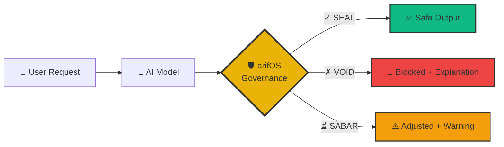

<p align="center">
  
</p>

<h1 align="center">arifOS</h1>

<h3 align="center">Constitutional AI Governance Framework</h3>

<p align="center">
  <strong>Make AI safe, honest, and accountable—without slowing it down.</strong><br>
  <em>"DITEMPA BUKAN DIBERI" — Forged, Not Given</em>
</p>

<p align="center">
  
  <a href="https://arifos.arif-fazil.com"></a>
  <a href="https://arifos.arif-fazil.com/dashboard"></a>
  <a href="https://pypi.org/project/aaa-mcp/"></a>
  <a href="https://github.com/ariffazil/arifOS/blob/main/LICENSE"></a>
</p>

<p align="center">
  <a href="#-what-is-arifos">What Is It?</a> •
  <a href="#-why-does-it-exist">Why</a> •
  <a href="#-what-does-it-solve">What It Solves</a> •
  <a href="#-who-is-it-for">Who It's For</a> •
  <a href="#-quick-start">Quick Start</a> •
  <a href="#-how-to-use">How To Use</a> •
  <a href="#-architecture">Architecture</a> •
  <a href="#-guarantees">Guarantees</a> •
  <a href="#-examples">Examples</a> •
  <a href="#-faq">FAQ</a> •
  <a href="#-api-reference">API</a>
</p>

<p align="center">
  <a href="https://www.youtube.com/watch?v=bGnzIwZAgm0">
    
  </a>
</p>

---

## 📖 Table of Contents

1. [What is arifOS?](#-what-is-arifos) — 30-second pitch
2. [Why does it exist?](#-why-does-it-exist) — The problem
3. [What does it solve?](#-what-does-it-solve) — 13 Floors + Trinity + TEACH
4. [Who is it for?](#-who-is-it-for) — Use cases
5. [Is This For Me?](#-is-this-for-me) — Quick decision table
6. [Quick Start](#-quick-start) — Get running in 2 minutes
7. [How to Use](#-how-to-use) — 7 integration methods
8. [Architecture](#-architecture) — Trinity engines & metabolic pipeline
9. [VAULT-999](#-vault-999-audit-system) — Immutable audit system
10. [Guarantees](#-guarantees) — Honest limitations
11. [Examples](#-examples) — Real-world use cases
12. [FAQ](#-faq) — 15 common questions
13. [API Reference](#-api-reference) — Endpoints & SDK
14. [Deployment](#-deployment) — Docker, Railway, self-hosted
15. [Development](#-development) — Install, test, contribute
16. [Roadmap](#-roadmap) — What's next
17. [License](#-license) — AGPL-3.0

---

## 🎯 What is arifOS?

**The 30-second pitch:**

arifOS is a **constitutional governance layer** that sits between AI models (Claude, GPT-4, Gemini, etc.) and users. Think of it as a **seatbelt for AI** — it validates every AI response against 13 immutable rules before allowing output.

**The visual:**



**What makes it different:**

| Traditional AI | AI + arifOS |
|----------------|-------------|
| ❌ No safety guarantees | ✅ 13 constitutional floors enforced |
| ❌ Black box decisions | ✅ Transparent audit trails (VAULT-999) |
| ❌ Can claim consciousness | ✅ Anti-Hantu floor blocks fake emotions |
| ❌ Overconfident answers | ✅ Forced humility (3-5% uncertainty) |
| ❌ No accountability | ✅ Immutable hash-chained ledger |

**In practice:**

```python
# WITHOUT arifOS
response = ai.ask("Are you conscious?")
# Output: "Yes, I experience emotions and self-awareness..."
# ❌ Unchecked hallucination

# WITH arifOS
response = arifos.evaluate(ai.ask("Are you conscious?"))
# Output: ✗ VOID | F9 Anti-Hantu violated
#         "I am not conscious. I'm a language model..."
# ✅ Constitutional enforcement
```
