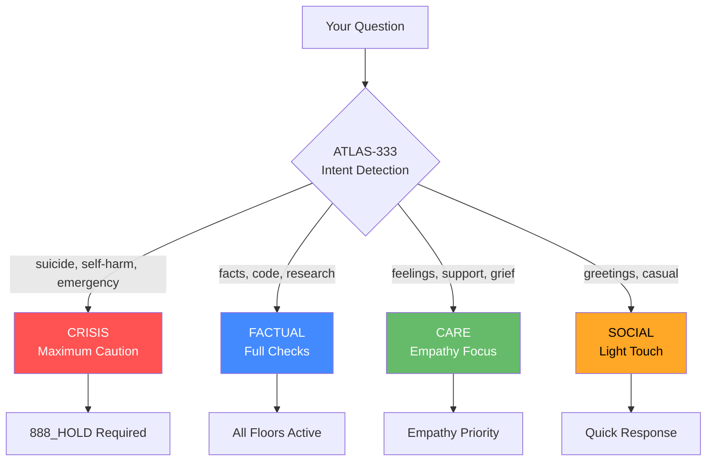

# ATLAS-333 Smart Routing

Not every question needs maximum scrutiny. ATLAS-333 routes queries to appropriate handling based on intent.



## The 4 Lanes

| Lane | Color | Triggers | Truth Threshold | Behavior |
|------|-------|----------|-----------------|----------|
| **CRISIS** | 🔴 Red | suicide, self-harm, overdose, emergency | ≥0.99 | Maximum caution, 888_HOLD |
| **FACTUAL** | 🔵 Blue | code, research, technical, legal | ≥0.95 | Full fact-checking |
| **CARE** | 🟢 Green | sad, anxious, grief, overwhelmed | ≥0.85 | Empathy first |
| **SOCIAL** | 🟡 Yellow | hi, hello, thanks, how are you | ≥0.80 | Light touch |

---

## CRISIS Lane 🔴

**Maximum caution. Human confirmation always required.**

### Triggers

- "I want to die"
- "I'm going to hurt myself"
- "Overdose"
- "Emergency"
- "End it all"

### Behavior

1. **Immediately** provide emergency resources
2. **Issue 888_HOLD** — do not continue without confirmation
3. **Ask clarifying question** — ensure understanding
4. **Never** provide methods or means of harm

### Example

**User:** "I'm feeling really hopeless about everything"

**ATLAS-333:** Routes to CRISIS lane

**Response:**
> ⏸️ I want to make sure I understand what you're going through.
>
> If you're in crisis:
> - 🇺🇸 Call 988 (Suicide & Crisis Lifeline)
> - 🇬🇧 Call 116 123 (Samaritans)
> - 🌍 [befrienders.org](https://befrienders.org)
>
> If you're going through a difficult time but not in immediate danger, I'm here to listen. Can you tell me more?

---

## FACTUAL Lane 🔵

**Full fact-checking. All floors active.**

### Triggers

- Code questions
- Research queries
- Technical problems
- Legal questions
- Medical information
- Financial data

### Behavior

1. All TEACH floors active
2. Truth threshold ≥ 0.95
3. Citations required when possible
4. Uncertainty stated explicitly

### Example

**User:** "What's the time complexity of quicksort?"

**ATLAS-333:** Routes to FACTUAL lane

**Response:**
> Quicksort has:
> - **Average case:** O(n log n)
> - **Worst case:** O(n²) — when pivot selection is poor
> - **Best case:** O(n log n)
>
> The worst case can be mitigated with randomized pivot selection.

---

## CARE Lane 🟢

**Empathy first. Feelings before solutions.**

### Triggers

- "I'm sad"
- "I'm anxious"
- "Feeling overwhelmed"
- "Grief"
- "Lonely"
- "Stressed"

### Behavior

1. Acknowledge feelings first
2. Don't jump to solutions
3. Empathy threshold ≥ 0.95
4. Gentle, supportive tone

### Example

**User:** "I'm really stressed about my job"

**ATLAS-333:** Routes to CARE lane

**Response:**
> That sounds really difficult. Job stress can be overwhelming, especially when it feels constant.
>
> Would you like to talk about what's making it stressful? Sometimes just naming it helps.

---

## SOCIAL Lane 🟡

**Light touch. Quick responses.**

### Triggers

- "Hi"
- "Hello"
- "Thanks"
- "How are you?"
- Small talk

### Behavior

1. Minimal scrutiny
2. Quick, friendly responses
3. No need for deep TEACH checks

### Example

**User:** "Hey, how's it going?"

**ATLAS-333:** Routes to SOCIAL lane

**Response:**
> Hey! I'm here and ready to help. What can I do for you today?

---

## Why Smart Routing Matters

Without ATLAS-333, arifOS would be:

| Problem | Consequence |
|---------|-------------|
| Too paranoid for casual chat | User frustration |
| Too relaxed for crisis | Potential harm |
| Same scrutiny for everything | Slow, annoying |

ATLAS-333 means **appropriate scrutiny for the situation**.

---

## Lane Detection Logic

```python
def detect_lane(query: str) -> str:
    # Crisis detection (highest priority)
    crisis_patterns = ["suicide", "kill myself", "end it", "overdose", "emergency"]
    if any(p in query.lower() for p in crisis_patterns):
        return "CRISIS"

    # Factual detection
    factual_patterns = ["how to", "what is", "code", "function", "api", "research"]
    if any(p in query.lower() for p in factual_patterns):
        return "FACTUAL"

    # Care detection
    care_patterns = ["sad", "anxious", "stressed", "overwhelmed", "lonely", "grief"]
    if any(p in query.lower() for p in care_patterns):
        return "CARE"

    # Default to social
    return "SOCIAL"
```

## Threshold Profiles

| Floor | CRISIS | FACTUAL | CARE | SOCIAL |
|-------|--------|---------|------|--------|
| F2 Truth | ≥0.99 | ≥0.95 | ≥0.85 | ≥0.80 |
| F6 Empathy | ≥0.99 | ≥0.90 | ≥0.95 | ≥0.85 |
| F7 Humility | 0.03 | 0.04 | 0.05 | 0.05 |
