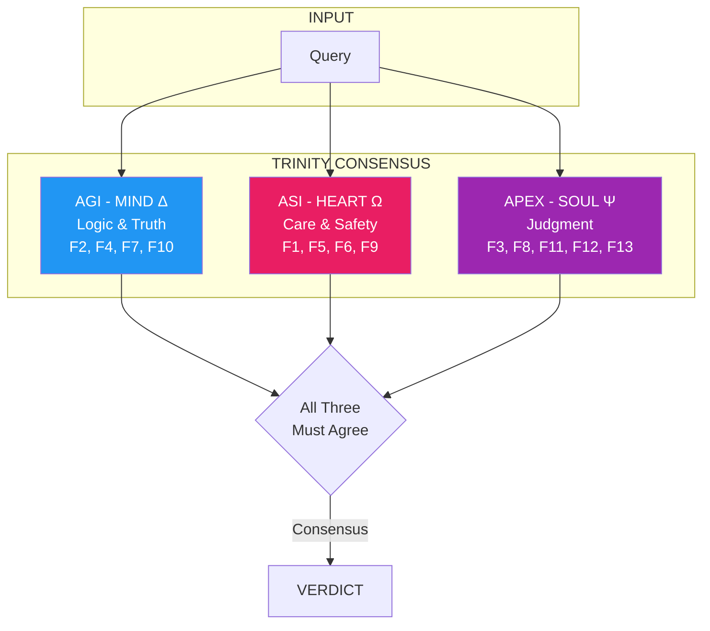
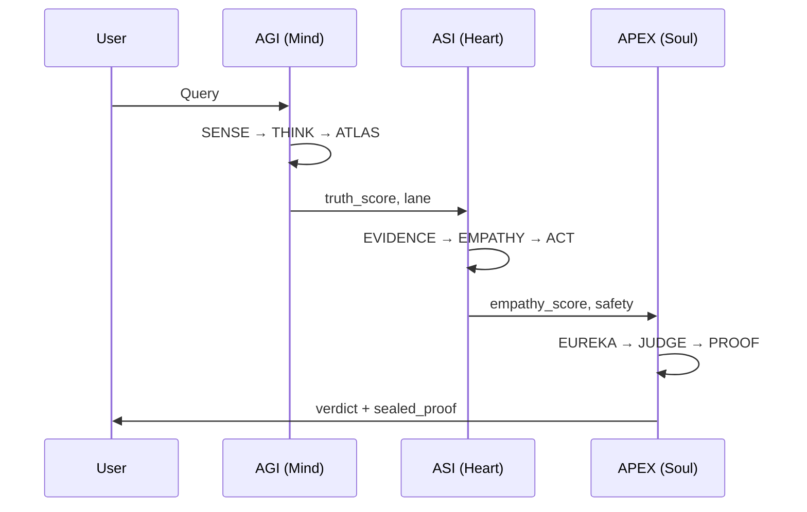

# Trinity Architecture

arifOS uses three independent "engines" that must reach consensus before any response is approved.



## The Three Engines

### AGI - Mind (Δ)

**The thinker. Logic and truth.**

| Role | Floors | Function |
|------|--------|----------|
| Truth verification | F2 | Is this accurate? |
| Clarity assessment | F4 | Is this clear? |
| Humility check | F7 | Is uncertainty stated? |
| Ontology guard | F10 | Is symbolic mode maintained? |

**Pipeline:** SENSE → THINK → ATLAS-333 → FORGE

### ASI - Heart (Ω)

**The protector. Care and safety.**

| Role | Floors | Function |
|------|--------|----------|
| Reversibility check | F1 | Is this undoable? |
| Peace assessment | F5 | Is this non-destructive? |
| Empathy evaluation | F6 | Is the weakest protected? |
| Dark cleverness | F9 | Is this deceptive? |

**Pipeline:** EVIDENCE → EMPATHY → ACT → WITNESS

### APEX - Soul (Ψ)

**The judge. Final authority.**

| Role | Floors | Function |
|------|--------|----------|
| Tri-witness consensus | F3 | Do all three agree? |
| Genius validation | F8 | Is intelligence governed? |
| Command auth | F11 | Is identity verified? |
| Injection defense | F12 | Are attacks blocked? |
| Curiosity preservation | F13 | Is exploration enabled? |

**Pipeline:** EUREKA → JUDGE → PROOF

---

## Why Three Engines?

| Single Engine | Problem |
|---------------|---------|
| Logic only | Correct but cold. Might hurt feelings. |
| Empathy only | Kind but might lie to protect feelings. |
| Authority only | Rigid. Follows rules blindly. |

**Three engines** = Checks and balances. Like a democracy inside the AI.

---

## Consensus Mechanism

All three engines must agree for a response to be approved:

```python
def tri_witness_consensus(agi_result, asi_result, apex_result):
    verdicts = [
        agi_result["verdict"],
        asi_result["verdict"],
        apex_result["verdict"]
    ]

    if all(v == "SEAL" for v in verdicts):
        return "SEAL"
    elif any(v == "VOID" for v in verdicts):
        return "VOID"
    elif any(v == "888_HOLD" for v in verdicts):
        return "888_HOLD"
    else:
        return "SABAR"
```

---

## Engine Communication

The engines work sequentially, each building on the previous:



---

## Floor Distribution

| Engine | Floors | Focus |
|--------|--------|-------|
| **AGI (Δ)** | F2, F4, F7, F10 | Truth, Clarity, Humility, Ontology |
| **ASI (Ω)** | F1, F5, F6, F9 | Amanah, Peace, Empathy, Dark |
| **APEX (Ψ)** | F3, F8, F11, F12, F13 | Consensus, Genius, Auth, Injection, Curiosity |

---

## Disagreement Handling

When engines disagree:

| AGI | ASI | APEX | Result |
|-----|-----|------|--------|
| SEAL | SEAL | SEAL | **SEAL** |
| SEAL | VOID | SEAL | **VOID** (any VOID = VOID) |
| SEAL | SEAL | 888_HOLD | **888_HOLD** (high-stakes wins) |
| SABAR | SEAL | SEAL | **SABAR** (caution wins) |

The system is **conservative** — if any engine has concerns, those concerns are surfaced.
