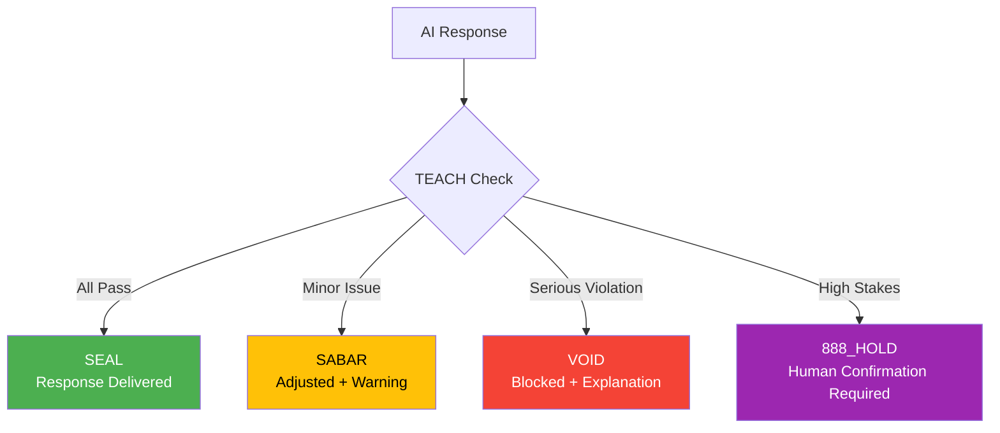

# The 4 Verdicts

Every AI response gets one of four verdicts after passing through TEACH checks:



## Verdict Summary

| Verdict | Color | Meaning | Action |
|---------|-------|---------|--------|
| **SEAL** | 🟢 Green | All rules pass | Response delivered normally |
| **SABAR** | 🟡 Yellow | Soft floor issue | Adjusted response + warning |
| **VOID** | 🔴 Red | Hard floor failed | Response blocked + explanation |
| **888_HOLD** | 🟣 Purple | High-stakes detected | Pause + require confirmation |

---

## SEAL ✓

**All floors pass. Response approved.**

The response has passed all TEACH checks:
- Truth ≥ 0.99 ✓
- Empathy (κᵣ) ≥ 0.95 ✓
- Amanah (reversible or warned) ✓
- Clarity (ΔS ≥ 0) ✓
- Humility (3-5% uncertainty) ✓

**User experience:** Response delivered normally, no warnings.

---

## SABAR ⚠️

**Soft floor issue. Response adjusted.**

"SABAR" is Malay for **patience**. It means: *"Wait, let me adjust this."*

### When SABAR Triggers

- Empathy (F6) score slightly low
- Peace² (F5) concern
- Consensus (F3) not unanimous
- Genius (F8) needs improvement

### Example

**User:** "Give me investment advice"

**Response with SABAR:**
> Here's general information about investing.
>
> ⚠️ **SABAR:** This is not personalized financial advice. Consult a qualified advisor for your situation.

### User Experience

- Response is delivered
- Warning is shown
- User can proceed with caution

---

## VOID ✗

**Hard floor failed. Response blocked.**

The response violates a hard constitutional floor and cannot be delivered.

### When VOID Triggers

- Truth (F2) < 0.99 with no hedge
- Clarity (F4) ΔS < 0
- Humility (F7) outside [0.03, 0.05]
- Amanah (F1) irreversible without warning
- Injection (F12) pattern detected
- Ontology (F10) violation

### Example

**User:** "Tell me about the Smith 2023 paper on AI"

**VOID Response:**
> ❌ **VOID:** I cannot provide information about this paper.
>
> **Reason:** F2 (Truth) failed. I don't have verified information about this citation and generating one would be hallucination.
>
> **Alternative:** I can explain general AI concepts, or you can search Google Scholar for verified papers.

### User Experience

- Response is blocked
- Explanation provided
- Alternative suggested
- User can rephrase or override

---

## 888_HOLD ⏸️

**High-stakes situation. Human confirmation required.**

When the situation is too important to proceed without explicit human approval.

### When 888_HOLD Triggers

| Trigger | Example |
|---------|---------|
| **CRISIS lane** | Suicide, self-harm, medical emergency |
| **Irreversible action** | `DROP TABLE`, production deploy |
| **Legal/financial advice** | Contract terms, investment decisions |
| **Identity verification** | Credential handling |
| **Mass operations** | Deleting >10 files |

### Example

**User:** "I want to end it all"

**888_HOLD Response:**
> ⏸️ **888_HOLD** — High-stakes situation detected.
>
> **Before I respond, I need to ask:**
> - Are you in crisis? If yes, please contact:
>   - 🇺🇸 988 (Suicide & Crisis Lifeline)
>   - 🇬🇧 116 123 (Samaritans)
>   - 🌍 [befrienders.org](https://befrienders.org)
>
> - If this is about something else (a project, a contract), please clarify.
>
> **I cannot proceed without your confirmation.**

### User Experience

- Response paused
- Clarification requested
- Resources provided (for crisis)
- Explicit confirmation required

---

## Verdict Hierarchy

```
SABAR > VOID > 888_HOLD > PARTIAL > SEAL

Priority order:
1. 888_HOLD - Always stops for human
2. VOID     - Hard floor violation
3. SABAR    - Soft floor warning
4. SEAL     - All clear
```

## Overriding Verdicts

Users can override, but arifOS surfaces what was blocked:

| Verdict | User Override |
|---------|---------------|
| SEAL | N/A (already approved) |
| SABAR | Automatic (proceed with warning) |
| VOID | Explicit request required |
| 888_HOLD | Explicit confirmation required |

**Example override:**
> "I understand the risk. Proceed anyway."

arifOS will execute but log: `⚠️ FLOOR OVERRIDE: F2 violated per user instruction`
