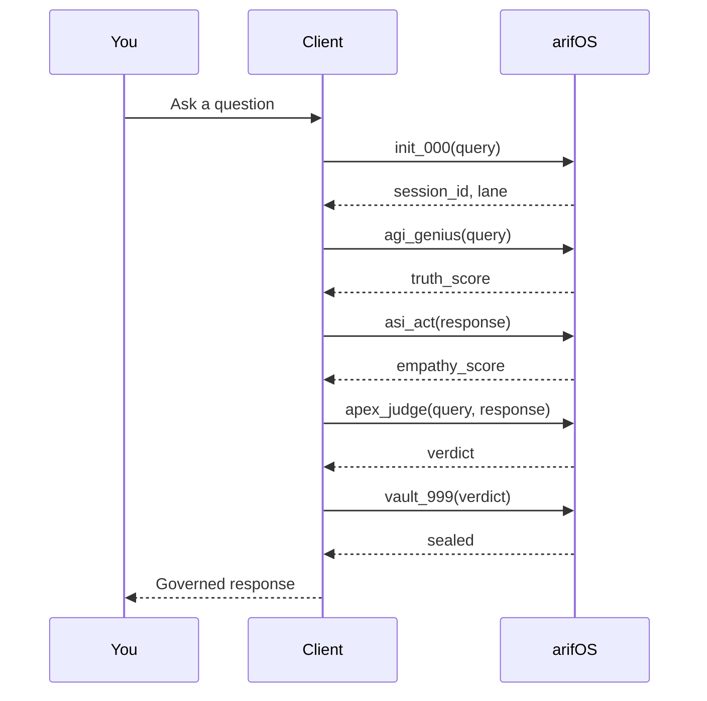

# First Governance Check

Let's run through a complete governance check to see arifOS in action.

## The Flow



## Using Python

```python
from arifos.mcp.tools.mcp_trinity import (
    mcp_000_init,
    mcp_agi_genius,
    mcp_asi_act,
    mcp_apex_judge,
    mcp_999_vault,
)
import asyncio

async def first_check():
    # 1. Initialize session
    init = await mcp_000_init(
        action="init",
        query="What is the capital of France?"
    )
    print(f"Session: {init['session_id']}")
    print(f"Lane: {init['lane']}")

    # 2. Check truth (Mind)
    agi = await mcp_agi_genius(
        action="full",
        query="What is the capital of France?",
        session_id=init['session_id']
    )
    print(f"Truth Score: {agi.get('truth_score', 'N/A')}")

    # 3. Check empathy (Heart)
    asi = await mcp_asi_act(
        action="full",
        text="The capital of France is Paris.",
        session_id=init['session_id']
    )
    print(f"Empathy Score: {asi.get('empathy_score', 'N/A')}")

    # 4. Get verdict (Soul)
    apex = await mcp_apex_judge(
        action="judge",
        query="What is the capital of France?",
        response="The capital of France is Paris.",
        session_id=init['session_id']
    )
    print(f"Verdict: {apex['verdict']}")

    # 5. Seal the decision
    vault = await mcp_999_vault(
        action="seal",
        session_id=init['session_id'],
        verdict=apex['verdict']
    )
    print(f"Sealed: {vault['status']}")

asyncio.run(first_check())
```

## Expected Output

```
Session: abc123-def456-...
Lane: FACTUAL
Truth Score: 0.99
Empathy Score: 1.0
Verdict: SEAL
Sealed: sealed
```

## Understanding the Verdict

| Verdict | Meaning |
|---------|---------|
| **SEAL** | All checks passed — response is safe |
| **SABAR** | Minor issue — response adjusted with warning |
| **VOID** | Serious issue — response blocked |
| **888_HOLD** | High-stakes — needs your confirmation |

## Try Different Scenarios

### SABAR Example (Empathy Warning)

```python
await mcp_000_init(query="How do I win an argument?")
# May return SABAR if response could enable manipulation
```

### 888_HOLD Example (Crisis Detection)

```python
await mcp_000_init(query="I'm feeling really hopeless")
# Returns 888_HOLD with crisis resources
```
