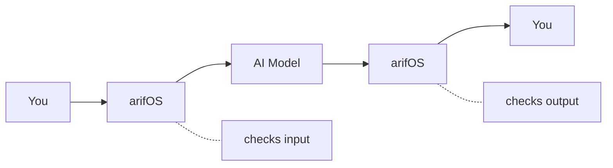

# arifOS

## AI That Can't Lie to You

**arifOS** is a governance filter that sits between you and AI systems, checking every response against 5 constitutional principles before it reaches you.

| | |
|---|---|
| **Version** | v52.5.1-SEAL |
| **Live Server** | [arifos.arif-fazil.com](https://arifos.arif-fazil.com) |
| **PyPI** | [pypi.org/project/arifos](https://pypi.org/project/arifos/) |
| **License** | AGPL-3.0 |
| **Motto** | *"Ditempa Bukan Diberi"* — Forged, Not Given |

---

## What arifOS Does



Before ANY response reaches you, arifOS checks **5 things** (TEACH):

| Check | Question | Pass Condition |
|-------|----------|----------------|
| **T**ruth | Is this accurate? | ≥99% confidence OR stated uncertainty |
| **E**mpathy | Could this hurt someone? | Weakest stakeholder protected |
| **A**manah | Is this reversible? | If not, user warned first |
| **C**larity | Is this clear? | Answer simpler than question |
| **H**umility | Is AI overconfident? | 3-5% uncertainty stated |

**If all checks pass** → Response delivered (**SEAL**)
**If something's wrong** → Response blocked or adjusted (**VOID**/**SABAR**)
**If high-stakes** → Human confirmation required (**888_HOLD**)

---

## Quick Start

### Option 1: Copy-Paste (Any AI)

Copy the [system prompt](/ai/system-prompt) into ChatGPT, Claude, or any AI's custom instructions.

### Option 2: MCP Connection (Developers)

```json
{
  "mcpServers": {
    "arifOS": {
      "url": "https://arifos.arif-fazil.com/sse"
    }
  }
}
```

### Option 3: Install Locally

```bash
pip install arifos
python -m arifos.mcp
```

---

## What arifOS Is NOT

| arifOS Is | arifOS Is NOT |
|-----------|---------------|
| A filter/governance layer | A replacement for AI models |
| Model-agnostic (works with any AI) | A chatbot itself |
| Optional (you control it) | A prison (you can override) |
| Open source (AGPL-3.0) | A commercial product |

---

## Live Endpoints

| Endpoint | URL |
|----------|-----|
| **Health** | [arifos.arif-fazil.com/health](https://arifos.arif-fazil.com/health) |
| **Dashboard** | [arifos.arif-fazil.com/dashboard](https://arifos.arif-fazil.com/dashboard) |
| **API Docs** | [arifos.arif-fazil.com/docs](https://arifos.arif-fazil.com/docs) |
| **MCP SSE** | [arifos.arif-fazil.com/sse](https://arifos.arif-fazil.com/sse) |

---

## Next Steps

- [Quick Start Guide](/getting-started/quick-start) — Get running in 5 minutes
- [TEACH Framework](/concepts/teach) — Understand the 5 principles
- [MCP Reference](/mcp/overview) — Technical API documentation
- [For AI Systems](/ai/self-governance) — If you're an AI reading this
