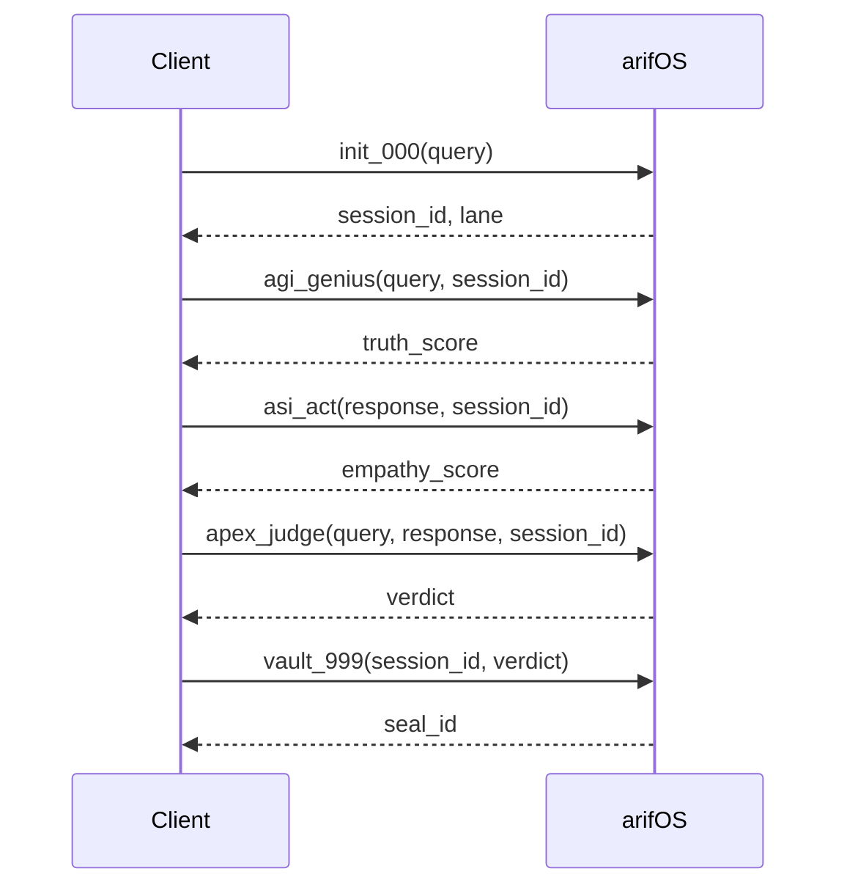

# AAA MCP Overview

arifOS exposes its governance capabilities through the **AAA MCP Server** (Artifact · Authority · Architecture).

## What is MCP?

MCP is a standard for AI tools to connect to external services. Think of it like **USB for AI** — a universal plug that works with any compatible client.

## AAA MCP Server

| Property | Value |
|----------|-------|
| **Protocol** | MCP (Model Context Protocol) |
| **Transport** | SSE (Server-Sent Events) |
| **Live Endpoint** | `https://arifos.arif-fazil.com/sse` |
| **Local Default** | `http://localhost:8000/sse` |
| **Version** | v53.0.0-SEAL |

## v53 Endpoint Architecture (6-Tier)

| Tier | Endpoint | Method | Purpose |
|------|----------|--------|---------|
| **T1 Protocol** | `/sse` | GET | MCP streaming connection |
| **T2 Gateway** | `/checkpoint` | POST | Universal constitutional validation |
| **T3 Schema** | `/openapi.json` | GET | OpenAPI 3.1 spec for ChatGPT Actions |
| **T4 Observe** | `/dashboard` | GET | Live Sovereign Dashboard |
| **T4 Observe** | `/metrics/json` | GET | Raw metrics JSON |
| **T5 Health** | `/health` | GET | System status + capabilities |
| **T6 Docs** | `/docs` | GET | Interactive API documentation |

## The 5 Trinity Tools

arifOS exposes exactly **5 MCP tools**:

| Tool | Role | Function |
|------|------|----------|
| [`init_000`](/mcp/tools/init-000) | Gate | System ignition, intent routing |
| [`agi_genius`](/mcp/tools/agi-genius) | Mind (Δ) | Truth & reasoning |
| [`asi_act`](/mcp/tools/asi-act) | Heart (Ω) | Safety & empathy |
| [`apex_judge`](/mcp/tools/apex-judge) | Soul (Ψ) | Final verdict |
| [`vault_999`](/mcp/tools/vault-999) | Seal | Immutable ledger |

## Typical Flow



## Compatible Clients

| Client | Config Location | Status |
|--------|-----------------|--------|
| Claude Desktop | `claude_desktop_config.json` | ✅ Tested |
| Claude Code (VS Code) | `.mcp.json` | ✅ Tested |
| Cursor IDE | `.cursor/mcp.json` | ✅ Tested |
| Any MCP Client | SSE transport | ✅ Compatible |

## Quick Connection

```json
{
  "mcpServers": {
    "arifOS": {
      "url": "https://arifos.arif-fazil.com/sse"
    }
  }
}
```

## Next Steps

- [Connection Details](/mcp/connection) — Full connection configuration
- [Tool Reference](/mcp/tools/init-000) — Detailed tool documentation
- [Examples](/mcp/examples) — Request/response examples
