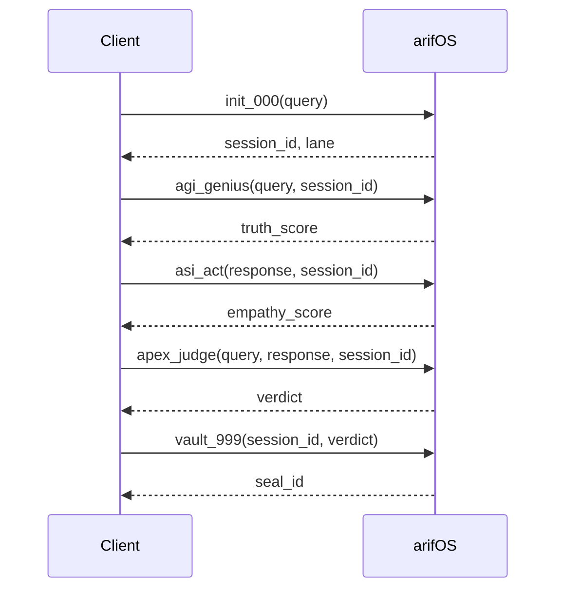
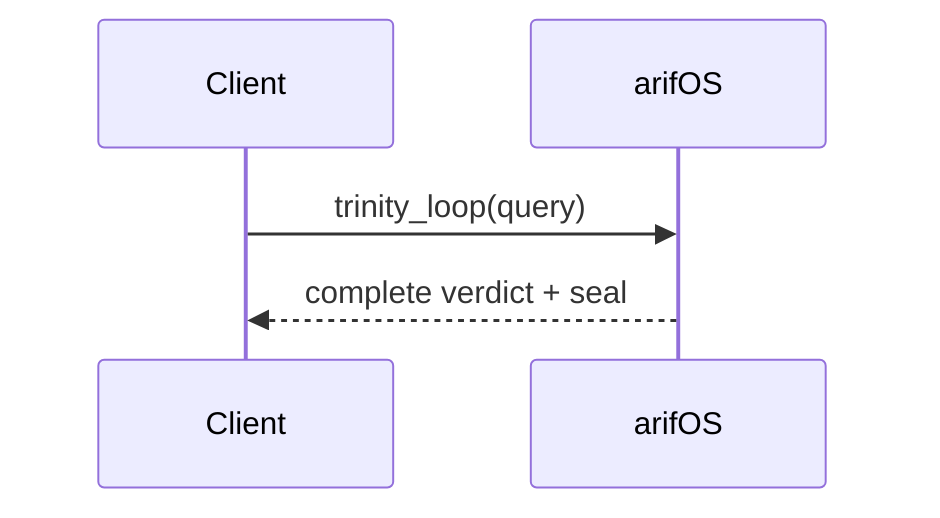

# AAA MCP Overview

arifOS exposes its governance capabilities through the **AAA MCP Server** (Artifact · Authority · Architecture).

## What is MCP?

MCP is a standard for AI tools to connect to external services. Think of it like **USB for AI** — a universal plug that works with any compatible client.

## AAA MCP Server

| Property | Value |
|----------|-------|
| **Protocol** | MCP (Model Context Protocol) |
| **Transport** | Streamable HTTP (MCP 2024-11-05+) |
| **Live Endpoint** | `https://arifos.arif-fazil.com/mcp` |
| **Local Default** | `http://localhost:8000/mcp` |
| **Version** | v53.2.1-CODEBASE |

:::info Transport Change (v53.2.1)
The MCP transport has been upgraded from **SSE** (`/sse` + `/messages`) to **Streamable HTTP** (`/mcp` — single POST endpoint). This follows the MCP protocol 2024-11-05+ standard. All new clients should use `/mcp`.
:::

## v53.2.1 Endpoint Architecture

| Endpoint | Method | Purpose |
|----------|--------|---------|
| `/mcp` | POST | MCP Streamable HTTP protocol (primary) |
| `/health` | GET | Railway/Docker liveness check |
| `/metrics/json` | GET | Constitutional telemetry metrics |
| `/dashboard` | GET | Live Serena monitoring dashboard |
| `/` | GET | Interactive discovery landing page |

## The 6 Trinity Tools

arifOS exposes exactly **6 MCP tools**:

| Tool | Role | Function |
|------|------|----------|
| [`init_000`](/mcp/tools/init-000) | Gate | System ignition, intent routing, identity verification |
| [`agi_genius`](/mcp/tools/agi-genius) | Mind (Δ) | Truth & reasoning (F2, F4, F7, F10) |
| [`asi_act`](/mcp/tools/asi-act) | Heart (Ω) | Safety & empathy (F1, F5, F6, F9) |
| [`apex_judge`](/mcp/tools/apex-judge) | Soul (Ψ) | Final verdict (F3, F8, F11, F12) |
| [`vault_999`](/mcp/tools/vault-999) | Seal | Immutable ledger |
| [`trinity_loop`](/mcp/tools/trinity-loop) | Pipeline | Complete AGI→ASI→APEX→VAULT in one call |

## Typical Flow

### Individual Tools (Step-by-Step)



### One-Shot Pipeline (trinity_loop)



Use `trinity_loop` when you want the full constitutional governance cycle in a single call. Use individual tools when you need fine-grained control over each stage.

## Compatible Clients

| Client | Transport | Config Location | Status |
|--------|-----------|-----------------|--------|
| Claude Desktop | stdio | `claude_desktop_config.json` | ✅ Tested |
| Claude Code (VS Code) | stdio | `.mcp.json` | ✅ Tested |
| Cursor IDE | stdio | `.cursor/mcp.json` | ✅ Tested |
| Kimi CLI | stdio | `~/.kimi/mcp_config.json` | ✅ Tested |
| Gemini CLI | stdio | `~/.gemini/settings.json` | ✅ Tested |
| ChatGPT Dev Mode | HTTP | `/mcp` endpoint | ✅ Compatible |
| OpenAI Codex | HTTP | `/mcp` endpoint | ✅ Compatible |
| Any MCP Client | HTTP | Streamable HTTP | ✅ Compatible |

:::tip Two Transport Modes
**stdio** (local): Clients like Claude Desktop, Kimi CLI, and Gemini CLI run the MCP server as a subprocess via `python -m codebase.mcp`. No network required.

**HTTP** (remote): Clients like ChatGPT and Codex connect to the live server at `https://arifos.arif-fazil.com/mcp` over HTTPS.
:::

## Quick Connection

### Remote (HTTP)

```json
{
  "mcpServers": {
    "arifOS": {
      "url": "https://arifos.arif-fazil.com/mcp"
    }
  }
}
```

### Local (stdio)

```json
{
  "mcpServers": {
    "arifOS": {
      "command": "python",
      "args": ["-m", "codebase.mcp"],
      "env": {
        "PYTHONIOENCODING": "utf-8"
      }
    }
  }
}
```

## Next Steps

- [Connection Details](/mcp/connection) — Full connection configuration for all clients
- [Tool Reference](/mcp/tools/init-000) — Detailed tool documentation
- [Trinity Loop](/mcp/tools/trinity-loop) — One-call governance pipeline
- [Examples](/mcp/examples) — Request/response examples
