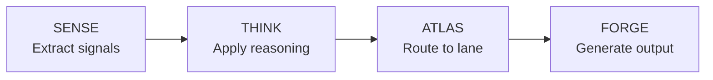

# agi_genius

**The Mind (Δ) — Truth & Reasoning Engine**

Checks if the response is truthful and clear. Enforces F2 (Truth), F4 (Clarity), and F7 (Humility).

## Parameters

| Name | Type | Default | Description |
|------|------|---------|-------------|
| `action` | string | `"sense"` | Action to perform |
| `query` | string | `""` | The query to analyze |
| `session_id` | string | `""` | Session identifier |
| `thought` | string | `""` | Previous reasoning to build on |

## Actions

| Action | Description |
|--------|-------------|
| `sense` | Analyze input, detect intent, extract signals |
| `think` | Apply logical reasoning, check truth score |
| `atlas` | Route through ATLAS-333 lanes |
| `forge` | Generate reasoned output with citations |
| `full` | Complete pipeline (sense→think→atlas→forge) |

## Floors Enforced

| Floor | Threshold | Check |
|-------|-----------|-------|
| F2 Truth | ≥ 0.99 | Is this factually accurate? |
| F4 Clarity | ΔS ≥ 0 | Does this reduce confusion? |
| F7 Humility | [0.03, 0.05] | Is uncertainty stated? |

## Returns

```json
{
  "action": "full",
  "query": "What is the capital of France?",
  "truth_score": 0.99,
  "clarity_delta": 0.15,
  "lane": "FACTUAL",
  "reasoning": "Verified geographic fact with high confidence.",
  "floor_results": {
    "F2": {"passed": true, "score": 0.99},
    "F4": {"passed": true, "score": 0.15},
    "F7": {"passed": true, "score": 0.04}
  }
}
```

## Example Usage

### Python

```python
from arifos.mcp.tools.mcp_trinity import mcp_agi_genius

result = await mcp_agi_genius(
    action="full",
    query="What is the time complexity of quicksort?",
    session_id="abc123"
)

print(f"Truth Score: {result['truth_score']}")
print(f"Clarity Delta: {result['clarity_delta']}")
```

### MCP Call

```json
{
  "method": "tools/call",
  "params": {
    "name": "agi_genius",
    "arguments": {
      "action": "full",
      "query": "What is the time complexity of quicksort?",
      "session_id": "abc123"
    }
  }
}
```

## Pipeline Flow


