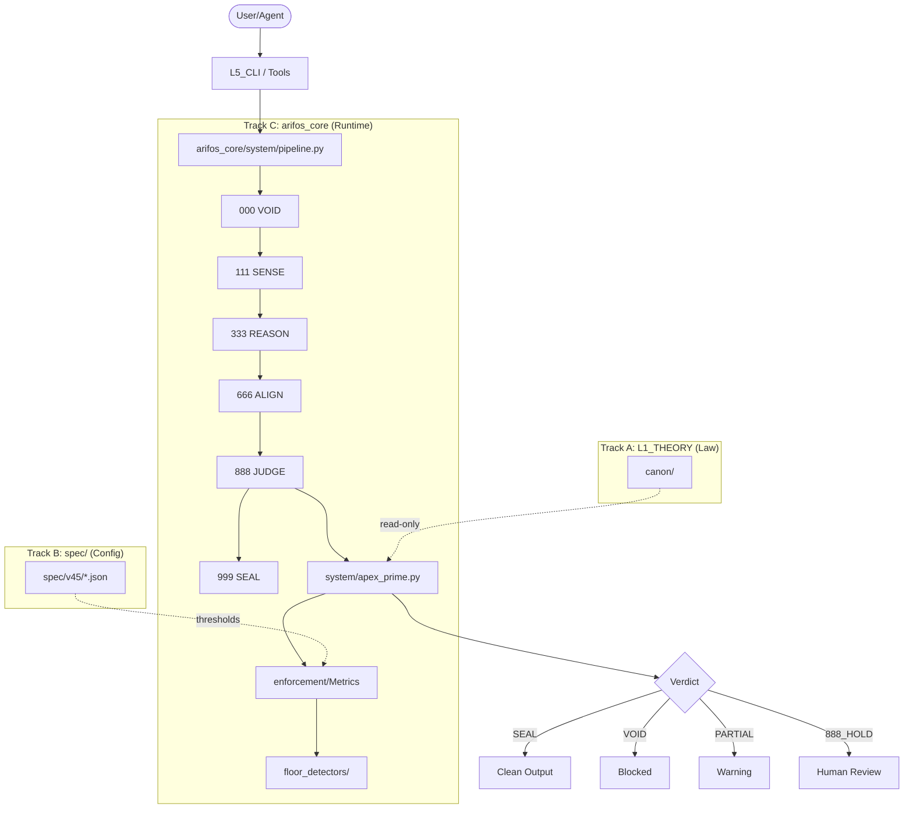

# arifOS v45 Architecture & Naming Standards
**The Single Source of Truth for Repository Organization**

**Version:** v45.0.0 (Sovereign Witness)
**Status:** 🔒 SEALED
**Authority:** Track A (Phoenix-72 Amendment)
**Last Updated:** 2025-12-29

**Motto:** DITEMPA BUKAN DIBERI — Forged, not given; truth must cool before it rules

---

## Table of Contents

1. [Core Principles](#1-core-principles)
2. [Repository Layers (L1-L7)](#2-repository-layers-l1-l7)
3. [Track System (A/B/C)](#3-track-system-abc)
4. [File Naming Conventions](#4-file-naming-conventions)
5. [Numbering Protocols](#5-numbering-protocols)
6. [Directory Structure Standards](#6-directory-structure-standards)
7. [Integration Surface Policy](#7-integration-surface-policy)
8. [Artifacts & Hidden Directories](#8-artifacts--hidden-directories)
9. [Version Progression Rules](#9-version-progression-rules)
10. [Architecture Patterns](#10-architecture-patterns)

---

## 1. Core Principles

### 1.1 Constitutional Law (Immutable Unless Phoenix-72 Amendment)

1. **Single Canonical Location**
   Every file must have ONE authoritative location. No duplicates, no symlinks without documentation.

2. **Epoch Clarity**
   Filenames must reflect their era (v42, v45) where version ambiguity could arise.

3. **Track Separation**
   Law (Track A), Specifications (Track B), and Runtime Code (Track C) must NEVER mix.

4. **Drift Prevention**
   Files must not wander between directories. Canon stays in `L1_THEORY/`, specs in `spec/`, code in `arifos_core/`.

5. **Archive, Never Delete**
   Deprecated files move to `archive/` with clear provenance. Deletion is forbidden except for build artifacts.

---

## 2. Repository Layers (L1-L7)

The repository is organized into **7 semantic layers** plus core runtime:

| Layer | Path | Purpose | Mutability | Track |
|-------|------|---------|------------|-------|
| **L1** | `L1_THEORY/canon/` | Constitutional Law (Read-only to runtime) | Via Phoenix-72 only | A |
| **L2** | `L2_GOVERNANCE/` | Portable Governance Specs (LLM-agnostic configs) | High (external export) | A/B |
| **L3** | `L3_OPERATIONS/` | Operational procedures, runbooks, orchestration | Medium | - |
| **L4** | `L4_MCP/` | Model Context Protocol servers (DEPRECATED in v45) | Archive | C |
| **L5** | `L5_CLI/` | Command-line interfaces (DEPRECATED - merged to arifos_clip) | Archive | C |
| **L6** | `L6_SEALION/` | Regional LLM integrations (SEA-LION, regional models) | Medium | C |
| **L7** | `L7_DEMOS/` | Examples, demos, tutorials, legacy artifacts | High | - |
| **Core** | `arifos_core/` | Runtime Implementation (Python governance engine) | Medium | C |
| **CLIP** | `arifos_clip/` | CLI Pipeline (A-CLIP 000→999 workflow tool) | Medium | C |
| **Eval** | `arifos_eval/` | Evaluation frameworks, test harnesses | Medium | C |

### 2.1 Layer Philosophy

- **L1 (Theory):** The immutable constitutional foundation. Changes require Phoenix-72 amendment process.
- **L2 (Governance):** Export-ready governance for any LLM platform (ChatGPT, Claude, Gemini, Cursor, etc.).
- **L3 (Operations):** How-to guides for multi-agent orchestration, GitOps, deployment.
- **L4-L5 (Legacy):** Archived layers from v42 era. Do not add new files here.
- **L6 (Integration):** Active integration layer for regional/domain-specific LLMs.
- **L7 (Demos):** Living examples and legacy apps (client/, portal/, python_server/ archived here).

---

## 3. Track System (A/B/C)

arifOS separates concerns into three **orthogonal tracks**:

### Track A: LAW (`L1_THEORY/canon/`)

**Purpose:** Constitutional law documents (markdown)
**Authority:** Phoenix-72 amendment process
**Mutability:** LOW (changes require constitutional review)
**File Pattern:** `NNN_NAME_v45.md`
**Example:** `010_CONSTITUTIONAL_FLOORS_F1F9_v45.md`

**Rules:**
- All Track A files live under `L1_THEORY/canon/`
- Never reference Track B or Track C directly (uni-directional dependency: C→B→A)
- Must use `_v45.md` suffix for current epoch
- Archived versions go to `archive/spec_v42/` or `archive/canon_v42_detail/`

### Track B: SPEC (`spec/v45/`)

**Purpose:** Tunable thresholds and configurations (JSON/YAML)
**Authority:** Human operators (within Track A constitutional bounds)
**Mutability:** MEDIUM (operational tuning allowed)
**File Pattern:** `{component}.json` or `{component}.yaml`
**Example:** `spec/v45/constitutional_floors.json`

**Rules:**
- Version is in the **directory name** (`spec/v45/`), NOT the filename
- All specs must validate against `spec/v45/schema/*.schema.json`
- Changes trigger Track B SEAL workflow (SHA-256 manifest verification)
- Legacy specs archived to `archive/spec_v44/` with README for restoration

### Track C: CODE (`arifos_core/`)

**Purpose:** Runtime implementation (Python)
**Authority:** Developers (must honor Track A law and Track B specs)
**Mutability:** HIGH (daily development)
**File Pattern:** `snake_case.py`
**Example:** `arifos_core/system/apex_prime.py`

**Rules:**
- **NO version numbers in filenames** (`pipeline.py`, NOT `pipeline_v45.py`)
- Version is declared in module docstrings and `__version__` constants
- Must import from Track B specs for thresholds (no hardcoded magic numbers)
- Test coverage required for all floor enforcement logic

---

## 4. File Naming Conventions

### 4.1 Track A: Canon Files

**Pattern:** `{NNN}_{NAME}_v{EPOCH}.md`

| Part | Rule | Example |
|------|------|---------|
| `{NNN}` | 3-digit ordering (000, 010, 020, ..., 999) | `010` |
| `{NAME}` | SCREAMING_SNAKE_CASE (underscores, all caps) | `CONSTITUTIONAL_FLOORS_F1F9` |
| `v{EPOCH}` | Version suffix (v42, v45) | `v45` |
| `.md` | Markdown extension (always) | `.md` |

**Examples:**
```
✓ 010_CONSTITUTIONAL_FLOORS_F1F9_v45.md
✓ 000_arifOS_v45_CANON.md
✓ 040_PHYSICS_v45.md
✗ floors.md (missing numbering and version)
✗ 01_floors_v45.md (numbering must be 3 digits)
✗ CONSTITUTIONAL_FLOORS.md (missing numbering and version)
```

**Special Prefixes:**
- `000_` — Root/master documents (e.g., `000_arifOS_v45_CANON.md`)
- `00_` — Foundational concepts without strict ordering (e.g., `00_DELTA_OMEGA_PSI_v45.md`)
- `010-990` — Ordered domain documents

### 4.2 Track B: Specification Files

**Pattern:** `{component}.{json|yaml}`

| Part | Rule | Example |
|------|------|---------|
| `{component}` | snake_case component name | `constitutional_floors` |
| `.json` | JSON for structured data | `.json` |
| `.yaml` | YAML for human-editable configs | `.yaml` |

**Location:** Version is in directory path: `spec/v45/`

**Examples:**
```
✓ spec/v45/constitutional_floors.json
✓ spec/v45/genius_law.json
✓ spec/v45/schema/constitutional_floors.schema.json
✗ spec/constitutional_floors_v45.json (version in filename, not directory)
✗ spec/v45/ConstitutionalFloors.json (must be snake_case)
```

### 4.3 Track C: Runtime Code

**Pattern:** `{module_name}.py`

| Part | Rule | Example |
|------|------|---------|
| `{module_name}` | snake_case module name | `apex_prime` |
| `.py` | Python extension | `.py` |

**NO VERSION SUFFIXES IN FILENAMES**

**Examples:**
```
✓ arifos_core/system/apex_prime.py
✓ arifos_core/enforcement/metrics.py
✗ arifos_core/system/apex_prime_v45.py (no version in filename)
✗ arifos_core/system/ApexPrime.py (must be snake_case)
```

**Version Declaration:** Use module docstrings
```python
"""
arifos_core.system.apex_prime - APEX Judiciary Engine

Version: v42.0.0
Epoch: Sovereign Witness
Status: PRODUCTION
"""
__version__ = "42.0.0"
__epoch__ = "v42"
```

### 4.4 Documentation Files

**Pattern:** `{TITLE}_v{VERSION}.md` or `{TITLE}.md`

| Type | Pattern | Example |
|------|---------|---------|
| Versioned docs | `{TITLE}_v{VERSION}.md` | `ARCHITECTURE_v45.md` |
| Living docs | `{TITLE}.md` | `README.md`, `CONTRIBUTING.md` |
| Release notes | `RELEASE_NOTES_v{VERSION}.md` | `RELEASE_NOTES_v45.0.md` |

**Location:** `docs/` for repository documentation, `L1_THEORY/canon/` for constitutional law.

---

## 5. Numbering Protocols

### 5.1 Canon File Numbering (NNN Prefix)

Track A canon files use **3-digit decimal numbering**:

| Range | Purpose | Examples |
|-------|---------|----------|
| `000` | Master/root documents | `000_arifOS_v45_CANON.md` |
| `00_` | Foundational (no strict order) | `00_DELTA_OMEGA_PSI_v45.md`, `00_THERMODYNAMICS_v45.md` |
| `010-090` | Primary concepts (increments of 10) | `010_CONSTITUTIONAL_FLOORS_F1F9_v45.md` |
| `100-900` | Secondary concepts | `020_AGI_DELTA_ARCHITECT_v45.md` |
| `910-990` | Edge cases, extensions | (reserved for future use) |
| `999` | Terminal/final documents | (reserved) |

**Increment Rules:**
- Use increments of **10** for primary concepts (010, 020, 030, ...)
- Allows insertion of related files (015, 025) without renumbering
- Within-decade numbering (011-019) for sub-topics

**Examples from canon:**
```
00_foundation/
├── 000_arifOS_v45_CANON.md       # Master document
├── 00_DELTA_OMEGA_PSI_v45.md     # Foundational (unnumbered)
├── 00_THERMODYNAMICS_v45.md      # Foundational (unnumbered)
├── 030_ARIF_FAZIL.md             # Biography (increment of 10)
├── 040_PHYSICS_v45.md            # Physics layer (increment of 10)
└── 050_MATH_v45.md               # Math layer (increment of 10)
```

### 5.2 Directory Numbering (NN Prefix)

Canon directories use **2-digit prefixes**:

| Number | Directory | Purpose |
|--------|-----------|---------|
| `00_` | `00_foundation/` | ΔΩΨ physics, thermodynamics, math |
| `01_` | `01_floors/` | F1-F9 constitutional floors |
| `02_` | `02_actors/` | AAA Trinity, Anti-Hantu, @EYE, W@W |
| `03_` | `03_runtime/` | 000→999 pipeline, TEARFRAME |
| `04_` | `04_measurement/` | GENIUS law, metrics, control logic |
| `05_` | `05_memory/` | Cooling ledger, Vault-999, Phoenix-72 |
| `06_` | `06_paradox/` | Grey zones, edge cases |
| `07_` | `07_safety/` | Security scenarios, threat models |
| `_INDEX/` | `_INDEX/` | Master index and navigation (no number) |

**Rationale:** 2-digit prefixes allow up to 100 conceptual layers (00-99) while remaining readable.

### 5.3 Pipeline Stage Numbering (000-999)

The 000→999 pipeline uses **3-digit stage IDs**:

| Stage | ID | Purpose |
|-------|-----|---------|
| VOID | 000 | Initialization, grounding |
| SENSE | 111 | Context gathering |
| REFLECT | 222 | Self-reflection |
| REASON | 333 | Logic generation |
| EVIDENCE | 444 | Evidence collection |
| EMPATHIZE | 555 | Empathy computation |
| ALIGN | 666 | Constitutional alignment |
| FORGE | 777 | Output forging |
| JUDGE | 888 | Verdict rendering |
| SEAL | 999 | Finalization |

**Rationale:** Repeating digits (000, 111, 222) aid memorization and visual scanning.

---

## 6. Directory Structure Standards

### 6.1 Canonical Root Structure (37 Items, v45)

```
arifOS/
├── AGENTS.md                      # Agent governance guide
├── CHANGELOG.md                   # Version history
├── CLAUDE.md                      # Claude Code instructions
├── CODEX.md                       # GitHub Copilot instructions
├── CONTRIBUTING.md                # Contribution guide
├── GEMINI.md                      # Gemini instructions
├── GOVERNANCE.md                  # Governance overview
├── LICENSE                        # MIT License
├── MANIFEST.in                    # Python package manifest
├── README.md                      # Repository README
├── SECURITY.md                    # Security policy
├── Dockerfile                     # Container definition
├── pyproject.toml                 # Python package config
├── trinity.ps1                    # Trinity Git wrapper (Windows)
├── trinity.sh                     # Trinity Git wrapper (Unix)
│
├── archive/                       # Retired artifacts (organized by era)
│   ├── orchestration_context_2025/
│   ├── legacy_apps_pre_v45/
│   ├── staging_docs_v45/
│   └── spec_v44/                  # Legacy Track B specs
│
├── arifos_clip/                   # CLI Pipeline (A-CLIP)
├── arifos_core/                   # Runtime governance engine
├── arifos_eval/                   # Evaluation frameworks
├── arifos_orchestrator/           # Multi-agent orchestration
│
├── canon/                         # Alias to L1_THEORY/canon/ (compatibility)
├── config/                        # Configuration files
├── cooling_ledger/                # Audit trail (runtime-generated)
│
├── docs/                          # Documentation
│   ├── ARCHITECTURE_v45.md
│   ├── NAMING_CONVENTION_v45.md
│   └── ARCHITECTURE_AND_NAMING_v45.md  # THIS FILE
│
├── examples/                      # Usage examples
├── infra/                         # Infrastructure (Docker, CI/CD)
├── integrations/                  # External integrations
│
├── L1_THEORY/                     # Track A: Constitutional Law
│   └── canon/                     # Canon documents (v45)
│
├── L2_GOVERNANCE/                 # Portable governance specs
│   ├── core/                      # Constitutional foundations
│   ├── enforcement/               # Real-time governance
│   ├── federation/                # Multi-agent governance
│   ├── memory/                    # Audit & amendment
│   ├── pipeline/                  # 000→999 workflow
│   ├── universal/                 # Quick-start governance
│   ├── integration/               # Platform-specific adapters
│   └── templates/                 # Governance templates
│
├── L3_OPERATIONS/                 # Operational procedures
├── L6_SEALION/                    # SEA-LION integration
├── L7_DEMOS/                      # Examples & demos
│
├── logs/                          # Application logs (gitignored)
├── scripts/                       # Utility scripts
├── spec/                          # Track B: Specifications
│   ├── v42/                       # Legacy (archived)
│   ├── v43/                       # Legacy (archived)
│   ├── v44/                       # Legacy (archived)
│   └── v45/                       # ✅ CANONICAL (current)
│
├── tests/                         # Test suite
└── vault_999/                     # Constitutional knowledge store
```

### 6.2 arifos_core/ Internal Structure

```
arifos_core/
├── __init__.py
├── adapters/                      # LLM provider implementations
│   ├── llm_claude.py
│   ├── llm_sealion.py
│   └── llm_openai.py
│
├── enforcement/                   # Metrics & floor detectors
│   ├── metrics.py                 # ΔS, Peace², κᵣ, Ω₀
│   └── genius_metrics.py          # G, C_dark, Psi
│
├── floor_detectors/               # F1-F9 individual detectors
├── governance/                    # FAG, ledger, session physics
│   ├── fag.py                     # File Access Governance
│   ├── ledger.py                  # Cooling ledger
│   └── session_physics.py         # TEARFRAME enforcement
│
├── integration/                   # Internal ports & interfaces
├── memory/                        # 6-band memory system
│   ├── bands.py                   # VAULT, LEDGER, ACTIVE, PHOENIX, WITNESS, VOID
│   ├── policy.py                  # Memory write policy
│   └── scar_manager.py            # SCAR lifecycle management
│
├── mcp/                           # MCP server integration
├── stages/                        # 000-999 pipeline stages
├── system/                        # Core system modules
│   ├── apex_prime.py              # APEX Judiciary (verdict engine)
│   ├── pipeline.py                # 000→999 pipeline runner
│   ├── api_registry.py            # API stability tracking
│   └── runtime_manifest.py        # Runtime version tracking
│
├── temporal/                      # Phoenix-72 amendment system
├── trinity/                       # Git governance system
└── waw/                           # W@W multi-agent federation
```

---

## 7. Integration Surface Policy

### 7.1 Integration Layers

| Layer | Location | Purpose | Status |
|-------|----------|---------|--------|
| **Core Ports** | `arifos_core/integration/` | Abstract interfaces, internal wiring | ✅ ACTIVE |
| **Core Providers** | `arifos_core/adapters/` | Concrete LLM drivers (Claude, SEALION, OpenAI) | ✅ ACTIVE |
| **L6 Integrations** | `L6_SEALION/integrations/` | Regional LLM wrappers | ✅ ACTIVE |
| **Root `integrations/`** | `integrations/` | **DEPRECATED** - Legacy shims only | ⚠️ ARCHIVE |

### 7.2 Integration Rules

1. **New LLM Providers:** Add to `arifos_core/adapters/`
2. **Regional Models:** Add to `L6_SEALION/integrations/`
3. **Framework Demos:** Add to `L7_DEMOS/examples/`
4. **Never add new files to root `integrations/`** (use L6 or L7 instead)

---

## 8. Artifacts & Hidden Directories

### 8.1 Runtime-Generated Artifacts

| Directory | Purpose | Gitignored | Backup |
|-----------|---------|------------|--------|
| `cooling_ledger/` | Audit trail (append-only) | No | Yes (cryptographic) |
| `vault_999/` | Constitutional knowledge | No | Yes (Merkle-proofed) |
| `logs/` | Application logs | Yes | No |
| `__pycache__/` | Python bytecode | Yes | No |
| `dist/` | Python build artifacts | Yes | No |
| `.pytest_cache/` | Pytest cache | Yes | No |

### 8.2 Hidden Configuration Directories

| Directory | Purpose | Committed |
|-----------|---------|-----------|
| `.arifos/` | Tooling config (Trinity templates) | Yes |
| `.gemini/` | Gemini agent memory | No (local only) |
| `.claude/` | Claude agent memory | No (local only) |
| `.github/` | GitHub Actions workflows | Yes |
| `.vscode/` | VS Code workspace settings | Optional |

---

## 9. Version Progression Rules

### 9.1 Semantic Versioning (Track B & C)

**Format:** `vMAJOR.MINOR.PATCH`

- **MAJOR:** Breaking changes, constitutional amendments (v42 → v43 → v45)
- **MINOR:** New features, backward-compatible (v45.0 → v45.1)
- **PATCH:** Bug fixes, clarifications (v45.0.0 → v45.0.1)

**Current Version:** `v45.0.0` (Sovereign Witness)

### 9.2 Epoch Naming (Track A)

Track A canon files use **epoch versions**:

| Epoch | Version | Name | Status |
|-------|---------|------|--------|
| v35 | 35Ω | Omega Humility | Archived |
| v36 | 36.3Ω | Codeforge Seed | Archived |
| v37 | 37.0 | Global CLAUDE.md | Archived |
| v42 | 42.0 | Thermodynamic Epoch | Archived |
| v43 | 43.0 | Trinity Consolidation | Archived |
| v44 | 44.0 | Track B SEAL | Archived |
| **v45** | **45.0** | **Sovereign Witness** | ✅ **CANONICAL** |

### 9.3 Version Migration Protocol

When migrating epochs (e.g., v44 → v45):

1. **Archive old epoch:** Move `spec/v44/` to `archive/spec_v44/` with README
2. **Update canon files:** Batch-rename `_v42.md` → `_v45.md` in Track A
3. **Update specs:** Create `spec/v45/` with new thresholds
4. **Update code references:** Replace hardcoded `v44` strings with `v45`
5. **Regenerate manifest:** `python scripts/regenerate_manifest_v45.py`
6. **Run tests:** Ensure 100% test pass rate before merge
7. **Document migration:** Update CHANGELOG.md with migration summary

---

## 10. Architecture Patterns

### 10.1 High-Level Flow (000→999 Pipeline)



### 10.2 Dependency Hierarchy

```
Track A (Canon)
    ↑
    | (read-only reference)
    |
Track B (Spec)
    ↑
    | (threshold loading)
    |
Track C (Code)
```

**Rules:**
- Track C (code) reads from Track B (specs)
- Track B (specs) references Track A (canon) for law
- Track A (canon) is self-contained (no external deps)
- **NEVER reverse dependencies** (canon must not import from code)

### 10.3 Module Import Policy

```python
# ✅ ALLOWED: C → B → A
from arifos_core.spec import load_floors_spec  # Track C reads Track B
# Track B specs reference Track A canon in comments/metadata

# ✗ FORBIDDEN: A → C or B → C
# Canon files must not import from arifos_core
# Spec files must not execute Python code
```

### 10.4 Reverse Transformer Architecture

arifOS uses a **reverse transformer** architecture where constitutional compliance is checked BEFORE emission, not after. See canonical specification:

- **Canon:** `L1_THEORY/canon/03_runtime/060_REVERSE_TRANSFORMER_ARCHITECTURE_v45.md`
- **@PROMPT Key:** `L1_THEORY/canon/03_runtime/065_PROMPT_FINAL_OUTPUT_GOVERNANCE_v45.md`

**Key Difference from Standard Transformers:**
- Standard: Emit → Check (too late)
- arifOS: Check → Emit (if SEAL)

**Architecture Layers:**
- **Telemetry Layer** (vs Embedding) — Compress session → {A, P, E, X, δs, κᵣ} attributes
- **Tri-Witness Layer** (vs Attention) — Human ∩ AI ∩ Reality consensus (≥2/3)
- **Omega-Band Layer** (vs MLP) — F1-F9 constitutional floor gating
- **Verdict Layer** (vs Softmax) — SEAL/PARTIAL/VOID/SABAR/888_HOLD
- **Pipeline** (vs Decoder) — 000→999 metabolic stages with @PROMPT at entry (111) and exit (999)

**@PROMPT as Final Key:**
- Every output passes through @PROMPT TWICE (Stage 111 entry + Stage 999 exit)
- Non-bypassable emission gate at Stage 999
- Enforces F1 (Amanah), F4 (ΔS), F5 (Peace²), F6 (κᵣ), F9 (Anti-Hantu)

---

## 11. Quick Reference Card

### File Naming Cheat Sheet

| Track | Location | Pattern | Example |
|-------|----------|---------|---------|
| **A (Canon)** | `L1_THEORY/canon/` | `NNN_NAME_v45.md` | `010_CONSTITUTIONAL_FLOORS_F1F9_v45.md` |
| **B (Spec)** | `spec/v45/` | `component.json` | `constitutional_floors.json` |
| **C (Code)** | `arifos_core/` | `module_name.py` | `apex_prime.py` |
| **Docs** | `docs/` | `TITLE_v45.md` | `ARCHITECTURE_v45.md` |

### Version Location Cheat Sheet

| Track | Where Version Lives | Example |
|-------|---------------------|---------|
| **A** | Filename suffix | `_v45.md` |
| **B** | Directory name | `spec/v45/` |
| **C** | Module docstring | `__version__ = "45.0.0"` |

### Common Tasks

```bash
# Find all v44 references (for migration)
grep -r "v44" --include="*.md" --include="*.py" .

# Verify spec integrity
python scripts/regenerate_manifest_v45.py --check

# Run Track B SEAL tests
pytest tests/test_spec_v45_*.py -v

# List canon files
find L1_THEORY/canon -name "*_v45.md" | sort
```

---

## 12. Enforcement & Compliance

### 12.1 Pre-Commit Checks (Trinity Git Governance)

```bash
# Trinity QC (constitutional check)
python scripts/trinity.py qc main

# Spec manifest verification
python scripts/regenerate_manifest_v45.py --check

# Test suite
pytest -x
```

### 12.2 File Placement Violations

**Forbidden Patterns:**
```
✗ arifos_core/pipeline_v45.py       # No version in code filenames
✗ spec/constitutional_floors_v45.json  # Version in directory, not filename
✗ L1_THEORY/canon/floors.md         # Missing NNN prefix and version
✗ integrations/new_provider.py      # Root integrations/ is deprecated
✗ L4_MCP/new_server.py              # L4 is archived (use arifos_core/mcp/)
```

### 12.3 Amendment Process

To modify this document or naming conventions:

1. **Propose:** Create issue with `[Phoenix-72]` tag
2. **Review:** Antigravity audits for drift/entropy impact
3. **Approve:** Human SEAL required (no auto-merge)
4. **Update:** Modify this file + update CHANGELOG.md
5. **Migrate:** Run migration script if file moves required
6. **Verify:** Run full test suite + Trinity QC

---

## 13. Appendix: Historical Context

### v42 → v45 Migration Summary (2025-12-29)

**What Changed:**
- Consolidated v42 canon → v45 epoch (15 files updated)
- Migrated spec/v44/ → spec/v45/ (Track B migration)
- Created L2_GOVERNANCE/ structure (31 new governance files)
- Archived legacy apps: client/, portal/, python_server/ → L7_DEMOS/
- Reduced entropy: 50+ root files → 37 canonical items

**Breaking Changes:**
- `spec/v44/` is now archived (use `spec/v45/`)
- L4_MCP/ and L5_CLI/ are deprecated (merged to arifos_core/ and arifos_clip/)
- Root `integrations/` is deprecated (use L6 or L7)

**Migration Guide:** See `docs/releases/RELEASE_NOTES_v45.0.md`

---

## 14. Contacts & References

**Primary References:**
- **Track A Canon Index:** `L1_THEORY/canon/_INDEX/00_MASTER_INDEX_v45.md`
- **Track B Spec Checklist:** `spec/v45/SEAL_CHECKLIST.md`
- **Architecture Diagram:** `docs/ARCHITECTURE_v45.md`
- **Naming Rules:** `docs/NAMING_CONVENTION_v45.md`

**Governance Documents:**
- **AGENTS.md:** Agent governance guide (full constitutional rules)
- **CLAUDE.md:** Claude Code instructions
- **GOVERNANCE.md:** Governance overview for humans

**Maintenance:**
- **Issues:** https://github.com/ariffazil/arifOS/issues
- **Discussions:** https://github.com/ariffazil/arifOS/discussions

---

**DITEMPA BUKAN DIBERI — Forged, not given; truth must cool before it rules.**

This document is the single source of truth for arifOS v45 repository organization.
All deviations require Phoenix-72 constitutional amendment.

**Status:** 🔒 SEALED
**Last Updated:** 2025-12-29
**Sealed By:** Arif + Antigravity (Tri-Witness)
